# IMPORTANTE

En el punto 5.1 se habla sobre la compresión de las imágenes svg y yo he usado los svg en línea porque me permitía usar el atributo fill y eso me ha ayudado a cambiarlos de color, pero para demostrarte que he comprimido los svg, te he creado una página llamada pruebas que contiene los svg en ficheros comprimidas y se muestra una tabla de comparativas de la diferencia de tamaño sin comprimir y luego de comprimir.

Puedes acceder a ella buscando: **https://cofira.app/pruebas*+


# Sección 1: Arquitectura CSS y Comunicación Visual

## 1.1 Principios de Comunicación Visual

### 1. Jerarquía: Tamaños, Pesos y Espaciado para Crear Importancia Visual

**Estrategia:**

- **Agrupación de contenido similar:** Uso espaciados reducidos entre elementos relacionados
- **Elementos destacados:** Tamaño mayor y peso de fuente más grueso
- **Colores llamativos:** Para elementos importantes que necesitan resaltar
- **Espaciado generoso:** Alrededor de elementos importantes para aumentar su visibilidad
- **Elementos secundarios:** Tamaño menor, peso de fuente delgado y colores neutros

**Ejemplos de implementación:**

_Botón de acción principal:_

- Color amarillo brillante para máximo contraste
- Jerarquía visual: Botón → Imagen → Título

Ejemplo:


_Cabecera de navegación:_

- Colores consistentes en elementos de navegación
- Botón "Inscríbete" en color destacado para llamar la atención

Ejemplo:


_Separación entre secciones:_

- Espaciado amplio entre secciones principales
- Cambio de fondo para delimitar áreas
- Títulos grandes para marcar inicio de nueva sección
- Espaciado y colores consistentes en elementos relacionados (cards de pago)

Ejemplo:


---

### 2. Contraste: Color, Tamaño y Peso para Diferenciar Elementos

**Estrategia:**

- **Colores:** Diferenciación entre elementos importantes (amarillo brillante) y secundarios (neutros)
- **Tamaño y peso:** Mayor tamaño y negrita para títulos y elementos destacados
- **Jerarquía de información:** Títulos principales → Elementos secundarios → Contenido relacionado

**Ejemplos de implementación:**

_Formulario:_

- Coherencia visual en campos de entrada
- Botón "Enviar" en amarillo para destacar la acción principal

Ejemplo:
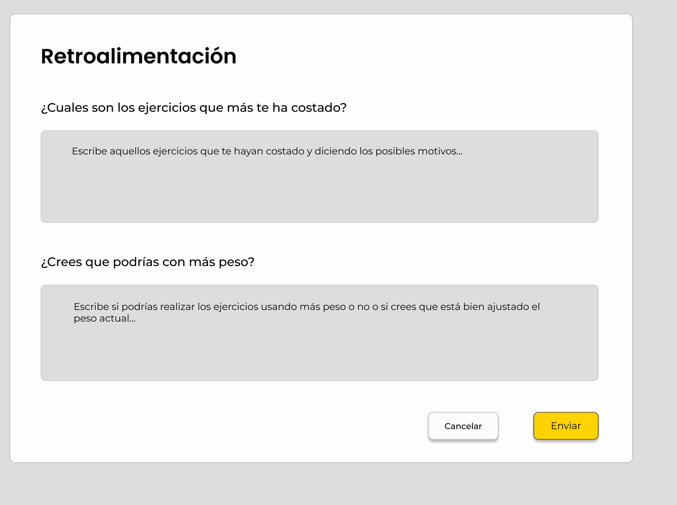

_Organización de horarios:_

- **Título:** Elemento más grande y con mayor peso
- **Días (Lunes, Miércoles):** Tamaño medio, peso moderado
- **Tabla de horarios:** Mismo tamaño, peso reducido (indica relación entre datos)


---

### 3. Alineación: Estrategia de Organización Visual

**Estrategia:**

- **Alineación centrada:** Como patrón principal para mayor claridad
- **Organización del contenido:** Distribución equilibrada de la información
- **Márgenes adecuados:** Para evitar saturación visual

**Ejemplos de implementación:**

Ejemplos:
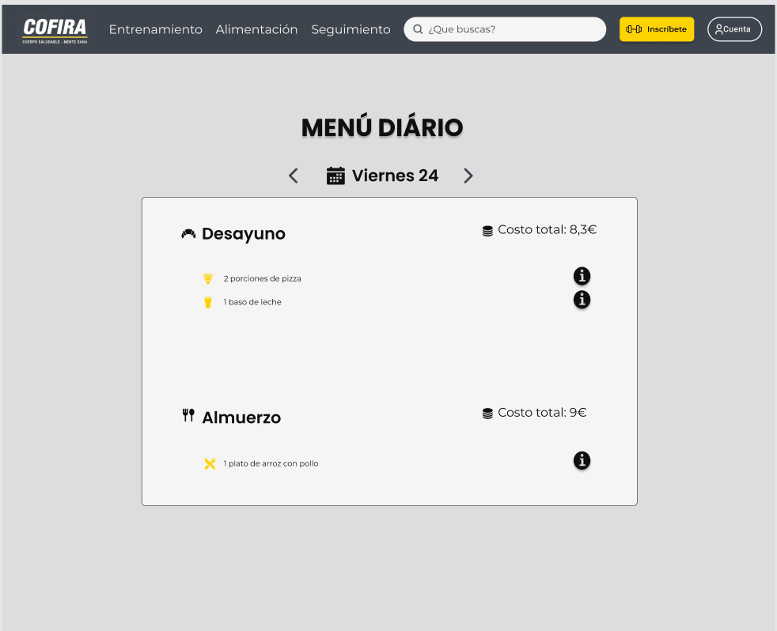
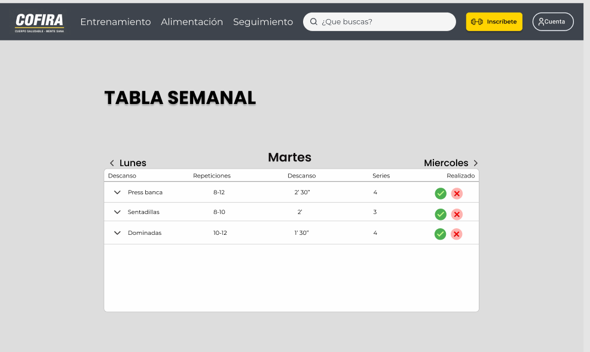

---

### 4. Proximidad: Agrupación de Elementos Relacionados

**Estrategia:**

- **Espaciado reducido:** Entre elementos con relación directa
- **Orden visual:** Permite identificar grupos sin necesidad de leer títulos
- **Jerarquía de separación:** Mayor distancia entre categorías principales

**Ejemplos de implementación:**

_Menú diario:_

- Separación mínima entre alimentos de la misma comida
- Mayor separación entre diferentes comidas del día
- Agrupación visual clara sin necesidad de indicadores adicionales

Ejemplo:
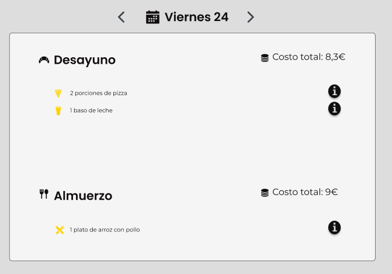

---

### 5. Repetición: Creación de Coherencia Visual

**Estrategia:**

- **Consistencia en botones:** Mismos colores, animaciones y tamaños de fuente
- **Estilos uniformes:** Colores, espaciados y tamaños consistentes en secciones similares
- **Iconografía coherente:** Mismo estilo de iconos para acciones relacionadas
- **Familiaridad:** Patrones repetitivos que facilitan la navegación

**Ejemplos de implementación:**
_Páginas de configuración:_

- Colores, espaciados y tamaños consistentes
- Iconos con estilo uniforme para acciones similares

Ejemplos:
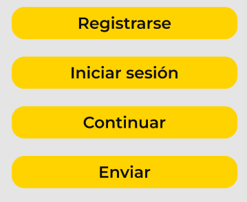

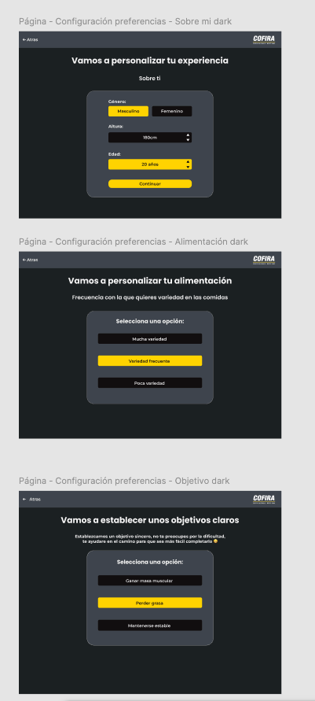
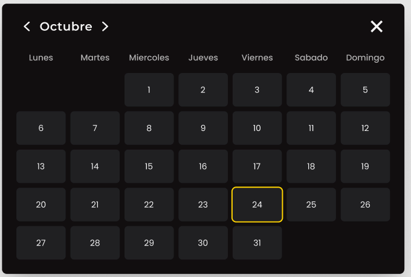

### 1.2 Metodología CSS Explica qué metodología usas (BEM recomendado) y por qué. Muestra ejemplos de tu nomenclatura. Si usas BEM, explica que usarás bloques (.card), elementos (.card\_\_title), y modificadores (.card--featured).

He usado la metología BEM porque me permite organizar el código por componentes, además de permitirme reutilizar estilos
en diferentes partes sin tener problemas de especificidad. El principal mótivo por lo que lo he usado es por la especifidad ya que al estar trabajando con componentes
muchas veces voy a tener estilos repetidos y con BEM puedo usar los estilos ya creados sin tener que preocuparme por que
se repita esta
clase.

Ejemplos de nomenclatura BEM usada en el proyecto:

```css
/* BLOQUE: Contenedor principal del componente */

.button {
}
.alert {
}
.pricing-card {
}
.menu-movil {
}

/* ELEMENTO: Parte interna del bloque (usa __) */

.button__icono {
}
.button__texto {
}
.alert__mensaje {
}
.alert__cerrar {
}
.pricing-card__titulo {
}
.pricing-card__lista {
}
.pricing-card__boton {
}
.menu-movil__contenido {
}
.menu-movil__link {
}

/* MODIFICADOR: Variante del bloque/elemento (usa --) */

.button--primary {
}
.button--secondary {
}
.button--danger {
}
.button--sm {
}
.button--lg {
}
.alert--success {
}
.alert--error {
}
.pricing-card--planes {
}
.menu-movil--abierto {
}
```

### 1.3 Organización de archivos: Documenta tu estructura ITCSS. Explica por qué cada carpeta está en ese orden (de menor a mayor especificidad). Muestra el árbol de carpetas completo.

#### Árbol de carpetas completo

```
styles/
├── 00-settings/
│   ├── _css-variables.scss
│   └── _variables.scss
├── 01-tools/
│   └── _mixins.scss
├── 02-generic/
│   └── _reset.scss
├── 03-elements/
│   ├── _buttons.scss
│   ├── _elements.scss
│   ├── _forms.scss
│   ├── _links.scss
│   ├── _lists.scss
│   └── _typography.scss
├── 04-layout/
│   ├── _grid.scss
│   └── _layaout.scss
├── 05-components/
│   ├── _alerta.scss
│   ├── _boton.scss
│   ├── _formulario.scss
│   ├── _inputs.scss
│   ├── _navegacion.scss
│   └── _tarjeta.scss
├── 06-utilities/
│   └── _utilities.scss
├── 07-dark-mode/
│   ├── _dark-mode-config.scss
│   └── _dark-mode.scss
```

### Explicación del orden (de menor a mayor especificidad)

**00-settings/** Variables y configuraciones globales

- **Especificidad:** No tiene ya que es a nivel global.
- **Propósito:** Define variables de colores, tamaños, espaciados, tiempos de animación y tipografías.
- **Ejemplo:** `--radius-xss`, `--spacing-size-xs`

**01-tools/** - Mixins y funciones

- **Especificidad:** No tiene especifidad ya que es a nivel global.
- **Propósito:** Herramientas reutilizables para generar CSS pre hechos.
- **Ejemplo:** Mixins para responsive, flexbox, animaciones...

**02-generic/** - Reset y normalización

- **Especificidad:** No tiene especifidad ya que el funcionamiento de este es para resetear los elementos por defecto.
- **Propósito:** Resetear estilos por defecto del navegador.
- **Ejemplo:** `* { margin: 0; padding: 0; }`

**03-elements/** - Estilos base de elementos HTML en caso de que no le demos estilos.

- **Especificidad:** No tiene especididad.
- **Propósito:** Estilos generales para etiquetas HTML sin clases para darles un estilo base.
- **Ejemplo:** `a`, `h1`, `p`, `button`

**04-layout/** - Estructura y distribución

- **Especificidad:** Si tiene especifidad pero tampoco tanta ya que son clases generales.
- **Propósito:** Grid, flex, contenedores principales su proposito es ser reutilizables para cualquier componente.
- **Ejemplo:** `.grid__cols__2`, `.flex__basico`

**05-components/** - Componentes específicos

- **Especificidad:** Si son específicos ya que son componentes concretos.
- **Propósito:** Estilos de componentes reutilizables
- **Ejemplo:** Inputs, cards, botones

**06-utilities/** - Clases unitarias

- **Especificidad:** Muy alta ya que aqui definiremos los componentes de forma individual.
- **Propósito:** Clases de una sola responsabilidad que sobrescriben otros estilos.
- **Ejemplo:** `.text-center`, `.m-2`, `.hidden`

**07-dark-mode/** - Dark mode

- **Especificidad:** Muy alta ya que aqui definiremos los componentes de forma individual para el dark mode.
- **Propósito:** Permitir cambiar los estilos de toda la web al modo oscuro, de una forma mucho más centralizada y ordenada en vez de tener todas estas clases en un mismo fichero junto con los estilos del modo claro.
- **Ejemplo:** `.app-header .menu-cuenta`, `.app-header .menu-cuenta__item`, `.typography-item`

Esta estructura sigue el principio ITCSS de "cascada invertida", donde los estilos van de lo más genérico y reutilizable
a lo más específico y concreto, evitando problemas de especificidad y facilitando el mantenimiento del código.

### 1.4 Sistema de Design Tokens: Documenta todas tus variables. Para cada grupo (colores, tipografía, espaciado, etc.) explica las decisiones:

- Por qué elegiste esos colores

  - Elegí esos colores porque quería usar una paleta que comunicara energía y positividad además de esfuerzo y
    dedicación, por eso usé el amarillo brillante como color principal. Además de que el amarillo es un color que
    llama mucho la atención y es perfecto para botones de llamada a la acción. Los colores neutros los elegí para que
    no compitieran con el amarillo y dejaran que este resaltara más.

  ```css
  /* ============================================
     COLORES - NEGRO
     ============================================ */

  /* Negro - Estados Normal) */
  --negro-normal: #110e10; /* Color secundario */
  --negro-normal-hover: #0f0d0e;
  --negro-normal-active: #0e0b0d;

  /* Negro - Estados Dark */
  --negro-dark: #0d0b0c;
  --negro-dark-hover: #0a080a;
  --negro-dark-active: #080607; /* FONDO */

  /* ============================================
     COLORES - AMARILLO
     ============================================ */

  /* Amarillo - Estados Normal */
  --amarillo-normal: #ffd300; /*  COLOR PRIMARIO */
  --amarillo-normal-hover: #e6be00;
  --amarillo-normal-active: #cca900;

  /* Amarillo - Estados Dark */
  --amarillo-dark: #bf9e00;
  --amarillo-dark-hover: #997f00;
  --amarillo-dark-active: #735f00;

  /* ============================================
     COLORES - BLANCO
     ============================================ */

  /* Blanco - Estados Normal */
  --blanco-normal: #f5f5f5; /* Color secundario // BACKGROUND CARD */
  --blanco-normal-hover: #dddddd; /* FONDO */
  --blanco-normal-active: #c4c4c4; /* Color secundario // BACKGROuND CARD INDIVIDUAL */

  /* Blanco - Estados Dark*/
  --blanco-dark: #b8b8b8;
  --blanco-dark-hover: #939393;
  --blanco-dark-active: #6e6e6e;

  /* ============================================
     COLORES - GRIS
     ============================================ */

  /* Gris - Estados Normal */
  --gris-normal: #3f454c; /* COLOR PRIMARIO DEL DARK MODE */
  --gris-normal-hover: #393e44;
  --gris-normal-active: #32373d; /* BACKGROUND CARD INDIVIDUAL */

  /* Gris - Estados Dark */
  --gris-dark: #2f3439; /* BACKGROUND CARD DARK MODE */
  --gris-dark-hover: #26292e;
  --gris-dark-active: #1c1f22;

  /*Textos*/
  --text-light: #110e10;
  --text-dark: #f5f5f5;

  /*Background gris transparente*/
  --background-light-gray: #3f454c;

  /*Botones*/
  --button-red: #ff3434;
  --button-red-hover: #910505;

  --button-gray: #3f454c;
  --buton-gray-hover: #2f3439;

  --button-yellow: #ffd300;
  --button-yellow-hover: #594a00;

  --button-darker: #32373d;
  --button-darker-hover: #26292e;
  ```

- ¿Por qué esa escala tipográfica?

  - He usado esta escala de tipografía porque es una escala muy ajustable a cualquier diseño que quieras hacer además de que es la más usada en diseño
    web, ya que permite crear jerarquías visuales claras y consistentes.

  ```css
  /* Tamaños de la tipografía */
  --font-size-xs: 0.64rem; /* 10.24px */
  --font-size-sm: 0.8rem; /* 12.8px  */
  --font-size-md: 1rem; /* 16px */
  --font-size-lg: 1.25rem; /* 20px */
  --font-size-xl: 1.563rem; /* 25px */
  --font-size-2xl: 1.953rem; /* 31.25px */
  --font-size-3xl: 2.441rem; /* 39px  */
  --font-size-4xl: 3.052rem; /* 48.8px */
  --font-size-5xl: 3.815rem; /* 61px */
  ```

- ¿Por qué esos breakpoints?

  - He usado estos breakpoints porque son los más comunes entre dispositivos y permiten que el diseño sea responsive en la mayoría de dispositivos.

  ```css
  // Mobile Grande / Phablets
  $breakpoint-xs: 640px;

  // Tablets
  $breakpoint-s: 768px;

  // Desktop / Tablets (Landscape)
  $breakpoint-M: 1024px;

  // Desktop Grande
  $breakpoint-L: 1280px;
  ```

### 1.5 Mixins y funciones: Documenta cada mixin que creaste, para qué sirve, y muestra un ejemplo de uso.

Cree estos mixins para facilitar la creación de layouts flexibles y reutilizables en todo el proyecto.

```css
// Centrado perfecto (horizontal y vertical)
@mixin flex-center {

@mixin flex-center {
    display: flex;
    justify-content: center;
    align-items: center;
}

// Distribuir espacio entre elementos

@mixin flex-between {
    display: flex;
    justify-content: space-between;
    align-items: center;
}

// Tipografia para textos (p, span, etc)
// Usa --font-primary (Montserrat)
// Uso: @include tipografia-texto;
@mixin tipografia-texto {
    font-family: var(--font-primary);
    font-weight: var(--font-weight-regular);
    line-height: var(--line-height-normal);
}


// Mixin para labels de formulario

@mixin form-label {
    color: var(--blanco-normal);
    font-size: var(--font-size-md);
    font-weight: var(--font-weight-regular);
    font-family: var(--font-secondary);
    margin-bottom: var(--spacing-size-xss);
}

```

Ejemplo de uso:

```css
nav {
  @include flex-full;
  background: var(--gris-normal);
  height: 4.4rem;
  align-items: center;
  box-sizing: border-box;
  justify-content: space-between;
  padding: 0 6rem;
}
```

### 1.6 ViewEncapsulation en Angular: Explica qué estrategia de encapsulación usarás. Angular por defecto usa Emulated (estilos encapsulados por componente). Documenta si mantendrás esto o usarás None (estilos globales). Justifica tu decisión.

He usado la estrategia hibrida emulated, la mayoría de los componentes usa ViewEncapsulation.Emulated para mantener los
estilos encapsulados y evitar conflictos entre componentes. Sin embargo, para los estilos globales y utilidades he
optado por ViewEncapsulation.None para que estos estilos puedan ser aplicados en todo el proyecto sin restricciones.
Esta combinación me permite tener un control preciso sobre los estilos específicos de cada componente mientras mantengo
una base de estilos globales accesible para todos los componentes. Lo he hecho asín para que cada componente pueda tener
sus estilos protegidos sin tener problemas de especifidad, por la escalabilidad ya que de esta forma puedo reutilizar
estilos globales en muchas partes y agilizar el proceso y por que es mucho mas mantenible al tener los estilos globales en un solo lugar.

### 2.1 Elementos semánticos utilizados: Explica qué elementos semánticos usas y cuándo: header, nav, main, article, section, aside, footer. Muestra ejemplos de tu código.

Uso los siguientes elementos:

- header: Lo uso para declarar la cabecera por ejemplo aqui:

```html
<header>
  
  <ul class="enlaces">
    <li><a routerLink="/gimnasio">Entrenamiento</a></li>
    <li><a routerLink="/alimentacion">Alimentación</a></li>
    <li><a routerLink="/seguimiento">Seguimiento</a></li>
  </ul>
</header>
```

- nav: Lo uso para declarar el menú de navegación, por ejemplo aqui:

```html
<!-- Sección derecha: Redes sociales -->
<nav class="footer__right">
  <ul class="footer__social-list">
    <li class="footer__social-item">
      <a
        aria-label="YouTube"
        class="footer__social"
        href="https://youtube.com"
        rel="noopener"
        target="_blank"
      >
        <svg
          fill="currentColor"
          height="24"
          viewBox="0 0 24 24"
          width="24"
          xmlns="http://www.w3.org/2000/svg"
        >
          <path
            d="M23.498 6.186a3.016 3.016 0 0 0-2.122-2.136C19.505 3.545 12 3.545 12 3.545s-7.505 0-9.377.505A3.017 3.017 0 0 0 .502 6.186C0 8.07 0 12 0 12s0 3.93.502 5.814a3.016 3.016 0 0 0 2.122 2.136c1.871.505 9.376.505 9.376.505s7.505 0 9.377-.505a3.015 3.015 0 0 0 2.122-2.136C24 15.93 24 12 24 12s0-3.93-.502-5.814zM9.545 15.568V8.432L15.818 12l-6.273 3.568z"
          />
        </svg>
      </a>
    </li>

    <li class="footer__social-item">
      <a
        aria-label="Facebook"
        class="footer__social"
        href="https://facebook.com"
        rel="noopener"
        target="_blank"
      >
        <svg
          fill="currentColor"
          height="24"
          viewBox="0 0 24 24"
          width="24"
          xmlns="http://www.w3.org/2000/svg"
        >
          <path
            d="M24 12.073c0-6.627-5.373-12-12-12s-12 5.373-12 12c0 5.99 4.388 10.954 10.125 11.854v-8.385H7.078v-3.47h3.047V9.43c0-3.007 1.792-4.669 4.533-4.669 1.312 0 2.686.235 2.686.235v2.953H15.83c-1.491 0-1.956.925-1.956 1.874v2.25h3.328l-.532 3.47h-2.796v8.385C19.612 23.027 24 18.062 24 12.073z"
          />
        </svg>
      </a>
    </li>

    <li class="footer__social-item">
      <a
        aria-label="Twitter"
        class="footer__social"
        href="https://twitter.com"
        rel="noopener"
        target="_blank"
      >
        <svg
          fill="currentColor"
          height="24"
          viewBox="0 0 24 24"
          width="24"
          xmlns="http://www.w3.org/2000/svg"
        >
          <path
            d="M18.244 2.25h3.308l-7.227 8.26 8.502 11.24H16.17l-5.214-6.817L4.99 21.75H1.68l7.73-8.835L1.254 2.25H8.08l4.713 6.231zm-1.161 17.52h1.833L7.084 4.126H5.117z"
          />
        </svg>
      </a>
    </li>

    <li class="footer__social-item">
      <a
        aria-label="Instagram"
        class="footer__social"
        href="https://instagram.com"
        rel="noopener"
        target="_blank"
      >
        <svg
          fill="currentColor"
          height="24"
          viewBox="0 0 24 24"
          width="24"
          xmlns="http://www.w3.org/2000/svg"
        >
          <path
            d="M12 2.163c3.204 0 3.584.012 4.85.07 3.252.148 4.771 1.691 4.919 4.919.058 1.265.069 1.645.069 4.849 0 3.205-.012 3.584-.069 4.849-.149 3.225-1.664 4.771-4.919 4.919-1.266.058-1.644.07-4.85.07-3.204 0-3.584-.012-4.849-.07-3.26-.149-4.771-1.699-4.919-4.92-.058-1.265-.07-1.644-.07-4.849 0-3.204.013-3.583.07-4.849.149-3.227 1.664-4.771 4.919-4.919 1.266-.057 1.645-.069 4.849-.069zM12 0C8.741 0 8.333.014 7.053.072 2.695.272.273 2.69.073 7.052.014 8.333 0 8.741 0 12c0 3.259.014 3.668.072 4.948.2 4.358 2.618 6.78 6.98 6.98C8.333 23.986 8.741 24 12 24c3.259 0 3.668-.014 4.948-.072 4.354-.2 6.782-2.618 6.979-6.98.059-1.28.073-1.689.073-4.948 0-3.259-.014-3.667-.072-4.947-.196-4.354-2.617-6.78-6.979-6.98C15.668.014 15.259 0 12 0zm0 5.838a6.162 6.162 0 1 0 0 12.324 6.162 6.162 0 0 0 0-12.324zM12 16a4 4 0 1 1 0-8 4 4 0 0 1 0 8zm6.406-11.845a1.44 1.44 0 1 0 0 2.881 1.44 1.44 0 0 0 0-2.881z"
          />
        </svg>
      </a>
    </li>

    <li class="footer__social-item">
      <a
        aria-label="LinkedIn"
        class="footer__social"
        href="https://linkedin.com"
        rel="noopener"
        target="_blank"
      >
        <svg
          fill="currentColor"
          height="24"
          viewBox="0 0 24 24"
          width="24"
          xmlns="http://www.w3.org/2000/svg"
        >
          <path
            d="M20.447 20.452h-3.554v-5.569c0-1.328-.027-3.037-1.852-3.037-1.853 0-2.136 1.445-2.136 2.939v5.667H9.351V9h3.414v1.561h.046c.477-.9 1.637-1.85 3.37-1.85 3.601 0 4.267 2.37 4.267 5.455v6.286zM5.337 7.433c-1.144 0-2.063-.926-2.063-2.065 0-1.138.92-2.063 2.063-2.063 1.14 0 2.064.925 2.064 2.063 0 1.139-.925 2.065-2.064 2.065zm1.782 13.019H3.555V9h3.564v11.452zM22.225 0H1.771C.792 0 0 .774 0 1.729v20.542C0 23.227.792 24 1.771 24h20.451C23.2 24 24 23.227 24 22.271V1.729C24 .774 23.2 0 22.222 0h.003z"
          />
        </svg>
      </a>
    </li>
  </ul>
</nav>
```

- main: El main lo utilizo para indicar el contenido principal de la página web y lo indico unicamente en el index.html ya que luego con el router-outlet indico que ese contenido va a ser reemplazable por los componentes, de esta forma hago que la cabecera y pie de página nunca desaparezca y no tenga que estar usandola por cada página.

```html
<main class="main-content">
  <router-outlet></router-outlet>
</main>
```

- article: Este elemento lo utilizo para agrupar elementos semanticamente iguales, por ejemplo un grupo de cards o un grupo de enlaces. Por ejemplo un buscador:

```html
<article class="buscador">
  <svg
    class="buscador__icono"
    viewBox="0 0 24 24"
    xmlns="http://www.w3.org/2000/svg"
  >
    <path
      d="M9.5 3A6.5 6.5 0 0 1 16 9.5c0 1.61-.59 3.09-1.56 4.23l.27.27h.79l5 5l-1.5 1.5l-5-5v-.79l-.27-.27A6.52 6.52 0 0 1 9.5 16A6.5 6.5 0 0 1 3 9.5A6.5
  6.5 0 0 1 9.5 3m0 2C7 5 5 7 5 9.5S7 14 9.5 14S14 12 14 9.5S12 5 9.5 5"
      fill="currentColor"
    />
  </svg>
  <input class="buscador__input" placeholder="¿Que buscas?" type="text" />
</article>
```

- section: El section lo utilizo para cuando agrupar muchos grupos de elementos por ejemplo, un ejemplo podría ser los botones de la cabecera:

```html
<section class="cabecera__botones">
  <button class="boton_inscribete">
    <svg viewBox="0 0 512 512" xmlns="http://www.w3.org/2000/svg">
      <path
        d="m77.492 18.457l-17.726 3.127L69.09 74.47a1631 1631 0 0 0-15.8 2.54l-6.503-36.89l-17.726 3.124l6.49 36.795a1878 1878 0 0 0-17.196 3.112l3.292 17.696c5.728-1.066 11.397-2.09 17.028-3.084l7.056 40.02l17.727-3.124l-7.04-39.93q7.956-1.319 15.798-2.54l9.777 55.45l17.727-3.126l-9.697-54.99a1416 1416 0 0 1 25.18-3.38c15.54 46.39 34.697 99.995 66.936 134.448C190.86 250.992 192 268 214.56 310C192 348 176 412 167.21 471l-48 6v15H192c16-48 64-144 64-144s48 96 64 144h72.79v-15l-48-6C336 412 320 348 294 310c26-42 24.175-59.585 35.83-89.377c32.25-34.452 51.42-88.075 66.967-134.478c8.314 1.04 16.697 2.16 25.18 3.38l-9.696 54.99l17.728 3.124l9.777-55.45q7.843 1.221 15.8 2.54l-7.042 39.93l17.727 3.125l7.056-40.02c5.63.993 11.3 2.017 17.028 3.083l3.292-17.696c-5.78-1.075-11.507-2.11-17.195-3.113l6.49-36.796l-17.727-3.125l-6.504 36.89a1565 1565 0 0 0-15.8-2.54l9.324-52.886l-17.726-3.127l-9.406 53.35C365.982 63.31 310.982 59.04 256 59.04c-54.98 0-109.983 4.27-169.102 12.767zM256 76.98c35.53 0 71.07 1.83 107.822 5.463c-14.082 34.858-38.454 73.504-63.203 101.967C290.293 199.27 274.35 209 256 209s-34.294-9.73-44.62-24.59c-24.748-28.463-49.12-67.11-63.202-101.967c36.75-3.633 72.29-5.463 107.822-5.463M256 97c-20.835 0-39 20.24-39 47s18.165 47 39 47s39-20.24 39-47s-18.165-47-39-47"
        fill="currentColor"
      />
    </svg>

    <span>Inscribete</span>
  </button>

  <button class="boton__cuenta">
    <svg
      height="24"
      viewBox="0 0 24 24"
      width="24"
      xmlns="http://www.w3.org/2000/svg"
    >
      <path
        d="M12 4a4 4 0 0 1 4 4a4 4 0 0 1-4 4a4 4 0 0 1-4-4a4 4 0 0 1 4-4m0 10c4.42 0 8 1.79 8 4v2H4v-2c0-2.21 3.58-4 8-4"
        fill="currentColor"
      />
    </svg>
    <span>Cuenta</span>
  </button>
</section>
```

- aside: El aside se utiliza para declarar contenido secundario como menus de navegación a la izquierda o derecha en toda la página, osea como el menú hamburguesa de móvil o los tipicos menús desplegables de filtrado que tienen muchas páginas webs, pero yo no lo he utilizado porque mi web no tiene filtrado o contenido para filtrar.

- footer: El footer se utiliza para indicar el pie de página como el elemento header pero en el pie de página. En el footer declaramos todos los elementos que vamos a tener en el pie de página por ejemplo los iconos, enlaces y los textos que tendremos. Por ejemplo mi footer:

```
<footer class="footer">

  <!-- Sección izquierda: Condiciones de uso -->
  <nav class="footer__left">
    <a class="footer__link" routerLink="/condiciones">
      Leer condiciones de uso
    </a>
  </nav>

  <!-- Sección central: Copyright -->
  <p class="footer__copyright">@Copyright - Cofira</p>

  <!-- Sección derecha: Redes sociales -->
  <nav class="footer__right">
    <ul class="footer__social-list">

      <li class="footer__social-item">
        <a aria-label="YouTube" class="footer__social" href="https://youtube.com" rel="noopener" target="_blank">
          <svg fill="currentColor" height="24" viewBox="0 0 24 24" width="24" xmlns="http://www.w3.org/2000/svg">
            <path d="M23.498 6.186a3.016 3.016 0 0 0-2.122-2.136C19.505 3.545 12 3.545 12 3.545s-7.505 0-9.377.505A3.017 3.017 0 0 0 .502 6.186C0 8.07 0 12 0 12s0 3.93.502 5.814a3.016 3.016 0 0 0 2.122 2.136c1.871.505 9.376.505 9.376.505s7.505 0 9.377-.505a3.015 3.015 0 0 0 2.122-2.136C24 15.93 24 12 24 12s0-3.93-.502-5.814zM9.545 15.568V8.432L15.818 12l-6.273 3.568z"/>
          </svg>
        </a>
      </li>

      <li class="footer__social-item">
        <a aria-label="Facebook" class="footer__social" href="https://facebook.com" rel="noopener" target="_blank">
          <svg fill="currentColor" height="24" viewBox="0 0 24 24" width="24" xmlns="http://www.w3.org/2000/svg">
            <path d="M24 12.073c0-6.627-5.373-12-12-12s-12 5.373-12 12c0 5.99 4.388 10.954 10.125 11.854v-8.385H7.078v-3.47h3.047V9.43c0-3.007 1.792-4.669 4.533-4.669 1.312 0 2.686.235 2.686.235v2.953H15.83c-1.491 0-1.956.925-1.956 1.874v2.25h3.328l-.532 3.47h-2.796v8.385C19.612 23.027 24 18.062 24 12.073z"/>
          </svg>
        </a>
      </li>

      <li class="footer__social-item">
        <a aria-label="Twitter" class="footer__social" href="https://twitter.com" rel="noopener" target="_blank">
          <svg fill="currentColor" height="24" viewBox="0 0 24 24" width="24" xmlns="http://www.w3.org/2000/svg">
            <path d="M18.244 2.25h3.308l-7.227 8.26 8.502 11.24H16.17l-5.214-6.817L4.99 21.75H1.68l7.73-8.835L1.254 2.25H8.08l4.713 6.231zm-1.161 17.52h1.833L7.084 4.126H5.117z"/>
          </svg>
        </a>
      </li>

      <li class="footer__social-item">
        <a aria-label="Instagram" class="footer__social" href="https://instagram.com" rel="noopener" target="_blank">
          <svg fill="currentColor" height="24" viewBox="0 0 24 24" width="24" xmlns="http://www.w3.org/2000/svg">
            <path d="M12 2.163c3.204 0 3.584.012 4.85.07 3.252.148 4.771 1.691 4.919 4.919.058 1.265.069 1.645.069 4.849 0 3.205-.012 3.584-.069 4.849-.149 3.225-1.664 4.771-4.919 4.919-1.266.058-1.644.07-4.85.07-3.204 0-3.584-.012-4.849-.07-3.26-.149-4.771-1.699-4.919-4.92-.058-1.265-.07-1.644-.07-4.849 0-3.204.013-3.583.07-4.849.149-3.227 1.664-4.771 4.919-4.919 1.266-.057 1.645-.069 4.849-.069zM12 0C8.741 0 8.333.014 7.053.072 2.695.272.273 2.69.073 7.052.014 8.333 0 8.741 0 12c0 3.259.014 3.668.072 4.948.2 4.358 2.618 6.78 6.98 6.98C8.333 23.986 8.741 24 12 24c3.259 0 3.668-.014 4.948-.072 4.354-.2 6.782-2.618 6.979-6.98.059-1.28.073-1.689.073-4.948 0-3.259-.014-3.667-.072-4.947-.196-4.354-2.617-6.78-6.979-6.98C15.668.014 15.259 0 12 0zm0 5.838a6.162 6.162 0 1 0 0 12.324 6.162 6.162 0 0 0 0-12.324zM12 16a4 4 0 1 1 0-8 4 4 0 0 1 0 8zm6.406-11.845a1.44 1.44 0 1 0 0 2.881 1.44 1.44 0 0 0 0-2.881z"/>
          </svg>
        </a>
      </li>

      <li class="footer__social-item">
        <a aria-label="LinkedIn" class="footer__social" href="https://linkedin.com" rel="noopener" target="_blank">
          <svg fill="currentColor" height="24" viewBox="0 0 24 24" width="24" xmlns="http://www.w3.org/2000/svg">
            <path d="M20.447 20.452h-3.554v-5.569c0-1.328-.027-3.037-1.852-3.037-1.853 0-2.136 1.445-2.136 2.939v5.667H9.351V9h3.414v1.561h.046c.477-.9 1.637-1.85 3.37-1.85 3.601 0 4.267 2.37 4.267 5.455v6.286zM5.337 7.433c-1.144 0-2.063-.926-2.063-2.065 0-1.138.92-2.063 2.063-2.063 1.14 0 2.064.925 2.064 2.063 0 1.139-.925 2.065-2.064 2.065zm1.782 13.019H3.555V9h3.564v11.452zM22.225 0H1.771C.792 0 0 .774 0 1.729v20.542C0 23.227.792 24 1.771 24h20.451C23.2 24 24 23.227 24 22.271V1.729C24 .774 23.2 0 22.222 0h.003z"/>
          </svg>
        </a>
      </li>

    </ul>
  </nav>

</footer>

```

### 2.2 Jerarquía de headings: Documenta tu estrategia de headings (h1 a h6). Reglas: solo un h1 por página, h2 para secciones principales, h3 para subsecciones. NUNCA saltes niveles. Muestra un diagrama de tu jerarquía.

Mi estrategia ha sido siempre empezar usando los h1 y ir escalando para los elementos de esa página, siempre empezando por un h1 y ir escalando un diagrama que demuestre la jerarquía sería el siguiente:

Página: "Home"

├─ H1: Tu entrenamiento, nutrición y progreso en un solo lugar
│
├─ H2: Inscríbete hoy y empieza tu cambio
│
├─ H2: Cuota mensual
│
└─ H2: ¿Quieres estar al tanto de todas las noticias?
├─ H3: Contactoss

### 2.3 Estructura de formularios: Muestra tu estructura de formularios explicando el uso de fieldset, legend, y la asociación de labels con inputs (for e id) o como hemos visto en clase. Incluye un ejemplo de código de tu componente form-input.

- Fieldset: He usado el fieldset para agrupar todo el formulario en un mismo contenedor ya que fieldset es la etiqueta que se utiliza para agrupar todo el contenido de un formulario.
- Legend: El elemento legend lo he usado para ponerle el titulo al formulario dentro de dicho formulario, es el titulo que se ve dentro del formulario.
- Labels: La etiqueta label la he usado para asociar el input con el label através del for con el id del input, el label lo he usado para ponerle un titulo al input para que el usuario entienda que tiene que escribir en cada campo de input.
- Input: El input es usado para que el usuario pueda escribir en la página web, lo he asociado con el label a través del id.

```html
<fieldset class="form__fieldset">
  <legend class="form__legend">Datos de contacto</legend>

  <label for="nombre" class="form__label">Escribe tu nombre:</label>
  <input
    type="text"
    id="nombre"
    formControlName="nombre"
    class="form__input"
    placeholder="Escriba su nombre..."
  />

  <label for="apellido" class="form__label">Escribe tu apellido:</label>
  <input
    type="text"
    id="apellido"
    formControlName="apellido"
    class="form__input"
    placeholder="Escriba su apellido..."
  />

  <label for="email" class="form__label">Escribe tu email:</label>
  <input
    type="email"
    id="email"
    formControlName="email"
    class="form__input"
    placeholder="Escriba su email..."
  />
</fieldset>

<button type="submit" class="form__button" [disabled]="contactForm.invalid">
  Enviar
</button>
```

### 3.1 Componentes implementados

He creado 19 componentes reutilizables organizados por categoría. Todos siguen la metodología BEM con nombres en español y están pensados para ser usados en múltiples páginas:

**Componentes de notificación y mensajes:**
- **alert** - Alertas inline persistentes (success, error, warning, info)
- **notification** - Notificaciones toast temporales que aparecen y desaparecen
- **modal** - Modales con overlay oscuro y animaciones de entrada

**Componentes de formulario:**
- **form-input** - Campos de entrada de texto con validación en tiempo real
- **form-select** - Selectores desplegables personalizados
- **form-textarea** - Áreas de texto expandibles
- **form-checkbox** - Casillas de verificación con label
- **autocomplete** - Campo con autocompletado y búsqueda

**Componentes de UI:**
- **button** - Botones con 4 variantes (primario, secundario, fantasma, peligro) y 3 tamaños
- **card** - Tarjetas reutilizables para planes, información, etc.
- **chip** - Etiquetas pequeñas para categorías o tags
- **progress-bar** - Barra de progreso animada
- **option-card** - Tarjetas seleccionables para el onboarding
- **calendario** - Componente de calendario para seleccionar fechas
- **ingredientes** - Lista de ingredientes con cantidades

**Componentes especializados:**
- **form-contact** - Formulario completo de contacto
- **form-login** - Formulario de inicio de sesión
- **form-register** - Formulario de registro con validación compleja

Todos los componentes usan CSS Custom Properties para adaptarse automáticamente al tema claro/oscuro

---

#### COMPONENTES DE LAYOUT

---

- **Header**
  - Propósito: Su propósito es definir la cabecera, he creado este componente en vez de hacerlo directamente en cada página porque como voy a tener siempre páginas que usen la cabecera pues creo que la cabecera debería ser un componente si o si ya se va a reutilizar muchas veces.
  - Variantes: Actualmente la cabecera no cuenta con variantes.
  - Tamaños disponibles: La cabecera tiene 2 tamaños, su primer tamaño es el de desktop que es la cabecera completa, la que vemos en un ordenador y su segundo tamaño es el de los dispositivos móviles, este tamaño es una versión muy recortada de la cabecera de ordenador ya que esta cabecera solo cuenta con el menú de hamburguesa y el logo.
  - Estados que maneja:
    - `menuAbierto`: Este estado indica si el menú en su modo hamburguesa ha sido clickeado y está visible su contenido o no.
    - `menuCuentaAbierto`: Este estado indica si el menú de la cuenta ha sido clickeado o no y por lo tanto si está visible su contenido o no.
    - `modoOscuro`: Este estado hace referencia al modo oscuro / modo claro de la web, si este estado está activo indica que la web está en modo oscuro.
  - Ejemplo de uso:
  ```html
  <app-header></app-header>
  ```

---

- **Footer**
  - Propósito: Su propósito es definir el pie de página de la aplicación, he decidido crear este componente porque al igual que la cabecera, el footer va a estar presente en todas las páginas de la aplicación por lo que tiene sentido que sea un componente reutilizable. El footer contiene los enlaces a las redes sociales, el copyright y el enlace a las condiciones de uso.
  - Variantes: Actualmente el footer no cuenta con variantes.
  - Tamaños disponibles: El footer tiene un único tamaño que se adapta a todos los dispositivos mediante responsive, manteniendo la misma estructura pero reorganizando los elementos según el espacio disponible.
  - Estados que maneja:
    - `currentYear`: Este estado almacena el año actual para mostrarlo en el copyright, se calcula automáticamente al cargar el componente.
    - `socialLinks`: Este estado es un array que contiene todos los enlaces a las redes sociales con su nombre, URL e icono.
  - Ejemplo de uso:
  ```html
  <app-footer></app-footer>
  ```

---

#### COMPONENTES UI BÁSICOS

---

- **Button**
  - Propósito: Su propósito es crear un componente de botón reutilizable que mantenga la consistencia visual en toda la aplicación. He creado este componente porque los botones se utilizan en muchas partes de la web y quería tener un único lugar donde gestionar todos los estilos y comportamientos de los botones para evitar repetir código y mantener la coherencia visual.
  - Variantes: El botón cuenta con 4 variantes diferentes:
    - `primary`: Es el botón principal, el que se usa para las acciones más importantes como "Inscríbete" o "Enviar". Tiene el color amarillo característico de la marca.
    - `secondary`: Es el botón secundario, se usa para acciones menos importantes o alternativas. Tiene un estilo más neutro.
    - `ghost`: Es el botón fantasma, no tiene fondo y solo muestra el texto con un borde. Se usa para acciones terciarias o cuando no quieres que el botón destaque mucho.
    - `danger`: Es el botón de peligro, se usa para acciones destructivas como eliminar o cancelar. Tiene color rojo para alertar al usuario.
  - Tamaños disponibles: El botón tiene 3 tamaños:
    - `sm`: Tamaño pequeño, ideal para espacios reducidos o acciones secundarias.
    - `md`: Tamaño mediano, es el tamaño por defecto y el más utilizado.
    - `lg`: Tamaño grande, se usa para botones de llamada a la acción importantes.
  - Estados que maneja:
    - `habilitado`: Este estado indica si el botón está habilitado o deshabilitado. Cuando está deshabilitado el botón se muestra con opacidad reducida y no permite interacción.
  - Ejemplo de uso:
  ```html
  <app-button variante="primary" tamanio="md">Inscríbete</app-button>
  <app-button variante="secondary" tamanio="sm">Cancelar</app-button>
  <app-button variante="danger" tamanio="lg" [habilitado]="true"
    >Eliminar</app-button
  >
  <app-button variante="ghost" tipo="submit">Enviar</app-button>
  ```

---

- **Card**
  - Propósito: Su propósito es mostrar información de los planes de suscripción de forma visual y atractiva. He creado este componente porque necesitaba mostrar los diferentes planes de pago (mensual y anual) con sus ventajas y precios, y quería que fuera un componente reutilizable para poder usarlo en diferentes partes de la web sin repetir código.
  - Variantes: La card cuenta con 2 variantes:
    - `planes`: Es la variante principal, diseñada específicamente para mostrar los planes de suscripción con título, lista de ventajas, precio y botón de inscripción.
    - `info`: Es una variante más simple pensada para mostrar información general sin el formato de plan de precios.
  - Tamaños disponibles: La card tiene 3 tamaños:
    - `sm`: Tamaño pequeño, útil para grids con muchas cards.
    - `md`: Tamaño mediano, es el tamaño por defecto.
    - `lg`: Tamaño grande, para destacar un plan específico.
  - Estados que maneja:
    - `deshabilitada`: Este estado indica si la card está deshabilitada. Cuando está deshabilitada la card se muestra con opacidad reducida y el botón no permite interacción.
  - Ejemplo de uso:
  ```html
  <app-card
    title="Cuota mensual"
    [ventajas]="['Acceso completo', 'Soporte 24/7', 'Sin permanencia']"
    texto_boton="Suscríbete"
    precio="15.99€ + IVA al mes"
    variante="planes"
    tamanio="md"
    (subscribe)="onSubscribe()"
  >
  </app-card>
  ```

---

- **Alert**
  - Propósito: Su propósito es mostrar mensajes de alerta al usuario de forma visual y clara. He creado este componente porque necesitaba una forma de comunicar al usuario diferentes tipos de mensajes como éxitos, errores, advertencias o información general, y quería que todos estos mensajes tuvieran un estilo consistente.
  - Variantes: La alerta cuenta con 4 variantes según el tipo de mensaje:
    - `success`: Se usa para mensajes de éxito, como cuando una acción se ha completado correctamente. Tiene color verde.
    - `error`: Se usa para mensajes de error, como cuando algo ha fallado. Tiene color rojo.
    - `warning`: Se usa para mensajes de advertencia, como cuando el usuario debe prestar atención a algo. Tiene color naranja/amarillo.
    - `info`: Se usa para mensajes informativos generales. Tiene color azul. Es la variante por defecto.
  - Tamaños disponibles: Actualmente la alerta no tiene variantes de tamaño, tiene un tamaño único que se adapta al contenido del mensaje.
  - Estados que maneja:
    - `visible`: Este estado indica si la alerta está visible o no. Cuando el usuario cierra la alerta este estado cambia a false y la alerta desaparece.
    - `closable`: Este estado indica si la alerta puede ser cerrada por el usuario. Si está en true muestra el botón de cerrar.
  - Ejemplo de uso:
  ```html
  <app-alert
    type="success"
    message="¡Registro completado correctamente!"
    [closable]="true"
  ></app-alert>
  <app-alert
    type="error"
    message="Ha ocurrido un error, inténtalo de nuevo"
  ></app-alert>
  <app-alert
    type="warning"
    message="Tu sesión expirará en 5 minutos"
  ></app-alert>
  <app-alert type="info" message="Recuerda completar tu perfil"></app-alert>
  ```

---

- **Notification**
  - Propósito: Su propósito es mostrar notificaciones temporales al usuario que desaparecen automáticamente después de un tiempo. He creado este componente porque necesitaba una forma de mostrar mensajes que no requieran acción del usuario y que no interrumpan su flujo de navegación, como confirmaciones de acciones o recordatorios breves.
  - Variantes: La notificación cuenta con 4 variantes según el tipo de mensaje:
    - `success`: Se usa para notificar acciones exitosas. Tiene color verde.
    - `error`: Se usa para notificar errores. Tiene color rojo.
    - `warning`: Se usa para advertencias. Tiene color naranja/amarillo.
    - `info`: Se usa para información general. Tiene color azul. Es la variante por defecto.
  - Tamaños disponibles: Actualmente la notificación no tiene variantes de tamaño, tiene un tamaño único optimizado para ser visible sin ser intrusiva.
  - Estados que maneja:
    - `closing`: Este estado indica si la notificación está en proceso de cerrarse. Se usa para activar la animación de salida antes de que la notificación desaparezca completamente.
    - `duration`: Este estado indica cuánto tiempo (en milisegundos) permanecerá visible la notificación antes de cerrarse automáticamente. Por defecto son 3000ms (3 segundos).
    - `closable`: Este estado indica si el usuario puede cerrar manualmente la notificación.
  - Ejemplo de uso:
  ```html
  <app-notification
    type="success"
    message="¡Cambios guardados correctamente!"
    [duration]="3000"
    [closable]="true"
    (onClose)="eliminarNotificacion(notif.id)"
  >
  </app-notification>
  ```

---

#### COMPONENTES DE FORMULARIO

---

- **FormInput**
  - Propósito: Su propósito es crear un componente de campo de entrada reutilizable que incluya la etiqueta, el input y los mensajes de error/ayuda todo en uno. He creado este componente porque los inputs se usan en todos los formularios de la aplicación y quería evitar repetir el mismo código HTML una y otra vez, además de mantener la consistencia visual entre todos los campos de entrada.
  - Variantes: Actualmente el input no tiene variantes de estilo, pero soporta diferentes tipos de input a través del atributo `type` (text, email, password, number, etc.).
  - Tamaños disponibles: Actualmente el input tiene un tamaño único que se adapta al ancho del contenedor padre.
  - Estados que maneja:
    - `control`: Este estado es el FormControl de Angular que gestiona el valor del input y sus validaciones.
    - `required`: Este estado indica si el campo es obligatorio o no.
    - `errorMessage`: Este estado contiene el mensaje de error que se muestra cuando el campo no es válido.
    - `helpText`: Este estado contiene un texto de ayuda que se muestra debajo del input para guiar al usuario.
  - Ejemplo de uso:
  ```html
  <app-form-input
    label="Nombre"
    name="nombre"
    type="text"
    placeholder="Escribe tu nombre..."
    [required]="true"
    errorMessage="El nombre es obligatorio"
    helpText="Introduce tu nombre completo"
    [control]="nombreControl"
  >
  </app-form-input>
  ```

---

- **FormTextarea**
  - Propósito: Su propósito es crear un componente de área de texto reutilizable para cuando necesito que el usuario introduzca textos más largos como descripciones, comentarios o mensajes. He creado este componente siguiendo la misma filosofía que el FormInput, para mantener la consistencia y evitar repetir código.
  - Variantes: Actualmente el textarea no tiene variantes de estilo.
  - Tamaños disponibles: Actualmente el textarea tiene un tamaño único que se adapta al contenedor, aunque se puede redimensionar verticalmente.
  - Estados que maneja:
    - `control`: Este estado es el FormControl de Angular que gestiona el valor del textarea y sus validaciones.
    - `required`: Este estado indica si el campo es obligatorio o no.
    - `errorMessage`: Este estado contiene el mensaje de error que se muestra cuando el campo no es válido.
    - `helpText`: Este estado contiene un texto de ayuda que se muestra debajo del textarea.
  - Ejemplo de uso:
  ```html
  <app-form-textarea
    label="Mensaje"
    name="mensaje"
    placeholder="Escribe tu mensaje..."
    [required]="true"
    errorMessage="El mensaje es obligatorio"
    [control]="mensajeControl"
  >
  </app-form-textarea>
  ```

---

- **FormCheckbox**
  - Propósito: Su propósito es crear un componente de checkbox reutilizable que incluya la etiqueta asociada. He creado este componente porque los checkboxes se usan en formularios para aceptar términos y condiciones, suscripciones a newsletters, etc., y quería tener un componente consistente con el resto de campos de formulario.
  - Variantes: Actualmente el checkbox no tiene variantes de estilo.
  - Tamaños disponibles: Actualmente el checkbox tiene un tamaño único.
  - Estados que maneja:
    - `control`: Este estado es el FormControl de Angular que gestiona el valor del checkbox (true/false).
    - `required`: Este estado indica si el checkbox debe estar marcado obligatoriamente (útil para términos y condiciones).
  - Ejemplo de uso:
  ```html
  <app-form-checkbox
    label="Acepto los términos y condiciones"
    name="terminos"
    [required]="true"
    [control]="terminosControl"
  >
  </app-form-checkbox>
  ```

---

- **FormSelect**
  - Propósito: Su propósito es crear un componente de selector desplegable reutilizable. He creado este componente porque necesitaba selectores en varios formularios para que el usuario pueda elegir entre opciones predefinidas, como el objetivo de entrenamiento o los días de ejercicio.
  - Variantes: Actualmente el select no tiene variantes de estilo.
  - Tamaños disponibles: Actualmente el select tiene un tamaño único que se adapta al contenedor.
  - Estados que maneja:
    - `options`: Este estado es un array de strings que contiene todas las opciones disponibles en el selector.
  - Ejemplo de uso:
  ```html
  <app-form-select
    label="Objetivo"
    name="objetivo"
    [options]="['Perder peso', 'Ganar músculo', 'Mantener peso', 'Definir']"
  >
  </app-form-select>
  ```

---

#### COMPONENTES DE FORMULARIO COMPLETOS

---

- **FormLogin**
  - Propósito: Su propósito es proporcionar un formulario completo de inicio de sesión. He creado este componente porque el login es una funcionalidad que voy a necesitar en la aplicación y quería tener un formulario preparado con todos los campos necesarios (email y contraseña) ya estructurado.
  - Variantes: Actualmente el formulario de login no tiene variantes.
  - Tamaños disponibles: El formulario tiene un tamaño único que se adapta al contenedor.
  - Estados que maneja: Actualmente el componente está en desarrollo y no tiene estados implementados.
  - Ejemplo de uso:
  ```html
  <app-form-login></app-form-login>
  ```

---

- **FormRegister**
  - Propósito: Su propósito es proporcionar un formulario completo de registro de usuarios. He creado este componente porque el registro es esencial para la aplicación y necesitaba un formulario con validaciones avanzadas como verificación de contraseñas coincidentes y aceptación de términos.
  - Variantes: Actualmente el formulario de registro no tiene variantes.
  - Tamaños disponibles: El formulario tiene un tamaño único que se adapta al contenedor.
  - Estados que maneja:
    - `registerForm`: Este estado es el FormGroup que contiene todos los campos del formulario (nombre, apellido, email, password, confirmPassword, terminos).
    - Validaciones implementadas:
      - Nombre y apellido: Obligatorios con mínimo 2 caracteres.
      - Email: Obligatorio y debe ser un email válido.
      - Password: Obligatorio con mínimo 6 caracteres.
      - ConfirmPassword: Obligatorio y debe coincidir con el password.
      - Términos: Obligatorio y debe estar marcado.
  - Ejemplo de uso:
  ```html
  <app-form-register></app-form-register>
  ```

---

- **FormContact**
  - Propósito: Su propósito es proporcionar un formulario de contacto para que los usuarios puedan comunicarse con nosotros. He creado este componente porque quería tener una forma de que los usuarios pudieran enviar mensajes o suscribirse a las novedades de la aplicación.
  - Variantes: Actualmente el formulario de contacto no tiene variantes.
  - Tamaños disponibles: El formulario tiene un tamaño único que se adapta al contenedor.
  - Estados que maneja:
    - `contactForm`: Este estado es el FormGroup que contiene los campos del formulario (nombre, apellido, email).
    - Validaciones implementadas:
      - Nombre y apellido: Obligatorios con mínimo 2 caracteres.
      - Email: Obligatorio y debe ser un email válido.
  - Ejemplo de uso:
  ```html
  <app-contact-form></app-contact-form>
  ```

## 3.2 Nomenclatura y metodología: Muestra ejemplos reales de tu nomenclatura BEM aplicada en los componentes. Explica tu estrategia: qué es block vs element, cuándo usas modificadores vs clases de estado.

### Mi estrategia BEM

He aplicado la metodología BEM (Block, Element, Modifier) en todos mis componentes para mantener el código organizado y evitar problemas de especificidad. A continuación explico cómo he diferenciado cada parte:

---

#### ¿Qué es un Block?

Un **Block** es el contenedor principal del componente, es la raíz de la que cuelgan todos los demás elementos. Lo identifico porque es el nombre base de la clase sin guiones bajos dobles ni guiones dobles.

**Ejemplos de Blocks en mi proyecto:**

```scss
// Archivo: cofira/src/app/components/shared/button/button.scss
// El bloque .button es el contenedor principal del botón
.button {
  display: inline-flex;
  align-items: center;
  justify-content: center;
  font-family: var(--font-primary);
  font-weight: var(--font-weight-semibold);
  border: none;
  border-radius: var(--radius-m);
  cursor: pointer;
  transition: all var(--duration-base) ease;
  text-decoration: none;
  user-select: none;
  white-space: nowrap;
}

// Archivo: cofira/src/app/components/shared/alert/alert.scss
// El bloque .alert es el contenedor principal de las alertas
.alert {
  display: flex;
  align-items: center;
  gap: var(--spacing-size-s);
  padding: var(--spacing-size-s) var(--spacing-size-m);
  margin-bottom: var(--spacing-size-s);
  border-radius: var(--radius-xss);
  border-left: 4px solid;
  box-shadow: 0 2px 8px rgba(0, 0, 0, 0.1);
  font-family: var(--font-primary);
  font-size: var(--font-size-md);
  transition: all var(--duration-base) ease;
  animation: alertSlideIn var(--duration-base) ease;
}

// Archivo: cofira/src/app/components/layaout/header/header.scss
// El bloque .hamburguesa es el botón del menú móvil
.hamburguesa {
  display: none;
  flex-direction: column;
  justify-content: space-around;
  width: 2rem;
  height: 2rem;
  background: transparent;
  border: none;
  cursor: pointer;
  padding: 0;
  z-index: 200;

  @include responsive-down("md") {
    display: flex;
  }
}

// El bloque .menu-movil es el contenedor del menú en móviles
.menu-movil {
  position: fixed;
  top: 0;
  left: 0;
  width: 100%;
  height: 100vh;
  visibility: hidden;
  z-index: 150;
  pointer-events: none;
}

// El bloque .buscador es el contenedor del campo de búsqueda
.buscador {
  position: relative;
  display: flex;
  align-items: center;
  width: 100%;
  max-width: 36rem;
  min-width: 20rem;
  flex-shrink: 1;
}
```

---

#### ¿Qué es un Element?

Un **Element** es una parte interna del bloque que no tiene sentido por sí sola, siempre depende del bloque padre. Lo identifico con doble guión bajo **\_\_** después del nombre del bloque.

**Ejemplos de Elements en mi proyecto:**

```scss
// Archivo: cofira/src/app/components/shared/button/button.scss
// Elementos del bloque .button
.button__icono {
  display: flex;
  align-items: center;
  justify-content: center;
  width: 1.5rem;
  height: 1.5rem;
  flex-shrink: 0; // CLAVE: No se encoge aunque falte espacio
}

.button__texto {
  flex: 1;
  font-weight: var(--font-weight-medium);
}

// Archivo: cofira/src/app/components/shared/alert/alert.scss
// Elementos del bloque .alert
.alert__icono {
  flex-shrink: 0; // CLAVE: No se encoge aunque falte espacio
  display: flex;
  align-items: center;
  justify-content: center;
  width: 1.5rem;
  height: 1.5rem;
  margin: 0;
}

.alert__mensaje {
  flex: 1; // Crece para llenar el espacio disponible
  line-height: var(--line-height-normal);
  font-weight: var(--font-weight-medium);
  margin: 0;
}

.alert__cerrar {
  flex-shrink: 0; // CLAVE: No se encoge
  display: flex;
  align-items: center;
  justify-content: center;
  background: transparent;
  border: none;
  cursor: pointer;
  padding: 0.25rem;
  border-radius: 50%;
  opacity: 0.7;
  transition: all var(--duration-fast) ease;
}

// Archivo: cofira/src/app/components/shared/card/card.scss
// Elementos del bloque .pricing-card
.pricing-card__titulo {
  color: var(--text-dark);
  font-size: var(--font-size-4xl);
  font-weight: var(--font-weight-bold);
  margin: 0 0 var(--spacing-size-xxl) 0;
  line-height: 1.2;
}

.pricing-card__lista {
  padding: 0;
  margin: 0 0 var(--spacing-size-xxl) 0;
  width: 100%;
  list-style: none;
  display: flex;
  flex-direction: column;
  gap: var(--spacing-size-s);
}

.pricing-card__ventaja {
  color: var(--text-dark);
  font-size: var(--font-size-lg);
  font-weight: var(--font-weight-normal);
  padding-left: var(--spacing-size-s);
  position: relative;
  text-align: left;
  display: flex;
  align-items: center;
  gap: var(--spacing-size-xs);
}

.pricing-card__boton {
  width: 100%;
  max-width: 21rem;
  height: 4rem;
  padding: var(--spacing-size-s) var(--spacing-size-m);
  background: var(--button-yellow);
  color: var(--negro-normal);
  border: none;
  border-radius: var(--radius-m);
  font-size: var(--font-size-xl);
  font-weight: var(--font-weight-semibold);
  cursor: pointer;
  box-shadow: var(--shadow-md);
  margin-bottom: var(--spacing-size-m);
  transition: all 0.3s ease;
}

.pricing-card__precio {
  color: var(--text-dark);
  font-size: var(--font-size-lg);
  font-weight: var(--font-weight-bold);
  margin: 0;
}

// Elementos del bloque .menu-movil
.menu-movil__overlay {
  position: absolute;
  inset: 0;
  background-color: rgba(0, 0, 0, 0);
  transition: background-color 0.25s ease-out;
}

.menu-movil__contenido {
  position: absolute;
  top: 0;
  right: 0;
  width: 80%;
  max-width: 400px;
  height: 100%;
  background: var(--gris-dark);
  transform: translateX(100%);
  transition: transform 0.3s cubic-bezier(0.4, 0, 0.2, 1);
  overflow-y: auto;
  display: flex;
  flex-direction: column;
  box-shadow: -4px 0 20px rgba(0, 0, 0, 0.3);
  will-change: transform;
}

.menu-movil__header {
  display: flex;
  justify-content: space-between;
  align-items: center;
  padding: 1.5rem;
  background: var(--gris-normal);
  border-bottom: 2px solid var(--amarillo-normal);
}

.menu-movil__link {
  display: flex;
  align-items: center;
  gap: 1rem;
  padding: 1.25rem 1.5rem;
  color: var(--blanco-normal);
  text-decoration: none;
  font-size: var(--font-size-lg);
  font-weight: var(--font-weight-medium);
  transition: background-color 0.15s ease-out, transform 0.15s ease-out;
  border-left: 4px solid transparent;
  position: relative;
}

// Elementos del bloque .buscador
.buscador__input {
  width: 100%;
  height: 1.5rem;
  padding: 0.75rem 1rem 0.75rem 3rem;
  border-radius: var(--radius-l);
  border: 0 solid var(--blanco-dark);
  color: var(--text-light);
  font-size: var(--font-size-md);
  transition: all 0.3s ease;
}

.buscador__icono {
  position: absolute;
  left: 1rem;
  width: 1.5rem;
  color: var(--button-darker);
  pointer-events: none;
}

.menu-cuenta__icono {
  width: 1.5rem;
  height: 1.5rem;
  color: var(--negro-normal);
  flex-shrink: 0;
}
```

---

#### ¿Cuándo uso Modificadores?

Un **Modifier** es un modificador del bloque o elemento que cambia su apariencia o comportamiento. Lo identifico con doble guión **--** después del nombre del bloque o elemento. Los uso cuando quiero crear variantes del componente como diferentes colores, tamaños o estados visuales.

**Ejemplos de Modificadores en mi proyecto:**

```scss
// Archivo: cofira/src/app/components/shared/button/button.scss
// Modificadores de VARIANTE (tipo) para el bloque .button
.button--primary {
  background: var(--button-yellow);
  color: var(--negro-normal);
  box-shadow: var(--shadow-md);
}

.button--secondary {
  background: var(--button-gray);
  color: var(--text-dark);
  box-shadow: var(--shadow-sm);
}

.button--ghost {
  background: transparent;
  color: var(--text-dark);
  border: var(--border-width-normal) solid var(--gris-normal);
}

.button--danger {
  background: var(--button-red);
  color: var(--text-dark);
  box-shadow: var(--shadow-md);
}

// Modificadores de TAMAÑO para el bloque .button
.button--sm {
  padding: var(--spacing-size-xss) var(--spacing-size-s);
  font-size: var(--font-size-sm);
  height: 2rem;
  min-width: var(--width-muy-pequenio);
}

.button--md {
  padding: var(--spacing-size-xss) var(--spacing-size-m);
  font-size: var(--font-size-md);
  height: 2.75rem;
  min-width: var(--width-mediano);
}

.button--lg {
  padding: var(--spacing-size-s) var(--spacing-size-l);
  font-size: var(--font-size-lg);
  height: 3.5rem;
  min-width: var(--width-estandar);
}

// Archivo: cofira/src/app/components/shared/alert/alert.scss
// Modificadores de TIPO para el bloque .alert
.alert--success {
  background-color: var(--amarillo-normal);
  border-left-color: var(--amarillo-dark);
  color: var(--negro-normal);
}

.alert--error {
  background-color: var(--button-red);
  border-left-color: var(--button-red-hover);
  color: var(--blanco-normal);
}

.alert--warning {
  background-color: var(--amarillo-normal-hover);
  border-left-color: var(--amarillo-normal);
  color: var(--negro-normal);
}

.alert--info {
  background-color: var(--gris-normal);
  border-left-color: var(--gris-dark);
  color: var(--blanco-normal);
}

// Archivo: cofira/src/app/components/shared/card/card.scss
// Modificadores de VARIANTE para el bloque .pricing-card
.pricing-card--info {
  background: var(--gris-normal);
}

.pricing-card--planes {
  background: var(--gris-normal);
  box-shadow: var(--shadow-2xl);
}

// Modificadores de TAMAÑO para el bloque .pricing-card
.pricing-card--sm {
  max-width: 21rem;
  padding: var(--spacing-size-l) var(--spacing-size-s);
}

.pricing-card--md {
  max-width: 28rem;
}

.pricing-card--lg {
  max-width: 34rem;
  padding: var(--spacing-size-3xl) var(--spacing-size-xl);
}

// Archivo: cofira/src/app/components/layaout/header/header.scss
// Modificadores de ESTADO para el bloque .menu-movil
.menu-movil--abierto {
  visibility: visible;
  pointer-events: auto;
}

.menu-movil--abierto .menu-movil__overlay {
  background-color: rgba(0, 0, 0, 0.5);
}

.menu-movil--abierto .menu-movil__contenido {
  transform: translateX(0);
}

// Modificadores de ESTADO para el bloque .hamburguesa
.hamburguesa--abierto .hamburguesa__linea:nth-child(1) {
  transform: rotate(45deg) translateY(10px);
}

.hamburguesa--abierto .hamburguesa__linea:nth-child(2) {
  opacity: 0;
  transform: scaleX(0);
}

.hamburguesa--abierto .hamburguesa__linea:nth-child(3) {
  transform: rotate(-45deg) translateY(-10px);
}

// Modificadores de ELEMENTO (variante de un element)
.menu-movil__link--perfil {
  margin-top: auto;
  border-top: 1px solid var(--gris-normal);
}

.menu-cuenta__item--modo {
  display: flex;
  align-items: center;
  justify-content: center;
  gap: var(--spacing-size-xs);
  margin-top: var(--spacing-size-xs);
  padding: var(--spacing-size-s);
  border-top: 1px solid var(--blanco-dark);
  background: transparent;
  border-radius: var(--radius-xss);
}

// Modificadores de visibilidad para desktop/móvil
.enlaces--desktop {
  @include responsive-down("md") {
    display: none;
  }
}

.buscador--desktop {
  @include responsive-down("md") {
    display: none;
  }
}
```

---

#### ¿Cuándo uso clases de estado vs modificadores?

He decidido usar **modificadores BEM** para estados visuales que son parte del diseño del componente, como variantes de color o tamaño. Por otro lado, uso **pseudoclases CSS** para estados interactivos del usuario.

**Modificadores BEM para estados de diseño:**

Son estados que forman parte del diseño visual del componente y se activan mediante JavaScript (añadiendo/quitando clases).

```scss
// Archivo: cofira/src/app/components/shared/button/button.scss
// Estado deshabilitado como modificador (parte del diseño)
.button:disabled,
.button--disabled {
  opacity: 0.5;
  cursor: not-allowed;
  pointer-events: none;
  box-shadow: none;
}

// Archivo: cofira/src/app/components/layaout/header/header.scss
// Estado abierto del menú móvil (parte del diseño)
.menu-movil--abierto {
  visibility: visible;
  pointer-events: auto;
}

// Estado abierto de la hamburguesa (cambia visualmente las líneas)
.hamburguesa--abierto .hamburguesa__linea:nth-child(1) {
  transform: rotate(45deg) translateY(10px);
}

.hamburguesa--abierto .hamburguesa__linea:nth-child(2) {
  opacity: 0;
  transform: scaleX(0);
}

.hamburguesa--abierto .hamburguesa__linea:nth-child(3) {
  transform: rotate(-45deg) translateY(-10px);
}
```

**Pseudoclases CSS para estados interactivos:**

Son estados que se activan automáticamente por el navegador cuando el usuario interactúa con el elemento (hover, focus, active, disabled).

```scss
// Archivo: cofira/src/app/components/shared/button/button.scss
// Estados de hover para cada variante
.button--primary:hover:not(:disabled) {
  background: var(--button-yellow-hover);
  transform: translateY(-2px);
  box-shadow: var(--shadow-lg);
}

.button--secondary:hover:not(:disabled) {
  background: var(--button-gray-hover);
  transform: translateY(-2px);
  box-shadow: var(--shadow-md);
}

.button--ghost:hover:not(:disabled) {
  background: var(--gris-normal);
  color: var(--text-dark);
  border-color: var(--gris-normal-hover);
}

.button--danger:hover:not(:disabled) {
  background: var(--button-red-hover);
  transform: translateY(-2px);
  box-shadow: var(--shadow-lg);
}

// Estados active (cuando el usuario está presionando)
.button--primary:active:not(:disabled) {
  transform: translateY(0);
  box-shadow: var(--shadow-sm);
}

// Estados focus (para accesibilidad - navegación con teclado)
.button--primary:focus {
  outline: 3px solid var(--amarillo-normal);
  outline-offset: 2px;
}

.button--secondary:focus {
  outline: 3px solid var(--gris-normal);
  outline-offset: 2px;
}

// Archivo: cofira/src/app/components/shared/alert/alert.scss
// Hover en la alerta completa
.alert:hover {
  box-shadow: 0 4px 12px rgba(0, 0, 0, 0.15);
  transform: translateY(-2px);
}

// Hover en el botón de cerrar
.alert__cerrar:hover {
  opacity: 1;
  background: rgba(0, 0, 0, 0.1);
  transform: rotate(90deg);
}

// Focus para accesibilidad
.alert__cerrar:focus {
  outline: 2px solid currentColor;
  outline-offset: 2px;
}

// Archivo: cofira/src/app/components/layaout/header/header.scss
// Hover en los enlaces de navegación
.menu-movil__link:hover {
  background: var(--gris-normal-hover);
  border-left-color: var(--amarillo-normal);
  transform: translateX(0.5rem);
}

// Hover en la hamburguesa
.hamburguesa:hover .hamburguesa__linea {
  background-color: var(--amarillo-normal);
}

// Focus para accesibilidad
.hamburguesa:focus {
  outline: 2px solid var(--amarillo-normal);
  outline-offset: 2px;
}
```

### 3.3 Style Guide: Incluye capturas de pantalla de tu página de Style Guide mostrando los componentes. Explica para qué sirve (documentación visual, testing, referencia).

#### ¿Qué es el Style Guide y para qué sirve?

El Style Guide es una página especial que he creado dentro de la aplicación Cofira donde se muestran todos los design tokens (colores, tipografías, espaciados, etc.) y todos los componentes reutilizables de la web. Esta página la he implementado como un componente de Angular que se encuentra en `cofira/src/app/pages/style-guide/style-guide.ts`, `cofira/src/app/pages/style-guide/style-guide.html` y `cofira/src/app/pages/style-guide/style-guide.scss`.

He creado esta página porque cumple tres funciones muy importantes:

---

**1. Documentación Visual**

El Style Guide funciona como documentación visual porque muestra de forma clara y organizada todos los elementos de diseño que uso en la aplicación. En vez de tener que buscar en los archivos SCSS qué colores o tamaños de fuente tengo disponibles, puedo abrir el Style Guide y verlos todos de un vistazo con sus códigos hexadecimales y nombres de variables CSS.

Por ejemplo, si estoy desarrollando una nueva página y necesito saber qué colores amarillos tengo disponibles, en vez de ir a buscar en `cofira/src/styles/00-settings/_css-variables.scss` puedo simplemente mirar el Style Guide y ver que tengo desde `--amarillo-normal (#FFD300)` hasta `--amarillo-darker (#594A00)` con todos sus estados hover y active. Lo mismo pasa con la tipografía, los espaciados y los border-radius, todo está documentado visualmente para que cualquier persona que trabaje en el proyecto pueda consultarlo fácilmente sin tener que leer código.

---

**2. Testing Visual**

El Style Guide también sirve como herramienta de testing visual porque al tener todos los componentes reunidos en una sola página puedo detectar rápidamente si algo se ha roto o si los estilos no se están aplicando correctamente.

Por ejemplo, si hago un cambio en las variables de color en `cofira/src/styles/00-settings/_variables.scss` y sin querer rompo algún estilo, al abrir el Style Guide voy a ver inmediatamente que algo no está bien porque todos los componentes que usan esos colores van a verse afectados. Es mucho más fácil detectar errores visuales cuando tienes todos los componentes juntos que cuando están repartidos por toda la aplicación.

También me sirve para probar los diferentes estados de los componentes. Por ejemplo, en la sección de botones puedo ver cómo se ven los botones en sus diferentes variantes (primary, secondary, ghost, danger) y tamaños (sm, md, lg) sin tener que navegar por toda la web buscando dónde está cada tipo de botón. Lo mismo con las alertas y notificaciones, que tienen variantes de success, error, warning e info que puedo probar todas desde el Style Guide usando los botones de demostración que he implementado en `cofira/src/app/pages/style-guide/style-guide.ts`.

---

**3. Referencia para desarrollo**

El Style Guide funciona como referencia para el desarrollo porque cuando necesito usar un componente en alguna parte de la aplicación, puedo ir al Style Guide y ver exactamente cómo se usa, qué propiedades acepta y cómo se ve el resultado final.

Por ejemplo, si quiero añadir un botón en una nueva página, voy al Style Guide y veo que el componente `<app-button>` acepta las propiedades `variante`, `tamanio`, `habilitado` y `tipo`. También veo ejemplos visuales de todas las combinaciones posibles, así que puedo elegir la que mejor se adapte a lo que necesito. Lo mismo con las cards, los inputs, los textareas, los selects, los checkboxes, las alertas y las notificaciones.

Además, el Style Guide me sirve como referencia para mantener la consistencia visual en toda la aplicación. Si tengo dudas sobre qué espaciado usar entre dos elementos, puedo consultar la escala de espaciados y elegir el valor adecuado (`--spacing-size-s`, `--spacing-size-m`, etc.) sabiendo que voy a mantener la coherencia con el resto de la web.

---

#### Capturas de pantalla del style guide y explicaciones

**Paleta de colores**

Lo primero que muestra el Style Guide es la paleta de colores que he usado en toda la aplicación. Aquí se muestran los colores principales (amarillo), secundarios (negro), neutros (blanco y gris) y los colores específicos para botones y textos. Cada color aparece con su código hexadecimal y el nombre de la variable CSS asociada para que cualquiera pueda consultarlos fácilmente.

Las variables de colores están definidas en `cofira/src/styles/00-settings/_css-variables.scss` y se exponen como CSS custom properties en `cofira/src/styles/00-settings/_variables.scss`.

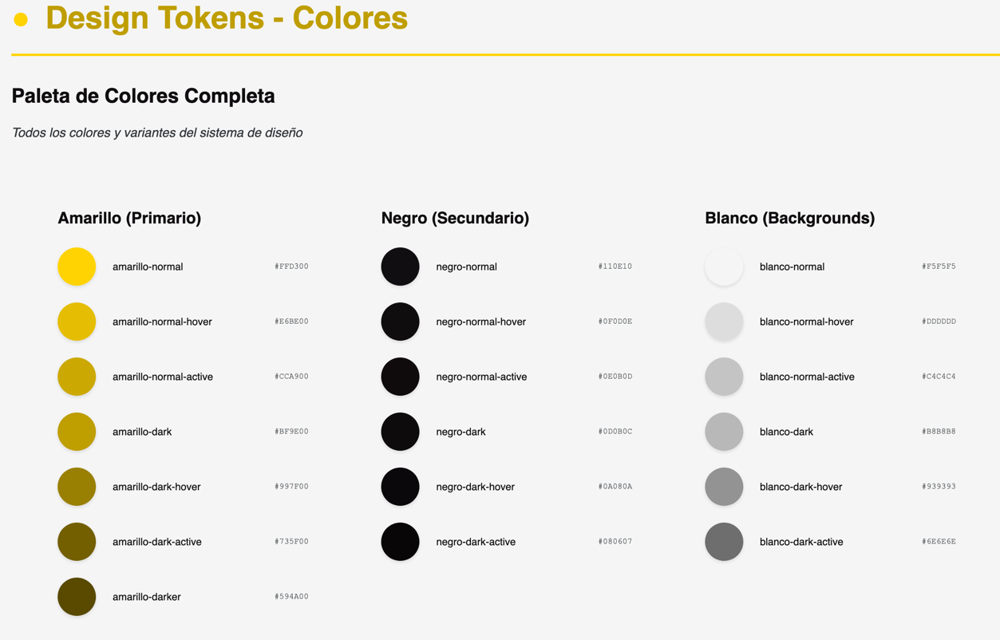
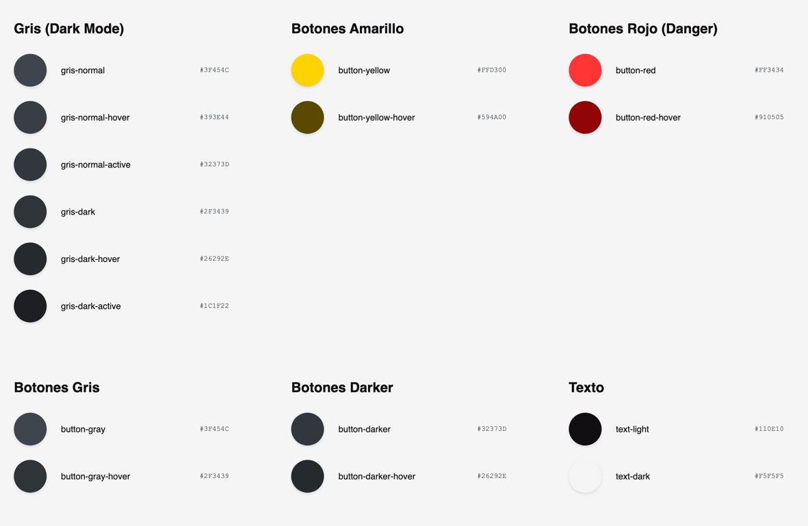
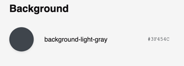

---

**Escala tipográfica**

A continuación se muestra la escala tipográfica utilizada en la web con ejemplos visuales de cada tamaño de fuente y su uso recomendado (h1, h2, párrafos, etc.). También aparece el nombre de la variable CSS asociada a cada tamaño, desde `--font-size-xs (0.64rem)` hasta `--font-size-5xl (3.815rem)`.

La escala tipográfica sigue un ratio de 1.25x (Major Third) y está definida en `cofira/src/styles/00-settings/_css-variables.scss`. Las familias tipográficas que uso son Montserrat para textos (`--font-primary`) y Poppins para títulos (`--font-secondary`).

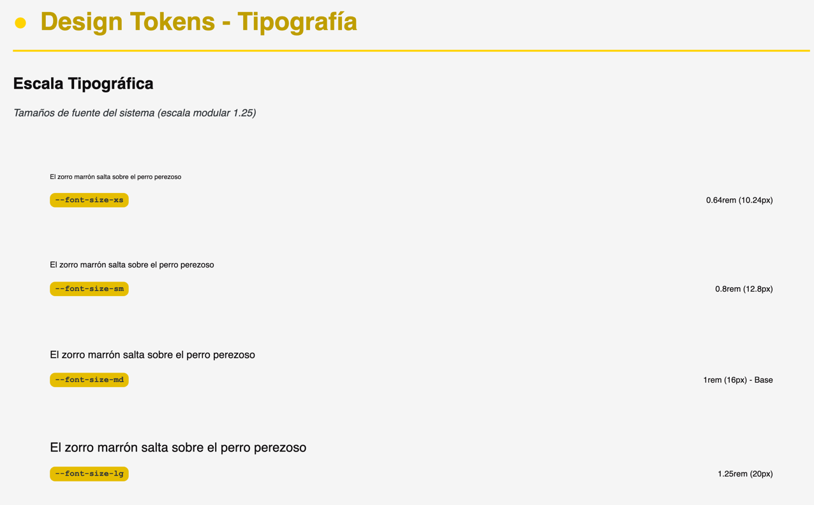
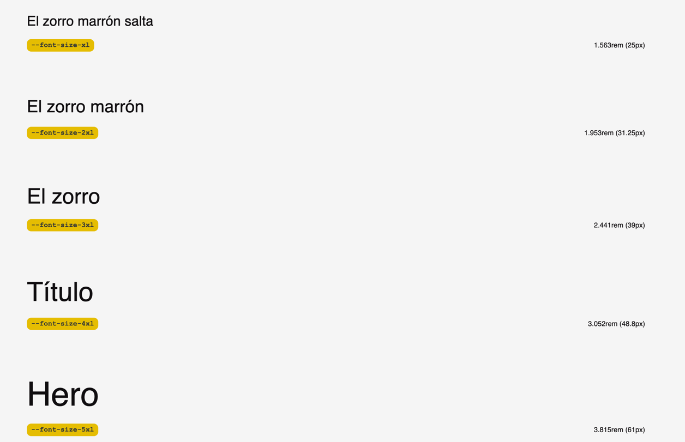

---

**Pesos tipográficos**

A continuación se muestran los diferentes pesos de la tipografía usados en la web con ejemplos visuales de cada peso (light, regular, medium, semibold, bold) y el nombre de la variable CSS asociada. Los pesos altos los uso para los títulos y los pesos medios para los párrafos y textos secundarios.

Los pesos están definidos en `cofira/src/styles/00-settings/_css-variables.scss` y van desde `--font-weight-light (300)` hasta `--font-weight-bold (700)`.

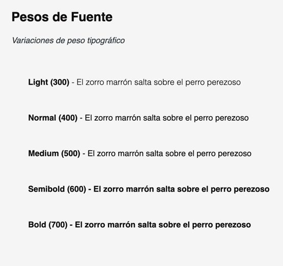

---

**Escala de espaciados**

En esta parte se muestra la escala de espaciados utilizada en la web con ejemplos visuales de cada tamaño de espaciado (xss, xs, s, m, l, xl, xxl, etc.) y el nombre de la variable CSS asociada. Estos espaciados los uso para márgenes y paddings en los diferentes componentes para mantener la consistencia visual en toda la aplicación.

La escala de espaciados está definida en `cofira/src/styles/00-settings/_css-variables.scss` y va desde `--spacing-size-xss (0.5rem)` hasta `--spacing-size-xxxxxl (8.75rem)`.

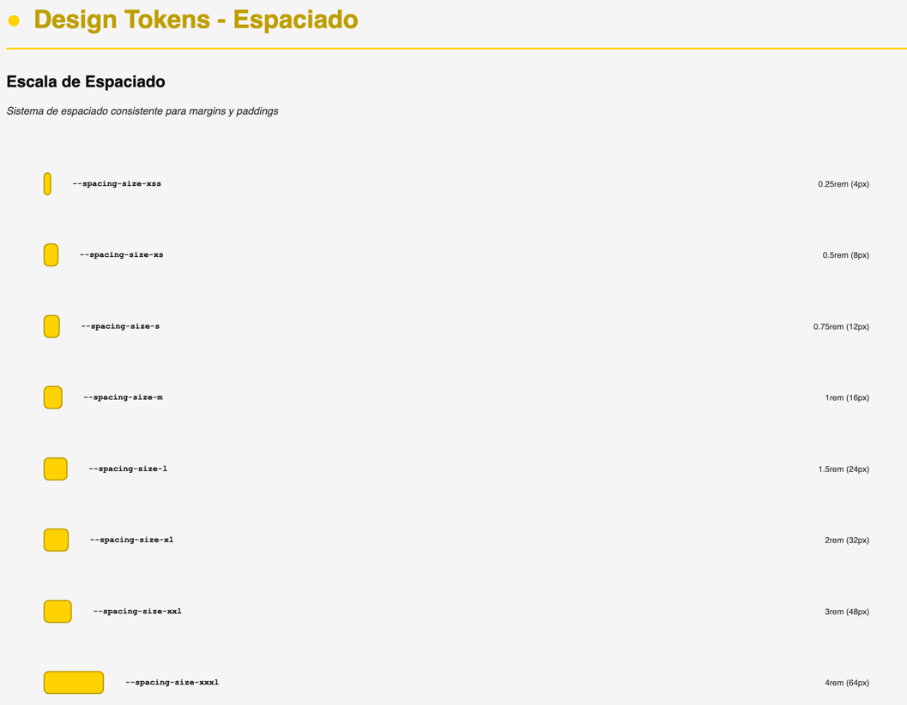

---

**Animaciones y border radius**

Aquí se muestra la duración de las animaciones usadas en la web con ejemplos visuales de cada duración (fast, base, slow, slower) y el nombre de la variable CSS asociada. Estas duraciones las uso para transiciones y animaciones en los componentes para mejorar la experiencia de usuario.

También se muestra el border radius usado en la web con ejemplos visuales de cada tamaño (xss, xs, s, m, l) y el nombre de la variable CSS asociada. Estos border radius los uso para redondear los bordes de los componentes y darles un aspecto más amigable.

Las duraciones y los border radius están definidos en `cofira/src/styles/00-settings/_css-variables.scss`.

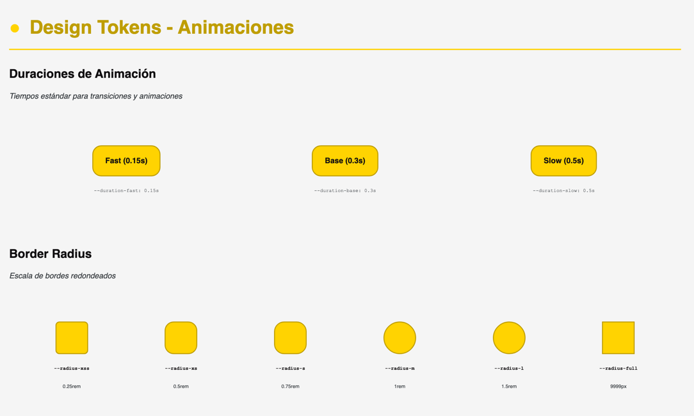

---

**Componentes Header y Footer**

A continuación se muestra el componente header y footer que sirven para ser reutilizables en las páginas de la web y mantener la consistencia visual. El header contiene el logo, el menú de navegación y el buscador, mientras que el footer contiene los enlaces a las redes sociales y la información legal.

El header está implementado en `cofira/src/app/components/layaout/header/header.ts`, `cofira/src/app/components/layaout/header/header.html` y `cofira/src/app/components/layaout/header/header.scss`. El footer está implementado en `cofira/src/app/components/layaout/footer/footer.ts`, `cofira/src/app/components/layaout/footer/footer.html` y `cofira/src/app/components/layaout/footer/footer.scss`.

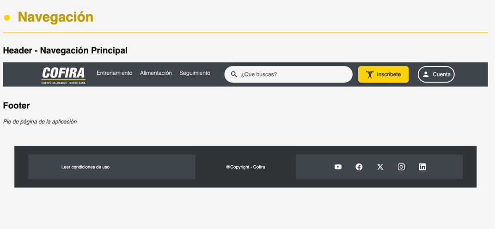

---

**Componente Button**

A continuación se muestra el componente button que sirve para crear botones reutilizables en la web con diferentes variantes (primary, secondary, ghost, danger) y tamaños (sm, md, lg). Estos botones los uso en diferentes partes de la web para acciones como inscribirse, enviar formularios o cancelar acciones.

El componente está implementado en `cofira/src/app/components/shared/button/button.ts`, `cofira/src/app/components/shared/button/button.html` y `cofira/src/app/components/shared/button/button.scss`. Acepta las propiedades `variante`, `tamanio`, `habilitado` y `tipo`.

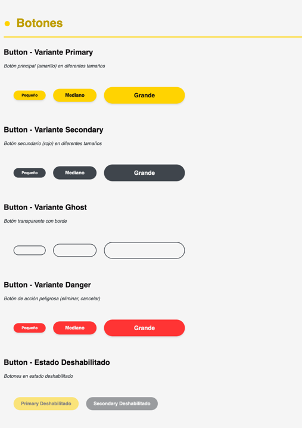

---

**Componente Card**

A continuación se muestra el componente card que sirve para mostrar información de los planes de suscripción de forma visual y atractiva. Estas cards tienen diferentes variantes (planes, info) y tamaños (sm, md, lg) y las uso para mostrar los diferentes planes de pago con sus ventajas y precios.

El componente está implementado en `cofira/src/app/components/shared/card/card.ts`, `cofira/src/app/components/shared/card/card.html` y `cofira/src/app/components/shared/card/card.scss`. Acepta las propiedades `title`, `ventajas`, `texto_boton`, `precio`, `variante`, `tamanio` y `deshabilitada`.

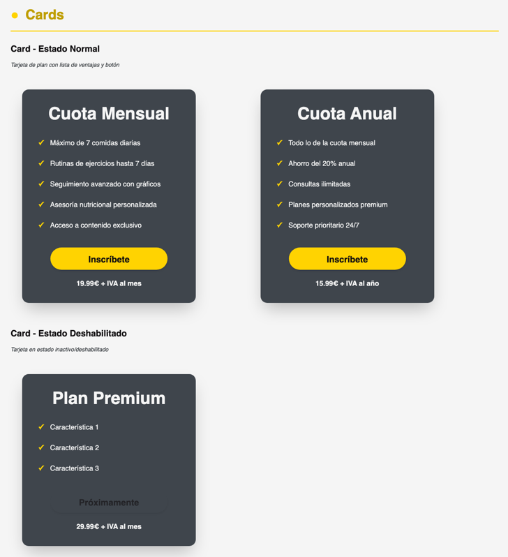

---

**Componente Input**

A continuación se muestra el componente input que sirve para crear campos de entrada reutilizables en los formularios de la web. Estos inputs incluyen la etiqueta, el input y los mensajes de error/ayuda todo en uno. Los uso en diferentes formularios para recoger datos del usuario como nombre, email o contraseña.

El componente está implementado en `cofira/src/app/components/shared/form-input/form-input.ts`, `cofira/src/app/components/shared/form-input/form-input.html` y `cofira/src/app/components/shared/form-input/form-input.scss`. Acepta las propiedades `label`, `name`, `type`, `placeholder`, `required`, `errorMessage`, `helpText` y `control`.

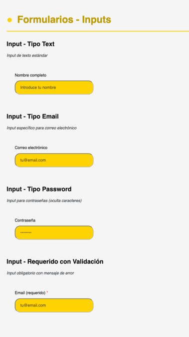

---

**Componente Textarea**

A continuación se muestra el componente textarea que sirve para crear áreas de texto reutilizables en los formularios de la web. Estos textareas incluyen la etiqueta, el área de texto y los mensajes de error/ayuda todo en uno. Los uso en formularios donde se necesita que el usuario introduzca textos más largos como descripciones o mensajes.

El componente está implementado en `cofira/src/app/components/shared/form-textarea/form-textarea.ts`, `cofira/src/app/components/shared/form-textarea/form-textarea.html` y `cofira/src/app/components/shared/form-textarea/form-textarea.scss`.

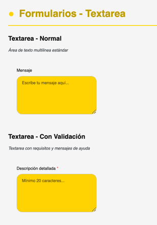

---

**Componente Select**

A continuación se muestra el componente select que sirve para crear selectores desplegables reutilizables en los formularios de la web. Estos selects permiten al usuario elegir entre opciones predefinidas y los uso en formularios para seleccionar objetivos de entrenamiento, días de ejercicio, etc.

El componente está implementado en `cofira/src/app/components/shared/form-select/form-select.ts`, `cofira/src/app/components/shared/form-select/form-select.html` y `cofira/src/app/components/shared/form-select/form-select.scss`. Acepta la propiedad `options` que es un array de strings con las opciones disponibles.

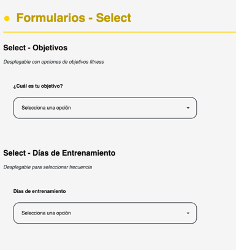

---

**Componente Checkbox**

A continuación se muestra el componente checkbox que sirve para crear casillas de verificación reutilizables en los formularios de la web. Estos checkboxes incluyen la etiqueta asociada y los uso en formularios para aceptar términos y condiciones, suscripciones a newsletters, etc.

El componente está implementado en `cofira/src/app/components/shared/form-checkbox/form-checkbox.ts`, `cofira/src/app/components/shared/form-checkbox/form-checkbox.html` y `cofira/src/app/components/shared/form-checkbox/form-checkbox.scss`.

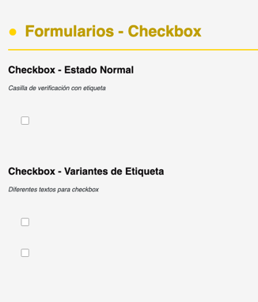

---

**Formularios de Contacto y Registro**

A continuación se muestran los componentes de contacto y registro que sirven para proporcionar formularios completos de contacto y registro de usuarios. Estos formularios incluyen todos los campos necesarios con sus respectivas validaciones y los uso para que los usuarios puedan comunicarse con nosotros o registrarse en la aplicación.

El formulario de contacto está implementado en `cofira/src/app/components/shared/form-contact/form-contact.ts` y el de registro en `cofira/src/app/components/shared/form-register/form-register.ts`. Ambos usan Reactive Forms de Angular con validaciones como `Validators.required`, `Validators.email` y `Validators.minLength`.

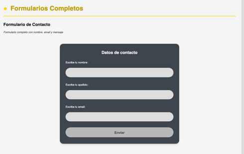

---

**Componentes Alert y Notification**

A continuación se muestran los componentes alerta y notificación que sirven para mostrar mensajes de alerta y notificaciones temporales al usuario. Estos componentes tienen diferentes variantes (success, error, warning, info) y los uso para comunicar al usuario diferentes tipos de mensajes como éxitos, errores, advertencias o información general.

La alerta está implementada en `cofira/src/app/components/shared/alert/alert.ts`, `cofira/src/app/components/shared/alert/alert.html` y `cofira/src/app/components/shared/alert/alert.scss`. Acepta las propiedades `type`, `message` y `closable`.

La notificación está implementada en `cofira/src/app/components/shared/notification/notification.ts` y `cofira/src/app/components/shared/notification/notification.scss`. Acepta las propiedades `type`, `message`, `duration` y `closable`, y tiene un evento `onClose` que se emite cuando la notificación se cierra.

En el Style Guide he añadido botones de demostración para probar las notificaciones de forma interactiva, la lógica está en `cofira/src/app/pages/style-guide/style-guide.ts` donde implemento el método `mostrarNotificacion()` que añade notificaciones al array y las muestra en pantalla.

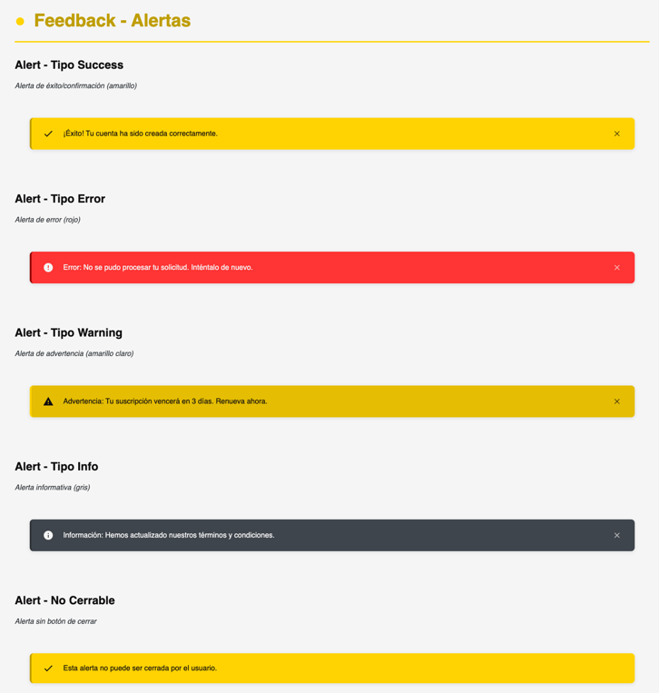
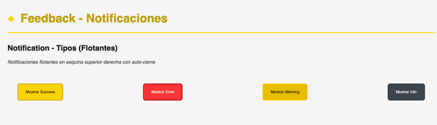

---

# Sección 4: Responsive Design

## 4.1 Breakpoints definidos

He definido 6 breakpoints principales para adaptar la aplicación a diferentes tamaños de pantalla. Estos breakpoints están definidos como variables SCSS en el archivo `cofira/src/styles/00-settings/_css-variables.scss` porque las media queries no soportan CSS Custom Properties.

**Breakpoints del proyecto:**

| Nombre            | Valor            | Dispositivo objetivo               |
| ----------------- | ---------------- | ---------------------------------- |
| `$breakpoint-xs`  | 40rem (640px)    | Móviles pequeños                   |
| `$breakpoint-sm`  | 48rem (768px)    | Móviles grandes / Tablets pequeñas |
| `$breakpoint-md`  | 56.25rem (900px) | Tablets                            |
| `$breakpoint-lg`  | 64rem (1024px)   | Tablets grandes / Laptops pequeños |
| `$breakpoint-xl`  | 75rem (1200px)   | Laptops                            |
| `$breakpoint-xxl` | 87.5rem (1400px) | Escritorios grandes                |

**Código de los breakpoints:**

```scss
// Archivo: cofira/src/styles/00-settings/_css-variables.scss

$breakpoint-xs: 40rem; // 640px - Móviles pequeños
$breakpoint-sm: 48rem; // 768px - Móviles grandes / Tablets pequeñas
$breakpoint-md: 56.25rem; // 900px - Tablets
$breakpoint-lg: 64rem; // 1024px - Tablets grandes / Laptops pequeños
$breakpoint-xl: 75rem; // 1200px - Laptops
$breakpoint-xxl: 87.5rem; // 1400px - Escritorios grandes
```

**¿Por qué elegí estos valores?**

- **640px (xs):** Es el ancho máximo de la mayoría de móviles pequeños y era un punto de ruptura en el que muchos componentes se solapaban.
- **768px (sm):** Es el punto donde la mayoría de tablets empiezan a tener suficiente espacio para mostrar más contenido.
- **900px (md):** Es mi breakpoint principal para tablets en horizontal, donde empiezo a usar layouts de 2 columnas para algunos componentes como cards.
- **1024px (lg):** Es donde la navegación de desktop empieza a tener sentido, aquí oculto el menú hamburguesa.
- **1200px (xl):** Es el ancho estándar de laptops, aquí aprovecho para mostrar más contenido lateral.
- **1400px (xxl):** Para monitores grandes, evito que el contenido se estire demasiado.

He usado estos breakpoints porque son los más comunes entre dispositivos y permiten que el diseño sea responsive en la mayoría de dispositivos y me permite ir ajustando el diseño de forma progresiva y fluida.

---

## 4.2 Estrategia responsive

He usado la estrategia **desktop-first** en mi proyecto. Esto significa que primero defino los estilos para pantallas grandes (desktop) y luego uso media queries con `max-width` para ir reduciendo y adaptando el diseño a pantallas más pequeñas.

**¿Por qué elegí desktop-first?**

1. **El diseño inicial fue pensado para desktop:** Cuando empecé el proyecto, diseñé primero la versión de escritorio porque era más fácil visualizar todos los elementos y luego ir simplificando para móvil.

2. **Facilidad para ocultar elementos:** Con desktop-first es más natural ir ocultando o simplificando elementos a medida que la pantalla se hace más pequeña, en vez de ir añadiéndolos.

3. **Mejor control del layout:** Me resulta más intuitivo pensar "en móvil esto debe ser más pequeño/simple y debe de ir en columnas" que "en desktop esto debe ser más grande/complejo y tengo que pensar las cuadriculas y los grid".

**Mixins responsive que he creado:**

He creado dos mixins en `cofira/src/styles/01-tools/_mixins.scss` para facilitar el uso de media queries:

```scss
// Archivo: cofira/src/styles/01-tools/_mixins.scss

// Mixin para media queries responsive (desktop-first: max-width)
// Este es el mixin principal que uso en todo el proyecto
@mixin responsive-down($breakpoint) {
  @if $breakpoint == "xs" {
    @media (max-width: $breakpoint-xs) {
      @content;
    }
  } @else if $breakpoint == "sm" {
    @media (max-width: $breakpoint-sm) {
      @content;
    }
  } @else if $breakpoint == "md" {
    @media (max-width: $breakpoint-md) {
      @content;
    }
  } @else if $breakpoint == "lg" {
    @media (max-width: $breakpoint-lg) {
      @content;
    }
  } @else if $breakpoint == "xl" {
    @media (max-width: $breakpoint-xl) {
      @content;
    }
  } @else if $breakpoint == "xxl" {
    @media (max-width: $breakpoint-xxl) {
      @content;
    }
  }
}
```

**Ejemplo de uso en un componente real:**

```scss
// Archivo: cofira/src/app/pages/gimnasio/gimnasio.scss

.gimnasio {
  // Estilos base para desktop
  @include flex-columna(var(--spacing-size-xxl));
  align-items: center;
  width: 100%;
  padding: var(--spacing-size-xxxl) 0;

  // Adaptación para tablets y móviles (900px o menos)
  @include responsive-down("md") {
    gap: var(--spacing-size-l);
    padding: var(--spacing-size-xl) var(--spacing-size-m);
  }
}

.gimnasio__titulo {
  @include titulo-seccion(var(--negro-normal), var(--font-size-4xl), 0);

  // Tablets grandes (1024px o menos)
  @include responsive-down("lg") {
    font-size: var(--font-size-3xl);
  }

  // Tablets y móviles (900px o menos)
  @include responsive-down("md") {
    font-size: var(--font-size-2xl);
  }
}
```

Como se puede ver, primero defino los estilos para desktop y luego voy reduciendo tamaños y espaciados para pantallas más pequeñas.

---

## 4.3 Container Queries

He implementado Container Queries en el componente de **pricing cards** para que las tarjetas se adapten al espacio disponible en su contenedor, no al viewport. Esto hace que las cards sean verdaderamente reutilizables y se adapten automáticamente cuando las pongo en diferentes contextos.

**¿Qué son las container queries?**

Las container queries permiten aplicar estilos a un elemento basándose en el tamaño de su contenedor padre en lugar del viewport. Esto es muy útil cuando tienes componentes que quieres que se vayan adaptando según el espacio que tengan disponible y además mejoras la velocidad de carga, ya que puedes cargar imágenes más pequeñas en contenedores pequeños.

**¿Por qué las usé en las pricing cards?**

Las pricing cards se muestran en la página home dentro de un grid de 3 columnas en desktop, pero en tablet pasan a 2 columnas y en móvil a 1 columna. Con container queries puedo hacer que la card adapte su tipografía y espaciado según el ancho que tenga disponible, sin importar en qué página o contexto esté. El motivo principal de usar el container queries era hacer que fuera responsive tanto para desktop, tablet y móvil, como para diferentes tamaños de contenedores en otras páginas.

**Implementación en el componente Card:**

```scss
// Archivo: cofira/src/app/components/shared/card/card.scss

.pricing-card {
  display: flex;
  flex-direction: column;
  align-items: center;
  width: 100%;
  max-width: 28.125rem;
  padding: var(--spacing-size-xxl) var(--spacing-size-m);
  text-align: center;
  background: var(--gris-normal);
  border-radius: var(--radius-xs);
  box-shadow: var(--shadow-xl);

  // Habilitar Container Queries en este componente
  container-type: inline-size;
  container-name: pricing-card;
}
```

**Implementación en la página Home:**

```scss
// Archivo: cofira/src/app/pages/home/home.scss

// Wrapper que habilita Container Queries para las pricing-cards
.home__card-wrapper {
  width: 100%;
  max-width: 28rem;

  // Habilitar Container Queries
  container-type: inline-size;
  container-name: card-container;

  @include responsive-down("md") {
    max-width: 100%;
    justify-self: center;
  }
}

// Container Query: Card compacta (contenedor menor a 640px)
@container card-container (max-width: 640px) {
  .pricing-card__titulo {
    margin-bottom: var(--spacing-size-l);
    font-size: var(--font-size-2xl);
  }

  .pricing-card__ventaja {
    font-size: var(--font-size-base);
  }

  .pricing-card__precio {
    font-size: var(--font-size-base);
  }

  .pricing-card__lista {
    margin-bottom: var(--spacing-size-l);
  }
}

// Container Query: Card expandida (contenedor mayor a 400px)
@container card-container (min-width: 400px) {
  .pricing-card__titulo {
    font-size: var(--font-size-5xl);
  }

  .pricing-card__ventaja {
    font-size: var(--font-size-xl);
  }

  .pricing-card__precio {
    font-size: var(--font-size-xl);
  }

  .pricing-card__lista {
    gap: var(--spacing-size-m);
  }
}
```

---

## 4.4 Adaptaciones principales

A continuación muestro cómo se adaptan las principales secciones de la aplicación en los tres breakpoints principales:

**Tabla de adaptaciones:**

| Componente/Sección          | Mobile (375px)                     | Tablet (768px)                            | Desktop (1280px)                    |
| --------------------------- | ---------------------------------- | ----------------------------------------- | ----------------------------------- |
| **Header**                  | Menú hamburguesa, logo reducido    | Menú hamburguesa, logo normal             | Navegación completa horizontal      |
| **Intro(Home)**             | Texto centrado, botones en columna | Texto alineado izquierda, botones en fila | Layout completo con imagen de fondo |
| **Sección Planes**          | Cards en 1 columna, apiladas       | Cards en 2 columnas centradas             | Grid de 3 columnas con info lateral |
| **Funcionalidades**         | Grid de 1 columna                  | Grid de 2 columnas                        | Grid auto-fit (3-4 columnas)        |
| **FAQ**                     | Padding reducido, tipografía menor | Padding medio                             | Padding amplio, max-width 800px     |
| **Footer**                  | Enlaces en columna, centrado       | Enlaces en 2 columnas                     | Enlaces en fila horizontal          |
| **Gimnasio**                | Tabla con scroll horizontal        | Tabla adaptada                            | Tabla completa                      |
| **Formularios de registro** | Formularios a ancho completo       | Formularios centrados                     | Formularios con max-width           |

**Ejemplo de adaptación del Header:**

```scss
// Archivo: cofira/src/app/components/layout/header/header.scss

.header {
  position: fixed;
  display: flex;
  align-items: center;
  justify-content: space-between;
  height: 4.5rem;
  padding: 0 6rem;

  // Laptop (1200px o menos)
  @include responsive-down("xl") {
    padding: 0 3rem;
  }

  // Tablet grande (1024px o menos)
  @include responsive-down("lg") {
    padding: 0 2rem;
  }

  // Tablet/Móvil (900px o menos)
  @include responsive-down("md") {
    height: 4rem;
    padding: 0 1.5rem;
  }
}

// Navegación desktop: se oculta en móvil
.header__nav--desktop {
  @include responsive-down("md") {
    display: none;
  }
}

// Botones de acción desktop: se ocultan en móvil
.header__actions--desktop {
  @include responsive-down("md") {
    display: none;
  }
}

// Hamburguesa: solo visible en móvil
.header__hamburguesa {
  display: none;

  @include responsive-down("md") {
    display: flex;
  }
}
```

**Ejemplo de adaptación de la cabecera:**

Cabecera en desktop:
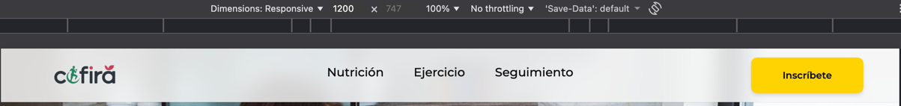

Cabecera en tablet:
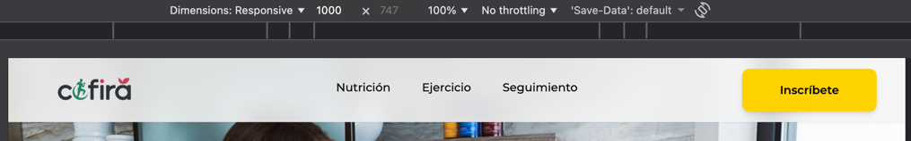

Cabecera en móvil:
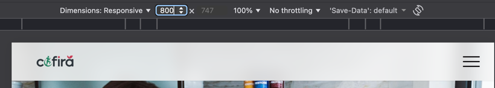

Podemos apreciar como la cabecera va adapántando distintos tamaños tanto de texto como de padding para adaptarse al dispositivo permitiendo que el contenido se pueda visualizar bien y sin ser molestado por otros elementos.

---

## 4.5 Páginas implementadas

# Sección 1: Arquitectura CSS y Comunicación Visual

## 1.1 Principios de Comunicación Visual

### 1. Jerarquía: Tamaños, Pesos y Espaciado para Crear Importancia Visual

**Estrategia:**

- **Agrupación de contenido similar:** Uso espaciados reducidos entre elementos relacionados
- **Elementos destacados:** Tamaño mayor y peso de fuente más grueso
- **Colores llamativos:** Para elementos importantes que necesitan resaltar
- **Espaciado generoso:** Alrededor de elementos importantes para aumentar su visibilidad
- **Elementos secundarios:** Tamaño menor, peso de fuente delgado y colores neutros

**Ejemplos de implementación:**

_Botón de acción principal:_

- Color amarillo brillante para máximo contraste
- Jerarquía visual: Botón → Imagen → Título

Ejemplo:


_Cabecera de navegación:_

- Colores consistentes en elementos de navegación
- Botón "Inscríbete" en color destacado para llamar la atención

Ejemplo:


_Separación entre secciones:_

- Espaciado amplio entre secciones principales
- Cambio de fondo para delimitar áreas
- Títulos grandes para marcar inicio de nueva sección
- Espaciado y colores consistentes en elementos relacionados (cards de pago)

Ejemplo:


---

### 2. Contraste: Color, Tamaño y Peso para Diferenciar Elementos

**Estrategia:**

- **Colores:** Diferenciación entre elementos importantes (amarillo brillante) y secundarios (neutros)
- **Tamaño y peso:** Mayor tamaño y negrita para títulos y elementos destacados
- **Jerarquía de información:** Títulos principales → Elementos secundarios → Contenido relacionado

**Ejemplos de implementación:**

_Formulario:_

- Coherencia visual en campos de entrada
- Botón "Enviar" en amarillo para destacar la acción principal

Ejemplo:


_Organización de horarios:_

- **Título:** Elemento más grande y con mayor peso
- **Días (Lunes, Miércoles):** Tamaño medio, peso moderado
- **Tabla de horarios:** Mismo tamaño, peso reducido (indica relación entre datos)


---

### 3. Alineación: Estrategia de Organización Visual

**Estrategia:**

- **Alineación centrada:** Como patrón principal para mayor claridad
- **Organización del contenido:** Distribución equilibrada de la información
- **Márgenes adecuados:** Para evitar saturación visual

**Ejemplos de implementación:**

Ejemplos:


---

### 4. Proximidad: Agrupación de Elementos Relacionados

**Estrategia:**

- **Espaciado reducido:** Entre elementos con relación directa
- **Orden visual:** Permite identificar grupos sin necesidad de leer títulos
- **Jerarquía de separación:** Mayor distancia entre categorías principales

**Ejemplos de implementación:**

_Menú diario:_

- Separación mínima entre alimentos de la misma comida
- Mayor separación entre diferentes comidas del día
- Agrupación visual clara sin necesidad de indicadores adicionales

Ejemplo:


---

### 5. Repetición: Creación de Coherencia Visual

**Estrategia:**

- **Consistencia en botones:** Mismos colores, animaciones y tamaños de fuente
- **Estilos uniformes:** Colores, espaciados y tamaños consistentes en secciones similares
- **Iconografía coherente:** Mismo estilo de iconos para acciones relacionadas
- **Familiaridad:** Patrones repetitivos que facilitan la navegación

**Ejemplos de implementación:**
_Páginas de configuración:_

- Colores, espaciados y tamaños consistentes
- Iconos con estilo uniforme para acciones similares

Ejemplos:


### 1.2 Metodología CSS Explica qué metodología usas (BEM recomendado) y por qué. Muestra ejemplos de tu nomenclatura. Si usas BEM, explica que usarás bloques (.card), elementos (.card\_\_title), y modificadores (.card--featured).

He usado la metología BEM porque me permite organizar el código por componentes, además de permitirme reutilizar estilos
en diferentes partes sin tener problemas de especificidad. El principal mótivo por lo que lo he usado es por la especifidad ya que al estar trabajando con componentes
muchas veces voy a tener estilos repetidos y con BEM puedo usar los estilos ya creados sin tener que preocuparme por que
se repita esta
clase.

Ejemplos de nomenclatura BEM usada en el proyecto:

```css
/* BLOQUE: Contenedor principal del componente */

.button {
}
.alert {
}
.pricing-card {
}
.menu-movil {
}

/* ELEMENTO: Parte interna del bloque (usa __) */

.button__icono {
}
.button__texto {
}
.alert__mensaje {
}
.alert__cerrar {
}
.pricing-card__titulo {
}
.pricing-card__lista {
}
.pricing-card__boton {
}
.menu-movil__contenido {
}
.menu-movil__link {
}

/* MODIFICADOR: Variante del bloque/elemento (usa --) */

.button--primary {
}
.button--secondary {
}
.button--danger {
}
.button--sm {
}
.button--lg {
}
.alert--success {
}
.alert--error {
}
.pricing-card--planes {
}
.menu-movil--abierto {
}
```

### 1.3 Organización de archivos: Documenta tu estructura ITCSS. Explica por qué cada carpeta está en ese orden (de menor a mayor especificidad). Muestra el árbol de carpetas completo.

#### Árbol de carpetas completo

```
styles/
├── 00-settings/
│   ├── _css-variables.scss
│   └── _variables.scss
├── 01-tools/
│   └── _mixins.scss
├── 02-generic/
│   └── _reset.scss
├── 03-elements/
│   ├── _buttons.scss
│   ├── _elements.scss
│   ├── _forms.scss
│   ├── _links.scss
│   ├── _lists.scss
│   └── _typography.scss
├── 04-layout/
│   ├── _grid.scss
│   └── _layaout.scss
├── 05-components/
│   ├── _alerta.scss
│   ├── _boton.scss
│   ├── _formulario.scss
│   ├── _inputs.scss
│   ├── _navegacion.scss
│   └── _tarjeta.scss
├── 06-utilities/
│   └── _utilities.scss
├── 07-dark-mode/
│   ├── _dark-mode-config.scss
│   └── _dark-mode.scss
```

### Explicación del orden (de menor a mayor especificidad)

**00-settings/** Variables y configuraciones globales

- **Especificidad:** No tiene ya que es a nivel global.
- **Propósito:** Define variables de colores, tamaños, espaciados, tiempos de animación y tipografías.
- **Ejemplo:** `--radius-xss`, `--spacing-size-xs`

**01-tools/** - Mixins y funciones

- **Especificidad:** No tiene especifidad ya que es a nivel global.
- **Propósito:** Herramientas reutilizables para generar CSS pre hechos.
- **Ejemplo:** Mixins para responsive, flexbox, animaciones...

**02-generic/** - Reset y normalización

- **Especificidad:** No tiene especifidad ya que el funcionamiento de este es para resetear los elementos por defecto.
- **Propósito:** Resetear estilos por defecto del navegador.
- **Ejemplo:** `* { margin: 0; padding: 0; }`

**03-elements/** - Estilos base de elementos HTML en caso de que no le demos estilos.

- **Especificidad:** No tiene especididad.
- **Propósito:** Estilos generales para etiquetas HTML sin clases para darles un estilo base.
- **Ejemplo:** `a`, `h1`, `p`, `button`

**04-layout/** - Estructura y distribución

- **Especificidad:** Si tiene especifidad pero tampoco tanta ya que son clases generales.
- **Propósito:** Grid, flex, contenedores principales su proposito es ser reutilizables para cualquier componente.
- **Ejemplo:** `.grid__cols__2`, `.flex__basico`

**05-components/** - Componentes específicos

- **Especificidad:** Si son específicos ya que son componentes concretos.
- **Propósito:** Estilos de componentes reutilizables
- **Ejemplo:** Inputs, cards, botones

**06-utilities/** - Clases unitarias

- **Especificidad:** Muy alta ya que aqui definiremos los componentes de forma individual.
- **Propósito:** Clases de una sola responsabilidad que sobrescriben otros estilos.
- **Ejemplo:** `.text-center`, `.m-2`, `.hidden`

**07-dark-mode/** - Dark mode

- **Especificidad:** Muy alta ya que aqui definiremos los componentes de forma individual para el dark mode.
- **Propósito:** Permitir cambiar los estilos de toda la web al modo oscuro, de una forma mucho más centralizada y ordenada en vez de tener todas estas clases en un mismo fichero junto con los estilos del modo claro.
- **Ejemplo:** `.app-header .menu-cuenta`, `.app-header .menu-cuenta__item`, `.typography-item`

Esta estructura sigue el principio ITCSS de "cascada invertida", donde los estilos van de lo más genérico y reutilizable
a lo más específico y concreto, evitando problemas de especificidad y facilitando el mantenimiento del código.

### 1.4 Sistema de Design Tokens: Documenta todas tus variables. Para cada grupo (colores, tipografía, espaciado, etc.) explica las decisiones:

- Por qué elegiste esos colores

  - Elegí esos colores porque quería usar una paleta que comunicara energía y positividad además de esfuerzo y
    dedicación, por eso usé el amarillo brillante como color principal. Además de que el amarillo es un color que
    llama mucho la atención y es perfecto para botones de llamada a la acción. Los colores neutros los elegí para que
    no compitieran con el amarillo y dejaran que este resaltara más.

  ```css
  /* ============================================
     COLORES - NEGRO
     ============================================ */

  /* Negro - Estados Normal) */
  --negro-normal: #110e10; /* Color secundario */
  --negro-normal-hover: #0f0d0e;
  --negro-normal-active: #0e0b0d;

  /* Negro - Estados Dark */
  --negro-dark: #0d0b0c;
  --negro-dark-hover: #0a080a;
  --negro-dark-active: #080607; /* FONDO */

  /* ============================================
     COLORES - AMARILLO
     ============================================ */

  /* Amarillo - Estados Normal */
  --amarillo-normal: #ffd300; /*  COLOR PRIMARIO */
  --amarillo-normal-hover: #e6be00;
  --amarillo-normal-active: #cca900;

  /* Amarillo - Estados Dark */
  --amarillo-dark: #bf9e00;
  --amarillo-dark-hover: #997f00;
  --amarillo-dark-active: #735f00;

  /* ============================================
     COLORES - BLANCO
     ============================================ */

  /* Blanco - Estados Normal */
  --blanco-normal: #f5f5f5; /* Color secundario // BACKGROUND CARD */
  --blanco-normal-hover: #dddddd; /* FONDO */
  --blanco-normal-active: #c4c4c4; /* Color secundario // BACKGROuND CARD INDIVIDUAL */

  /* Blanco - Estados Dark*/
  --blanco-dark: #b8b8b8;
  --blanco-dark-hover: #939393;
  --blanco-dark-active: #6e6e6e;

  /* ============================================
     COLORES - GRIS
     ============================================ */

  /* Gris - Estados Normal */
  --gris-normal: #3f454c; /* COLOR PRIMARIO DEL DARK MODE */
  --gris-normal-hover: #393e44;
  --gris-normal-active: #32373d; /* BACKGROUND CARD INDIVIDUAL */

  /* Gris - Estados Dark */
  --gris-dark: #2f3439; /* BACKGROUND CARD DARK MODE */
  --gris-dark-hover: #26292e;
  --gris-dark-active: #1c1f22;

  /*Textos*/
  --text-light: #110e10;
  --text-dark: #f5f5f5;

  /*Background gris transparente*/
  --background-light-gray: #3f454c;

  /*Botones*/
  --button-red: #ff3434;
  --button-red-hover: #910505;

  --button-gray: #3f454c;
  --buton-gray-hover: #2f3439;

  --button-yellow: #ffd300;
  --button-yellow-hover: #594a00;

  --button-darker: #32373d;
  --button-darker-hover: #26292e;
  ```

- ¿Por qué esa escala tipográfica?

  - He usado esta escala de tipografía porque es una escala muy ajustable a cualquier diseño que quieras hacer además de que es la más usada en diseño
    web, ya que permite crear jerarquías visuales claras y consistentes.

  ```css
  /* Tamaños de la tipografía */
  --font-size-xs: 0.64rem; /* 10.24px */
  --font-size-sm: 0.8rem; /* 12.8px  */
  --font-size-md: 1rem; /* 16px */
  --font-size-lg: 1.25rem; /* 20px */
  --font-size-xl: 1.563rem; /* 25px */
  --font-size-2xl: 1.953rem; /* 31.25px */
  --font-size-3xl: 2.441rem; /* 39px  */
  --font-size-4xl: 3.052rem; /* 48.8px */
  --font-size-5xl: 3.815rem; /* 61px */
  ```

- ¿Por qué esos breakpoints?

  - He usado estos breakpoints porque son los más comunes entre dispositivos y permiten que el diseño sea responsive en la mayoría de dispositivos.

  ```css
  // Mobile Grande / Phablets
  $breakpoint-xs: 640px;

  // Tablets
  $breakpoint-s: 768px;

  // Desktop / Tablets (Landscape)
  $breakpoint-M: 1024px;

  // Desktop Grande
  $breakpoint-L: 1280px;
  ```

### 1.5 Mixins y funciones: Documenta cada mixin que creaste, para qué sirve, y muestra un ejemplo de uso.

Cree estos mixins para facilitar la creación de layouts flexibles y reutilizables en todo el proyecto.

```css
// Centrado perfecto (horizontal y vertical)
@mixin flex-center {

@mixin flex-center {
    display: flex;
    justify-content: center;
    align-items: center;
}

// Distribuir espacio entre elementos

@mixin flex-between {
    display: flex;
    justify-content: space-between;
    align-items: center;
}

// Tipografia para textos (p, span, etc)
// Usa --font-primary (Montserrat)
// Uso: @include tipografia-texto;
@mixin tipografia-texto {
    font-family: var(--font-primary);
    font-weight: var(--font-weight-regular);
    line-height: var(--line-height-normal);
}


// Mixin para labels de formulario

@mixin form-label {
    color: var(--blanco-normal);
    font-size: var(--font-size-md);
    font-weight: var(--font-weight-regular);
    font-family: var(--font-secondary);
    margin-bottom: var(--spacing-size-xss);
}

```

Ejemplo de uso:

```css
nav {
  @include flex-full;
  background: var(--gris-normal);
  height: 4.4rem;
  align-items: center;
  box-sizing: border-box;
  justify-content: space-between;
  padding: 0 6rem;
}
```

### 1.6 ViewEncapsulation en Angular: Explica qué estrategia de encapsulación usarás. Angular por defecto usa Emulated (estilos encapsulados por componente). Documenta si mantendrás esto o usarás None (estilos globales). Justifica tu decisión.

He usado la estrategia hibrida emulated, la mayoría de los componentes usa ViewEncapsulation.Emulated para mantener los
estilos encapsulados y evitar conflictos entre componentes. Sin embargo, para los estilos globales y utilidades he
optado por ViewEncapsulation.None para que estos estilos puedan ser aplicados en todo el proyecto sin restricciones.
Esta combinación me permite tener un control preciso sobre los estilos específicos de cada componente mientras mantengo
una base de estilos globales accesible para todos los componentes. Lo he hecho asín para que cada componente pueda tener
sus estilos protegidos sin tener problemas de especifidad, por la escalabilidad ya que de esta forma puedo reutilizar
estilos globales en muchas partes y agilizar el proceso y por que es mucho mas mantenible al tener los estilos globales en un solo lugar.

### 2.1 Elementos semánticos utilizados: Explica qué elementos semánticos usas y cuándo: header, nav, main, article, section, aside, footer. Muestra ejemplos de tu código.

Uso los siguientes elementos:

- header: Lo uso para declarar la cabecera por ejemplo aqui:

```html
<header>
  
  <ul class="enlaces">
    <li><a routerLink="/gimnasio">Entrenamiento</a></li>
    <li><a routerLink="/alimentacion">Alimentación</a></li>
    <li><a routerLink="/seguimiento">Seguimiento</a></li>
  </ul>
</header>
```

- nav: Lo uso para declarar el menú de navegación, por ejemplo aqui:

```html
<!-- Sección derecha: Redes sociales -->
<nav class="footer__right">
  <ul class="footer__social-list">
    <li class="footer__social-item">
      <a
        aria-label="YouTube"
        class="footer__social"
        href="https://youtube.com"
        rel="noopener"
        target="_blank"
      >
        <svg
          fill="currentColor"
          height="24"
          viewBox="0 0 24 24"
          width="24"
          xmlns="http://www.w3.org/2000/svg"
        >
          <path
            d="M23.498 6.186a3.016 3.016 0 0 0-2.122-2.136C19.505 3.545 12 3.545 12 3.545s-7.505 0-9.377.505A3.017 3.017 0 0 0 .502 6.186C0 8.07 0 12 0 12s0 3.93.502 5.814a3.016 3.016 0 0 0 2.122 2.136c1.871.505 9.376.505 9.376.505s7.505 0 9.377-.505a3.015 3.015 0 0 0 2.122-2.136C24 15.93 24 12 24 12s0-3.93-.502-5.814zM9.545 15.568V8.432L15.818 12l-6.273 3.568z"
          />
        </svg>
      </a>
    </li>

    <li class="footer__social-item">
      <a
        aria-label="Facebook"
        class="footer__social"
        href="https://facebook.com"
        rel="noopener"
        target="_blank"
      >
        <svg
          fill="currentColor"
          height="24"
          viewBox="0 0 24 24"
          width="24"
          xmlns="http://www.w3.org/2000/svg"
        >
          <path
            d="M24 12.073c0-6.627-5.373-12-12-12s-12 5.373-12 12c0 5.99 4.388 10.954 10.125 11.854v-8.385H7.078v-3.47h3.047V9.43c0-3.007 1.792-4.669 4.533-4.669 1.312 0 2.686.235 2.686.235v2.953H15.83c-1.491 0-1.956.925-1.956 1.874v2.25h3.328l-.532 3.47h-2.796v8.385C19.612 23.027 24 18.062 24 12.073z"
          />
        </svg>
      </a>
    </li>

    <li class="footer__social-item">
      <a
        aria-label="Twitter"
        class="footer__social"
        href="https://twitter.com"
        rel="noopener"
        target="_blank"
      >
        <svg
          fill="currentColor"
          height="24"
          viewBox="0 0 24 24"
          width="24"
          xmlns="http://www.w3.org/2000/svg"
        >
          <path
            d="M18.244 2.25h3.308l-7.227 8.26 8.502 11.24H16.17l-5.214-6.817L4.99 21.75H1.68l7.73-8.835L1.254 2.25H8.08l4.713 6.231zm-1.161 17.52h1.833L7.084 4.126H5.117z"
          />
        </svg>
      </a>
    </li>

    <li class="footer__social-item">
      <a
        aria-label="Instagram"
        class="footer__social"
        href="https://instagram.com"
        rel="noopener"
        target="_blank"
      >
        <svg
          fill="currentColor"
          height="24"
          viewBox="0 0 24 24"
          width="24"
          xmlns="http://www.w3.org/2000/svg"
        >
          <path
            d="M12 2.163c3.204 0 3.584.012 4.85.07 3.252.148 4.771 1.691 4.919 4.919.058 1.265.069 1.645.069 4.849 0 3.205-.012 3.584-.069 4.849-.149 3.225-1.664 4.771-4.919 4.919-1.266.058-1.644.07-4.85.07-3.204 0-3.584-.012-4.849-.07-3.26-.149-4.771-1.699-4.919-4.92-.058-1.265-.07-1.644-.07-4.849 0-3.204.013-3.583.07-4.849.149-3.227 1.664-4.771 4.919-4.919 1.266-.057 1.645-.069 4.849-.069zM12 0C8.741 0 8.333.014 7.053.072 2.695.272.273 2.69.073 7.052.014 8.333 0 8.741 0 12c0 3.259.014 3.668.072 4.948.2 4.358 2.618 6.78 6.98 6.98C8.333 23.986 8.741 24 12 24c3.259 0 3.668-.014 4.948-.072 4.354-.2 6.782-2.618 6.979-6.98.059-1.28.073-1.689.073-4.948 0-3.259-.014-3.667-.072-4.947-.196-4.354-2.617-6.78-6.979-6.98C15.668.014 15.259 0 12 0zm0 5.838a6.162 6.162 0 1 0 0 12.324 6.162 6.162 0 0 0 0-12.324zM12 16a4 4 0 1 1 0-8 4 4 0 0 1 0 8zm6.406-11.845a1.44 1.44 0 1 0 0 2.881 1.44 1.44 0 0 0 0-2.881z"
          />
        </svg>
      </a>
    </li>

    <li class="footer__social-item">
      <a
        aria-label="LinkedIn"
        class="footer__social"
        href="https://linkedin.com"
        rel="noopener"
        target="_blank"
      >
        <svg
          fill="currentColor"
          height="24"
          viewBox="0 0 24 24"
          width="24"
          xmlns="http://www.w3.org/2000/svg"
        >
          <path
            d="M20.447 20.452h-3.554v-5.569c0-1.328-.027-3.037-1.852-3.037-1.853 0-2.136 1.445-2.136 2.939v5.667H9.351V9h3.414v1.561h.046c.477-.9 1.637-1.85 3.37-1.85 3.601 0 4.267 2.37 4.267 5.455v6.286zM5.337 7.433c-1.144 0-2.063-.926-2.063-2.065 0-1.138.92-2.063 2.063-2.063 1.14 0 2.064.925 2.064 2.063 0 1.139-.925 2.065-2.064 2.065zm1.782 13.019H3.555V9h3.564v11.452zM22.225 0H1.771C.792 0 0 .774 0 1.729v20.542C0 23.227.792 24 1.771 24h20.451C23.2 24 24 23.227 24 22.271V1.729C24 .774 23.2 0 22.222 0h.003z"
          />
        </svg>
      </a>
    </li>
  </ul>
</nav>
```

- main: El main lo utilizo para indicar el contenido principal de la página web y lo indico unicamente en el index.html ya que luego con el router-outlet indico que ese contenido va a ser reemplazable por los componentes, de esta forma hago que la cabecera y pie de página nunca desaparezca y no tenga que estar usandola por cada página.

```html
<main class="main-content">
  <router-outlet></router-outlet>
</main>
```

- article: Este elemento lo utilizo para agrupar elementos semanticamente iguales, por ejemplo un grupo de cards o un grupo de enlaces. Por ejemplo un buscador:

```html
<article class="buscador">
  <svg
    class="buscador__icono"
    viewBox="0 0 24 24"
    xmlns="http://www.w3.org/2000/svg"
  >
    <path
      d="M9.5 3A6.5 6.5 0 0 1 16 9.5c0 1.61-.59 3.09-1.56 4.23l.27.27h.79l5 5l-1.5 1.5l-5-5v-.79l-.27-.27A6.52 6.52 0 0 1 9.5 16A6.5 6.5 0 0 1 3 9.5A6.5
  6.5 0 0 1 9.5 3m0 2C7 5 5 7 5 9.5S7 14 9.5 14S14 12 14 9.5S12 5 9.5 5"
      fill="currentColor"
    />
  </svg>
  <input class="buscador__input" placeholder="¿Que buscas?" type="text" />
</article>
```

- section: El section lo utilizo para cuando agrupar muchos grupos de elementos por ejemplo, un ejemplo podría ser los botones de la cabecera:

```html
<section class="cabecera__botones">
  <button class="boton_inscribete">
    <svg viewBox="0 0 512 512" xmlns="http://www.w3.org/2000/svg">
      <path
        d="m77.492 18.457l-17.726 3.127L69.09 74.47a1631 1631 0 0 0-15.8 2.54l-6.503-36.89l-17.726 3.124l6.49 36.795a1878 1878 0 0 0-17.196 3.112l3.292 17.696c5.728-1.066 11.397-2.09 17.028-3.084l7.056 40.02l17.727-3.124l-7.04-39.93q7.956-1.319 15.798-2.54l9.777 55.45l17.727-3.126l-9.697-54.99a1416 1416 0 0 1 25.18-3.38c15.54 46.39 34.697 99.995 66.936 134.448C190.86 250.992 192 268 214.56 310C192 348 176 412 167.21 471l-48 6v15H192c16-48 64-144 64-144s48 96 64 144h72.79v-15l-48-6C336 412 320 348 294 310c26-42 24.175-59.585 35.83-89.377c32.25-34.452 51.42-88.075 66.967-134.478c8.314 1.04 16.697 2.16 25.18 3.38l-9.696 54.99l17.728 3.124l9.777-55.45q7.843 1.221 15.8 2.54l-7.042 39.93l17.727 3.125l7.056-40.02c5.63.993 11.3 2.017 17.028 3.083l3.292-17.696c-5.78-1.075-11.507-2.11-17.195-3.113l6.49-36.796l-17.727-3.125l-6.504 36.89a1565 1565 0 0 0-15.8-2.54l9.324-52.886l-17.726-3.127l-9.406 53.35C365.982 63.31 310.982 59.04 256 59.04c-54.98 0-109.983 4.27-169.102 12.767zM256 76.98c35.53 0 71.07 1.83 107.822 5.463c-14.082 34.858-38.454 73.504-63.203 101.967C290.293 199.27 274.35 209 256 209s-34.294-9.73-44.62-24.59c-24.748-28.463-49.12-67.11-63.202-101.967c36.75-3.633 72.29-5.463 107.822-5.463M256 97c-20.835 0-39 20.24-39 47s18.165 47 39 47s39-20.24 39-47s-18.165-47-39-47"
        fill="currentColor"
      />
    </svg>

    <span>Inscribete</span>
  </button>

  <button class="boton__cuenta">
    <svg
      height="24"
      viewBox="0 0 24 24"
      width="24"
      xmlns="http://www.w3.org/2000/svg"
    >
      <path
        d="M12 4a4 4 0 0 1 4 4a4 4 0 0 1-4 4a4 4 0 0 1-4-4a4 4 0 0 1 4-4m0 10c4.42 0 8 1.79 8 4v2H4v-2c0-2.21 3.58-4 8-4"
        fill="currentColor"
      />
    </svg>
    <span>Cuenta</span>
  </button>
</section>
```

- aside: El aside se utiliza para declarar contenido secundario como menus de navegación a la izquierda o derecha en toda la página, osea como el menú hamburguesa de móvil o los tipicos menús desplegables de filtrado que tienen muchas páginas webs, pero yo no lo he utilizado porque mi web no tiene filtrado o contenido para filtrar.

- footer: El footer se utiliza para indicar el pie de página como el elemento header pero en el pie de página. En el footer declaramos todos los elementos que vamos a tener en el pie de página por ejemplo los iconos, enlaces y los textos que tendremos. Por ejemplo mi footer:

```
<footer class="footer">

  <!-- Sección izquierda: Condiciones de uso -->
  <nav class="footer__left">
    <a class="footer__link" routerLink="/condiciones">
      Leer condiciones de uso
    </a>
  </nav>

  <!-- Sección central: Copyright -->
  <p class="footer__copyright">@Copyright - Cofira</p>

  <!-- Sección derecha: Redes sociales -->
  <nav class="footer__right">
    <ul class="footer__social-list">

      <li class="footer__social-item">
        <a aria-label="YouTube" class="footer__social" href="https://youtube.com" rel="noopener" target="_blank">
          <svg fill="currentColor" height="24" viewBox="0 0 24 24" width="24" xmlns="http://www.w3.org/2000/svg">
            <path d="M23.498 6.186a3.016 3.016 0 0 0-2.122-2.136C19.505 3.545 12 3.545 12 3.545s-7.505 0-9.377.505A3.017 3.017 0 0 0 .502 6.186C0 8.07 0 12 0 12s0 3.93.502 5.814a3.016 3.016 0 0 0 2.122 2.136c1.871.505 9.376.505 9.376.505s7.505 0 9.377-.505a3.015 3.015 0 0 0 2.122-2.136C24 15.93 24 12 24 12s0-3.93-.502-5.814zM9.545 15.568V8.432L15.818 12l-6.273 3.568z"/>
          </svg>
        </a>
      </li>

      <li class="footer__social-item">
        <a aria-label="Facebook" class="footer__social" href="https://facebook.com" rel="noopener" target="_blank">
          <svg fill="currentColor" height="24" viewBox="0 0 24 24" width="24" xmlns="http://www.w3.org/2000/svg">
            <path d="M24 12.073c0-6.627-5.373-12-12-12s-12 5.373-12 12c0 5.99 4.388 10.954 10.125 11.854v-8.385H7.078v-3.47h3.047V9.43c0-3.007 1.792-4.669 4.533-4.669 1.312 0 2.686.235 2.686.235v2.953H15.83c-1.491 0-1.956.925-1.956 1.874v2.25h3.328l-.532 3.47h-2.796v8.385C19.612 23.027 24 18.062 24 12.073z"/>
          </svg>
        </a>
      </li>

      <li class="footer__social-item">
        <a aria-label="Twitter" class="footer__social" href="https://twitter.com" rel="noopener" target="_blank">
          <svg fill="currentColor" height="24" viewBox="0 0 24 24" width="24" xmlns="http://www.w3.org/2000/svg">
            <path d="M18.244 2.25h3.308l-7.227 8.26 8.502 11.24H16.17l-5.214-6.817L4.99 21.75H1.68l7.73-8.835L1.254 2.25H8.08l4.713 6.231zm-1.161 17.52h1.833L7.084 4.126H5.117z"/>
          </svg>
        </a>
      </li>

      <li class="footer__social-item">
        <a aria-label="Instagram" class="footer__social" href="https://instagram.com" rel="noopener" target="_blank">
          <svg fill="currentColor" height="24" viewBox="0 0 24 24" width="24" xmlns="http://www.w3.org/2000/svg">
            <path d="M12 2.163c3.204 0 3.584.012 4.85.07 3.252.148 4.771 1.691 4.919 4.919.058 1.265.069 1.645.069 4.849 0 3.205-.012 3.584-.069 4.849-.149 3.225-1.664 4.771-4.919 4.919-1.266.058-1.644.07-4.85.07-3.204 0-3.584-.012-4.849-.07-3.26-.149-4.771-1.699-4.919-4.92-.058-1.265-.07-1.644-.07-4.849 0-3.204.013-3.583.07-4.849.149-3.227 1.664-4.771 4.919-4.919 1.266-.057 1.645-.069 4.849-.069zM12 0C8.741 0 8.333.014 7.053.072 2.695.272.273 2.69.073 7.052.014 8.333 0 8.741 0 12c0 3.259.014 3.668.072 4.948.2 4.358 2.618 6.78 6.98 6.98C8.333 23.986 8.741 24 12 24c3.259 0 3.668-.014 4.948-.072 4.354-.2 6.782-2.618 6.979-6.98.059-1.28.073-1.689.073-4.948 0-3.259-.014-3.667-.072-4.947-.196-4.354-2.617-6.78-6.979-6.98C15.668.014 15.259 0 12 0zm0 5.838a6.162 6.162 0 1 0 0 12.324 6.162 6.162 0 0 0 0-12.324zM12 16a4 4 0 1 1 0-8 4 4 0 0 1 0 8zm6.406-11.845a1.44 1.44 0 1 0 0 2.881 1.44 1.44 0 0 0 0-2.881z"/>
          </svg>
        </a>
      </li>

      <li class="footer__social-item">
        <a aria-label="LinkedIn" class="footer__social" href="https://linkedin.com" rel="noopener" target="_blank">
          <svg fill="currentColor" height="24" viewBox="0 0 24 24" width="24" xmlns="http://www.w3.org/2000/svg">
            <path d="M20.447 20.452h-3.554v-5.569c0-1.328-.027-3.037-1.852-3.037-1.853 0-2.136 1.445-2.136 2.939v5.667H9.351V9h3.414v1.561h.046c.477-.9 1.637-1.85 3.37-1.85 3.601 0 4.267 2.37 4.267 5.455v6.286zM5.337 7.433c-1.144 0-2.063-.926-2.063-2.065 0-1.138.92-2.063 2.063-2.063 1.14 0 2.064.925 2.064 2.063 0 1.139-.925 2.065-2.064 2.065zm1.782 13.019H3.555V9h3.564v11.452zM22.225 0H1.771C.792 0 0 .774 0 1.729v20.542C0 23.227.792 24 1.771 24h20.451C23.2 24 24 23.227 24 22.271V1.729C24 .774 23.2 0 22.222 0h.003z"/>
          </svg>
        </a>
      </li>

    </ul>
  </nav>

</footer>

```

### 2.2 Jerarquía de headings: Documenta tu estrategia de headings (h1 a h6). Reglas: solo un h1 por página, h2 para secciones principales, h3 para subsecciones. NUNCA saltes niveles. Muestra un diagrama de tu jerarquía.

Mi estrategia ha sido siempre empezar usando los h1 y ir escalando para los elementos de esa página, siempre empezando por un h1 y ir escalando un diagrama que demuestre la jerarquía sería el siguiente:

Página: "Home"

├─ H1: Tu entrenamiento, nutrición y progreso en un solo lugar
│
├─ H2: Inscríbete hoy y empieza tu cambio
│
├─ H2: Cuota mensual
│
└─ H2: ¿Quieres estar al tanto de todas las noticias?
├─ H3: Contactoss

### 2.3 Estructura de formularios: Muestra tu estructura de formularios explicando el uso de fieldset, legend, y la asociación de labels con inputs (for e id) o como hemos visto en clase. Incluye un ejemplo de código de tu componente form-input.

- Fieldset: He usado el fieldset para agrupar todo el formulario en un mismo contenedor ya que fieldset es la etiqueta que se utiliza para agrupar todo el contenido de un formulario.
- Legend: El elemento legend lo he usado para ponerle el titulo al formulario dentro de dicho formulario, es el titulo que se ve dentro del formulario.
- Labels: La etiqueta label la he usado para asociar el input con el label através del for con el id del input, el label lo he usado para ponerle un titulo al input para que el usuario entienda que tiene que escribir en cada campo de input.
- Input: El input es usado para que el usuario pueda escribir en la página web, lo he asociado con el label a través del id.

```html
<fieldset class="form__fieldset">
  <legend class="form__legend">Datos de contacto</legend>

  <label for="nombre" class="form__label">Escribe tu nombre:</label>
  <input
    type="text"
    id="nombre"
    formControlName="nombre"
    class="form__input"
    placeholder="Escriba su nombre..."
  />

  <label for="apellido" class="form__label">Escribe tu apellido:</label>
  <input
    type="text"
    id="apellido"
    formControlName="apellido"
    class="form__input"
    placeholder="Escriba su apellido..."
  />

  <label for="email" class="form__label">Escribe tu email:</label>
  <input
    type="email"
    id="email"
    formControlName="email"
    class="form__input"
    placeholder="Escriba su email..."
  />
</fieldset>

<button type="submit" class="form__button" [disabled]="contactForm.invalid">
  Enviar
</button>
```

### 3.1 Componentes implementados

He creado 19 componentes reutilizables organizados por categoría. Todos siguen la metodología BEM con nombres en español y están pensados para ser usados en múltiples páginas:

**Componentes de notificación y mensajes:**
- **alert** - Alertas inline persistentes (success, error, warning, info)
- **notification** - Notificaciones toast temporales que aparecen y desaparecen
- **modal** - Modales con overlay oscuro y animaciones de entrada

**Componentes de formulario:**
- **form-input** - Campos de entrada de texto con validación en tiempo real
- **form-select** - Selectores desplegables personalizados
- **form-textarea** - Áreas de texto expandibles
- **form-checkbox** - Casillas de verificación con label
- **autocomplete** - Campo con autocompletado y búsqueda

**Componentes de UI:**
- **button** - Botones con 4 variantes (primario, secundario, fantasma, peligro) y 3 tamaños
- **card** - Tarjetas reutilizables para planes, información, etc.
- **chip** - Etiquetas pequeñas para categorías o tags
- **progress-bar** - Barra de progreso animada
- **option-card** - Tarjetas seleccionables para el onboarding
- **calendario** - Componente de calendario para seleccionar fechas
- **ingredientes** - Lista de ingredientes con cantidades

**Componentes especializados:**
- **form-contact** - Formulario completo de contacto
- **form-login** - Formulario de inicio de sesión
- **form-register** - Formulario de registro con validación compleja

Todos los componentes usan CSS Custom Properties para adaptarse automáticamente al tema claro/oscuro

---

#### COMPONENTES DE LAYOUT

---

- **Header**
  - Propósito: Su propósito es definir la cabecera, he creado este componente en vez de hacerlo directamente en cada página porque como voy a tener siempre páginas que usen la cabecera pues creo que la cabecera debería ser un componente si o si ya se va a reutilizar muchas veces.
  - Variantes: Actualmente la cabecera no cuenta con variantes.
  - Tamaños disponibles: La cabecera tiene 2 tamaños, su primer tamaño es el de desktop que es la cabecera completa, la que vemos en un ordenador y su segundo tamaño es el de los dispositivos móviles, este tamaño es una versión muy recortada de la cabecera de ordenador ya que esta cabecera solo cuenta con el menú de hamburguesa y el logo.
  - Estados que maneja:
    - `menuAbierto`: Este estado indica si el menú en su modo hamburguesa ha sido clickeado y está visible su contenido o no.
    - `menuCuentaAbierto`: Este estado indica si el menú de la cuenta ha sido clickeado o no y por lo tanto si está visible su contenido o no.
    - `modoOscuro`: Este estado hace referencia al modo oscuro / modo claro de la web, si este estado está activo indica que la web está en modo oscuro.
  - Ejemplo de uso:
  ```html
  <app-header></app-header>
  ```

---

- **Footer**
  - Propósito: Su propósito es definir el pie de página de la aplicación, he decidido crear este componente porque al igual que la cabecera, el footer va a estar presente en todas las páginas de la aplicación por lo que tiene sentido que sea un componente reutilizable. El footer contiene los enlaces a las redes sociales, el copyright y el enlace a las condiciones de uso.
  - Variantes: Actualmente el footer no cuenta con variantes.
  - Tamaños disponibles: El footer tiene un único tamaño que se adapta a todos los dispositivos mediante responsive, manteniendo la misma estructura pero reorganizando los elementos según el espacio disponible.
  - Estados que maneja:
    - `currentYear`: Este estado almacena el año actual para mostrarlo en el copyright, se calcula automáticamente al cargar el componente.
    - `socialLinks`: Este estado es un array que contiene todos los enlaces a las redes sociales con su nombre, URL e icono.
  - Ejemplo de uso:
  ```html
  <app-footer></app-footer>
  ```

---

#### COMPONENTES UI BÁSICOS

---

- **Button**
  - Propósito: Su propósito es crear un componente de botón reutilizable que mantenga la consistencia visual en toda la aplicación. He creado este componente porque los botones se utilizan en muchas partes de la web y quería tener un único lugar donde gestionar todos los estilos y comportamientos de los botones para evitar repetir código y mantener la coherencia visual.
  - Variantes: El botón cuenta con 4 variantes diferentes:
    - `primary`: Es el botón principal, el que se usa para las acciones más importantes como "Inscríbete" o "Enviar". Tiene el color amarillo característico de la marca.
    - `secondary`: Es el botón secundario, se usa para acciones menos importantes o alternativas. Tiene un estilo más neutro.
    - `ghost`: Es el botón fantasma, no tiene fondo y solo muestra el texto con un borde. Se usa para acciones terciarias o cuando no quieres que el botón destaque mucho.
    - `danger`: Es el botón de peligro, se usa para acciones destructivas como eliminar o cancelar. Tiene color rojo para alertar al usuario.
  - Tamaños disponibles: El botón tiene 3 tamaños:
    - `sm`: Tamaño pequeño, ideal para espacios reducidos o acciones secundarias.
    - `md`: Tamaño mediano, es el tamaño por defecto y el más utilizado.
    - `lg`: Tamaño grande, se usa para botones de llamada a la acción importantes.
  - Estados que maneja:
    - `habilitado`: Este estado indica si el botón está habilitado o deshabilitado. Cuando está deshabilitado el botón se muestra con opacidad reducida y no permite interacción.
  - Ejemplo de uso:
  ```html
  <app-button variante="primary" tamanio="md">Inscríbete</app-button>
  <app-button variante="secondary" tamanio="sm">Cancelar</app-button>
  <app-button variante="danger" tamanio="lg" [habilitado]="true"
    >Eliminar</app-button
  >
  <app-button variante="ghost" tipo="submit">Enviar</app-button>
  ```

---

- **Card**
  - Propósito: Su propósito es mostrar información de los planes de suscripción de forma visual y atractiva. He creado este componente porque necesitaba mostrar los diferentes planes de pago (mensual y anual) con sus ventajas y precios, y quería que fuera un componente reutilizable para poder usarlo en diferentes partes de la web sin repetir código.
  - Variantes: La card cuenta con 2 variantes:
    - `planes`: Es la variante principal, diseñada específicamente para mostrar los planes de suscripción con título, lista de ventajas, precio y botón de inscripción.
    - `info`: Es una variante más simple pensada para mostrar información general sin el formato de plan de precios.
  - Tamaños disponibles: La card tiene 3 tamaños:
    - `sm`: Tamaño pequeño, útil para grids con muchas cards.
    - `md`: Tamaño mediano, es el tamaño por defecto.
    - `lg`: Tamaño grande, para destacar un plan específico.
  - Estados que maneja:
    - `deshabilitada`: Este estado indica si la card está deshabilitada. Cuando está deshabilitada la card se muestra con opacidad reducida y el botón no permite interacción.
  - Ejemplo de uso:
  ```html
  <app-card
    title="Cuota mensual"
    [ventajas]="['Acceso completo', 'Soporte 24/7', 'Sin permanencia']"
    texto_boton="Suscríbete"
    precio="15.99€ + IVA al mes"
    variante="planes"
    tamanio="md"
    (subscribe)="onSubscribe()"
  >
  </app-card>
  ```

---

- **Alert**
  - Propósito: Su propósito es mostrar mensajes de alerta al usuario de forma visual y clara. He creado este componente porque necesitaba una forma de comunicar al usuario diferentes tipos de mensajes como éxitos, errores, advertencias o información general, y quería que todos estos mensajes tuvieran un estilo consistente.
  - Variantes: La alerta cuenta con 4 variantes según el tipo de mensaje:
    - `success`: Se usa para mensajes de éxito, como cuando una acción se ha completado correctamente. Tiene color verde.
    - `error`: Se usa para mensajes de error, como cuando algo ha fallado. Tiene color rojo.
    - `warning`: Se usa para mensajes de advertencia, como cuando el usuario debe prestar atención a algo. Tiene color naranja/amarillo.
    - `info`: Se usa para mensajes informativos generales. Tiene color azul. Es la variante por defecto.
  - Tamaños disponibles: Actualmente la alerta no tiene variantes de tamaño, tiene un tamaño único que se adapta al contenido del mensaje.
  - Estados que maneja:
    - `visible`: Este estado indica si la alerta está visible o no. Cuando el usuario cierra la alerta este estado cambia a false y la alerta desaparece.
    - `closable`: Este estado indica si la alerta puede ser cerrada por el usuario. Si está en true muestra el botón de cerrar.
  - Ejemplo de uso:
  ```html
  <app-alert
    type="success"
    message="¡Registro completado correctamente!"
    [closable]="true"
  ></app-alert>
  <app-alert
    type="error"
    message="Ha ocurrido un error, inténtalo de nuevo"
  ></app-alert>
  <app-alert
    type="warning"
    message="Tu sesión expirará en 5 minutos"
  ></app-alert>
  <app-alert type="info" message="Recuerda completar tu perfil"></app-alert>
  ```

---

- **Notification**
  - Propósito: Su propósito es mostrar notificaciones temporales al usuario que desaparecen automáticamente después de un tiempo. He creado este componente porque necesitaba una forma de mostrar mensajes que no requieran acción del usuario y que no interrumpan su flujo de navegación, como confirmaciones de acciones o recordatorios breves.
  - Variantes: La notificación cuenta con 4 variantes según el tipo de mensaje:
    - `success`: Se usa para notificar acciones exitosas. Tiene color verde.
    - `error`: Se usa para notificar errores. Tiene color rojo.
    - `warning`: Se usa para advertencias. Tiene color naranja/amarillo.
    - `info`: Se usa para información general. Tiene color azul. Es la variante por defecto.
  - Tamaños disponibles: Actualmente la notificación no tiene variantes de tamaño, tiene un tamaño único optimizado para ser visible sin ser intrusiva.
  - Estados que maneja:
    - `closing`: Este estado indica si la notificación está en proceso de cerrarse. Se usa para activar la animación de salida antes de que la notificación desaparezca completamente.
    - `duration`: Este estado indica cuánto tiempo (en milisegundos) permanecerá visible la notificación antes de cerrarse automáticamente. Por defecto son 3000ms (3 segundos).
    - `closable`: Este estado indica si el usuario puede cerrar manualmente la notificación.
  - Ejemplo de uso:
  ```html
  <app-notification
    type="success"
    message="¡Cambios guardados correctamente!"
    [duration]="3000"
    [closable]="true"
    (onClose)="eliminarNotificacion(notif.id)"
  >
  </app-notification>
  ```

---

#### COMPONENTES DE FORMULARIO

---

- **FormInput**
  - Propósito: Su propósito es crear un componente de campo de entrada reutilizable que incluya la etiqueta, el input y los mensajes de error/ayuda todo en uno. He creado este componente porque los inputs se usan en todos los formularios de la aplicación y quería evitar repetir el mismo código HTML una y otra vez, además de mantener la consistencia visual entre todos los campos de entrada.
  - Variantes: Actualmente el input no tiene variantes de estilo, pero soporta diferentes tipos de input a través del atributo `type` (text, email, password, number, etc.).
  - Tamaños disponibles: Actualmente el input tiene un tamaño único que se adapta al ancho del contenedor padre.
  - Estados que maneja:
    - `control`: Este estado es el FormControl de Angular que gestiona el valor del input y sus validaciones.
    - `required`: Este estado indica si el campo es obligatorio o no.
    - `errorMessage`: Este estado contiene el mensaje de error que se muestra cuando el campo no es válido.
    - `helpText`: Este estado contiene un texto de ayuda que se muestra debajo del input para guiar al usuario.
  - Ejemplo de uso:
  ```html
  <app-form-input
    label="Nombre"
    name="nombre"
    type="text"
    placeholder="Escribe tu nombre..."
    [required]="true"
    errorMessage="El nombre es obligatorio"
    helpText="Introduce tu nombre completo"
    [control]="nombreControl"
  >
  </app-form-input>
  ```

---

- **FormTextarea**
  - Propósito: Su propósito es crear un componente de área de texto reutilizable para cuando necesito que el usuario introduzca textos más largos como descripciones, comentarios o mensajes. He creado este componente siguiendo la misma filosofía que el FormInput, para mantener la consistencia y evitar repetir código.
  - Variantes: Actualmente el textarea no tiene variantes de estilo.
  - Tamaños disponibles: Actualmente el textarea tiene un tamaño único que se adapta al contenedor, aunque se puede redimensionar verticalmente.
  - Estados que maneja:
    - `control`: Este estado es el FormControl de Angular que gestiona el valor del textarea y sus validaciones.
    - `required`: Este estado indica si el campo es obligatorio o no.
    - `errorMessage`: Este estado contiene el mensaje de error que se muestra cuando el campo no es válido.
    - `helpText`: Este estado contiene un texto de ayuda que se muestra debajo del textarea.
  - Ejemplo de uso:
  ```html
  <app-form-textarea
    label="Mensaje"
    name="mensaje"
    placeholder="Escribe tu mensaje..."
    [required]="true"
    errorMessage="El mensaje es obligatorio"
    [control]="mensajeControl"
  >
  </app-form-textarea>
  ```

---

- **FormCheckbox**
  - Propósito: Su propósito es crear un componente de checkbox reutilizable que incluya la etiqueta asociada. He creado este componente porque los checkboxes se usan en formularios para aceptar términos y condiciones, suscripciones a newsletters, etc., y quería tener un componente consistente con el resto de campos de formulario.
  - Variantes: Actualmente el checkbox no tiene variantes de estilo.
  - Tamaños disponibles: Actualmente el checkbox tiene un tamaño único.
  - Estados que maneja:
    - `control`: Este estado es el FormControl de Angular que gestiona el valor del checkbox (true/false).
    - `required`: Este estado indica si el checkbox debe estar marcado obligatoriamente (útil para términos y condiciones).
  - Ejemplo de uso:
  ```html
  <app-form-checkbox
    label="Acepto los términos y condiciones"
    name="terminos"
    [required]="true"
    [control]="terminosControl"
  >
  </app-form-checkbox>
  ```

---

- **FormSelect**
  - Propósito: Su propósito es crear un componente de selector desplegable reutilizable. He creado este componente porque necesitaba selectores en varios formularios para que el usuario pueda elegir entre opciones predefinidas, como el objetivo de entrenamiento o los días de ejercicio.
  - Variantes: Actualmente el select no tiene variantes de estilo.
  - Tamaños disponibles: Actualmente el select tiene un tamaño único que se adapta al contenedor.
  - Estados que maneja:
    - `options`: Este estado es un array de strings que contiene todas las opciones disponibles en el selector.
  - Ejemplo de uso:
  ```html
  <app-form-select
    label="Objetivo"
    name="objetivo"
    [options]="['Perder peso', 'Ganar músculo', 'Mantener peso', 'Definir']"
  >
  </app-form-select>
  ```

---

#### COMPONENTES DE FORMULARIO COMPLETOS

---

- **FormLogin**
  - Propósito: Su propósito es proporcionar un formulario completo de inicio de sesión. He creado este componente porque el login es una funcionalidad que voy a necesitar en la aplicación y quería tener un formulario preparado con todos los campos necesarios (email y contraseña) ya estructurado.
  - Variantes: Actualmente el formulario de login no tiene variantes.
  - Tamaños disponibles: El formulario tiene un tamaño único que se adapta al contenedor.
  - Estados que maneja: Actualmente el componente está en desarrollo y no tiene estados implementados.
  - Ejemplo de uso:
  ```html
  <app-form-login></app-form-login>
  ```

---

- **FormRegister**
  - Propósito: Su propósito es proporcionar un formulario completo de registro de usuarios. He creado este componente porque el registro es esencial para la aplicación y necesitaba un formulario con validaciones avanzadas como verificación de contraseñas coincidentes y aceptación de términos.
  - Variantes: Actualmente el formulario de registro no tiene variantes.
  - Tamaños disponibles: El formulario tiene un tamaño único que se adapta al contenedor.
  - Estados que maneja:
    - `registerForm`: Este estado es el FormGroup que contiene todos los campos del formulario (nombre, apellido, email, password, confirmPassword, terminos).
    - Validaciones implementadas:
      - Nombre y apellido: Obligatorios con mínimo 2 caracteres.
      - Email: Obligatorio y debe ser un email válido.
      - Password: Obligatorio con mínimo 6 caracteres.
      - ConfirmPassword: Obligatorio y debe coincidir con el password.
      - Términos: Obligatorio y debe estar marcado.
  - Ejemplo de uso:
  ```html
  <app-form-register></app-form-register>
  ```

---

- **FormContact**
  - Propósito: Su propósito es proporcionar un formulario de contacto para que los usuarios puedan comunicarse con nosotros. He creado este componente porque quería tener una forma de que los usuarios pudieran enviar mensajes o suscribirse a las novedades de la aplicación.
  - Variantes: Actualmente el formulario de contacto no tiene variantes.
  - Tamaños disponibles: El formulario tiene un tamaño único que se adapta al contenedor.
  - Estados que maneja:
    - `contactForm`: Este estado es el FormGroup que contiene los campos del formulario (nombre, apellido, email).
    - Validaciones implementadas:
      - Nombre y apellido: Obligatorios con mínimo 2 caracteres.
      - Email: Obligatorio y debe ser un email válido.
  - Ejemplo de uso:
  ```html
  <app-contact-form></app-contact-form>
  ```

## 3.2 Nomenclatura y metodología: Muestra ejemplos reales de tu nomenclatura BEM aplicada en los componentes. Explica tu estrategia: qué es block vs element, cuándo usas modificadores vs clases de estado.

### Mi estrategia BEM

He aplicado la metodología BEM (Block, Element, Modifier) en todos mis componentes para mantener el código organizado y evitar problemas de especificidad. A continuación explico cómo he diferenciado cada parte:

---

#### ¿Qué es un Block?

Un **Block** es el contenedor principal del componente, es la raíz de la que cuelgan todos los demás elementos. Lo identifico porque es el nombre base de la clase sin guiones bajos dobles ni guiones dobles.

**Ejemplos de Blocks en mi proyecto:**

```scss
// Archivo: cofira/src/app/components/shared/button/button.scss
// El bloque .button es el contenedor principal del botón
.button {
  display: inline-flex;
  align-items: center;
  justify-content: center;
  font-family: var(--font-primary);
  font-weight: var(--font-weight-semibold);
  border: none;
  border-radius: var(--radius-m);
  cursor: pointer;
  transition: all var(--duration-base) ease;
  text-decoration: none;
  user-select: none;
  white-space: nowrap;
}

// Archivo: cofira/src/app/components/shared/alert/alert.scss
// El bloque .alert es el contenedor principal de las alertas
.alert {
  display: flex;
  align-items: center;
  gap: var(--spacing-size-s);
  padding: var(--spacing-size-s) var(--spacing-size-m);
  margin-bottom: var(--spacing-size-s);
  border-radius: var(--radius-xss);
  border-left: 4px solid;
  box-shadow: 0 2px 8px rgba(0, 0, 0, 0.1);
  font-family: var(--font-primary);
  font-size: var(--font-size-md);
  transition: all var(--duration-base) ease;
  animation: alertSlideIn var(--duration-base) ease;
}

// Archivo: cofira/src/app/components/layaout/header/header.scss
// El bloque .hamburguesa es el botón del menú móvil
.hamburguesa {
  display: none;
  flex-direction: column;
  justify-content: space-around;
  width: 2rem;
  height: 2rem;
  background: transparent;
  border: none;
  cursor: pointer;
  padding: 0;
  z-index: 200;

  @include responsive-down("md") {
    display: flex;
  }
}

// El bloque .menu-movil es el contenedor del menú en móviles
.menu-movil {
  position: fixed;
  top: 0;
  left: 0;
  width: 100%;
  height: 100vh;
  visibility: hidden;
  z-index: 150;
  pointer-events: none;
}

// El bloque .buscador es el contenedor del campo de búsqueda
.buscador {
  position: relative;
  display: flex;
  align-items: center;
  width: 100%;
  max-width: 36rem;
  min-width: 20rem;
  flex-shrink: 1;
}
```

---

#### ¿Qué es un Element?

Un **Element** es una parte interna del bloque que no tiene sentido por sí sola, siempre depende del bloque padre. Lo identifico con doble guión bajo **\_\_** después del nombre del bloque.

**Ejemplos de Elements en mi proyecto:**

```scss
// Archivo: cofira/src/app/components/shared/button/button.scss
// Elementos del bloque .button
.button__icono {
  display: flex;
  align-items: center;
  justify-content: center;
  width: 1.5rem;
  height: 1.5rem;
  flex-shrink: 0; // CLAVE: No se encoge aunque falte espacio
}

.button__texto {
  flex: 1;
  font-weight: var(--font-weight-medium);
}

// Archivo: cofira/src/app/components/shared/alert/alert.scss
// Elementos del bloque .alert
.alert__icono {
  flex-shrink: 0; // CLAVE: No se encoge aunque falte espacio
  display: flex;
  align-items: center;
  justify-content: center;
  width: 1.5rem;
  height: 1.5rem;
  margin: 0;
}

.alert__mensaje {
  flex: 1; // Crece para llenar el espacio disponible
  line-height: var(--line-height-normal);
  font-weight: var(--font-weight-medium);
  margin: 0;
}

.alert__cerrar {
  flex-shrink: 0; // CLAVE: No se encoge
  display: flex;
  align-items: center;
  justify-content: center;
  background: transparent;
  border: none;
  cursor: pointer;
  padding: 0.25rem;
  border-radius: 50%;
  opacity: 0.7;
  transition: all var(--duration-fast) ease;
}

// Archivo: cofira/src/app/components/shared/card/card.scss
// Elementos del bloque .pricing-card
.pricing-card__titulo {
  color: var(--text-dark);
  font-size: var(--font-size-4xl);
  font-weight: var(--font-weight-bold);
  margin: 0 0 var(--spacing-size-xxl) 0;
  line-height: 1.2;
}

.pricing-card__lista {
  padding: 0;
  margin: 0 0 var(--spacing-size-xxl) 0;
  width: 100%;
  list-style: none;
  display: flex;
  flex-direction: column;
  gap: var(--spacing-size-s);
}

.pricing-card__ventaja {
  color: var(--text-dark);
  font-size: var(--font-size-lg);
  font-weight: var(--font-weight-normal);
  padding-left: var(--spacing-size-s);
  position: relative;
  text-align: left;
  display: flex;
  align-items: center;
  gap: var(--spacing-size-xs);
}

.pricing-card__boton {
  width: 100%;
  max-width: 21rem;
  height: 4rem;
  padding: var(--spacing-size-s) var(--spacing-size-m);
  background: var(--button-yellow);
  color: var(--negro-normal);
  border: none;
  border-radius: var(--radius-m);
  font-size: var(--font-size-xl);
  font-weight: var(--font-weight-semibold);
  cursor: pointer;
  box-shadow: var(--shadow-md);
  margin-bottom: var(--spacing-size-m);
  transition: all 0.3s ease;
}

.pricing-card__precio {
  color: var(--text-dark);
  font-size: var(--font-size-lg);
  font-weight: var(--font-weight-bold);
  margin: 0;
}

// Elementos del bloque .menu-movil
.menu-movil__overlay {
  position: absolute;
  inset: 0;
  background-color: rgba(0, 0, 0, 0);
  transition: background-color 0.25s ease-out;
}

.menu-movil__contenido {
  position: absolute;
  top: 0;
  right: 0;
  width: 80%;
  max-width: 400px;
  height: 100%;
  background: var(--gris-dark);
  transform: translateX(100%);
  transition: transform 0.3s cubic-bezier(0.4, 0, 0.2, 1);
  overflow-y: auto;
  display: flex;
  flex-direction: column;
  box-shadow: -4px 0 20px rgba(0, 0, 0, 0.3);
  will-change: transform;
}

.menu-movil__header {
  display: flex;
  justify-content: space-between;
  align-items: center;
  padding: 1.5rem;
  background: var(--gris-normal);
  border-bottom: 2px solid var(--amarillo-normal);
}

.menu-movil__link {
  display: flex;
  align-items: center;
  gap: 1rem;
  padding: 1.25rem 1.5rem;
  color: var(--blanco-normal);
  text-decoration: none;
  font-size: var(--font-size-lg);
  font-weight: var(--font-weight-medium);
  transition: background-color 0.15s ease-out, transform 0.15s ease-out;
  border-left: 4px solid transparent;
  position: relative;
}

// Elementos del bloque .buscador
.buscador__input {
  width: 100%;
  height: 1.5rem;
  padding: 0.75rem 1rem 0.75rem 3rem;
  border-radius: var(--radius-l);
  border: 0 solid var(--blanco-dark);
  color: var(--text-light);
  font-size: var(--font-size-md);
  transition: all 0.3s ease;
}

.buscador__icono {
  position: absolute;
  left: 1rem;
  width: 1.5rem;
  color: var(--button-darker);
  pointer-events: none;
}

.menu-cuenta__icono {
  width: 1.5rem;
  height: 1.5rem;
  color: var(--negro-normal);
  flex-shrink: 0;
}
```

---

#### ¿Cuándo uso Modificadores?

Un **Modifier** es un modificador del bloque o elemento que cambia su apariencia o comportamiento. Lo identifico con doble guión **--** después del nombre del bloque o elemento. Los uso cuando quiero crear variantes del componente como diferentes colores, tamaños o estados visuales.

**Ejemplos de Modificadores en mi proyecto:**

```scss
// Archivo: cofira/src/app/components/shared/button/button.scss
// Modificadores de VARIANTE (tipo) para el bloque .button
.button--primary {
  background: var(--button-yellow);
  color: var(--negro-normal);
  box-shadow: var(--shadow-md);
}

.button--secondary {
  background: var(--button-gray);
  color: var(--text-dark);
  box-shadow: var(--shadow-sm);
}

.button--ghost {
  background: transparent;
  color: var(--text-dark);
  border: var(--border-width-normal) solid var(--gris-normal);
}

.button--danger {
  background: var(--button-red);
  color: var(--text-dark);
  box-shadow: var(--shadow-md);
}

// Modificadores de TAMAÑO para el bloque .button
.button--sm {
  padding: var(--spacing-size-xss) var(--spacing-size-s);
  font-size: var(--font-size-sm);
  height: 2rem;
  min-width: var(--width-muy-pequenio);
}

.button--md {
  padding: var(--spacing-size-xss) var(--spacing-size-m);
  font-size: var(--font-size-md);
  height: 2.75rem;
  min-width: var(--width-mediano);
}

.button--lg {
  padding: var(--spacing-size-s) var(--spacing-size-l);
  font-size: var(--font-size-lg);
  height: 3.5rem;
  min-width: var(--width-estandar);
}

// Archivo: cofira/src/app/components/shared/alert/alert.scss
// Modificadores de TIPO para el bloque .alert
.alert--success {
  background-color: var(--amarillo-normal);
  border-left-color: var(--amarillo-dark);
  color: var(--negro-normal);
}

.alert--error {
  background-color: var(--button-red);
  border-left-color: var(--button-red-hover);
  color: var(--blanco-normal);
}

.alert--warning {
  background-color: var(--amarillo-normal-hover);
  border-left-color: var(--amarillo-normal);
  color: var(--negro-normal);
}

.alert--info {
  background-color: var(--gris-normal);
  border-left-color: var(--gris-dark);
  color: var(--blanco-normal);
}

// Archivo: cofira/src/app/components/shared/card/card.scss
// Modificadores de VARIANTE para el bloque .pricing-card
.pricing-card--info {
  background: var(--gris-normal);
}

.pricing-card--planes {
  background: var(--gris-normal);
  box-shadow: var(--shadow-2xl);
}

// Modificadores de TAMAÑO para el bloque .pricing-card
.pricing-card--sm {
  max-width: 21rem;
  padding: var(--spacing-size-l) var(--spacing-size-s);
}

.pricing-card--md {
  max-width: 28rem;
}

.pricing-card--lg {
  max-width: 34rem;
  padding: var(--spacing-size-3xl) var(--spacing-size-xl);
}

// Archivo: cofira/src/app/components/layaout/header/header.scss
// Modificadores de ESTADO para el bloque .menu-movil
.menu-movil--abierto {
  visibility: visible;
  pointer-events: auto;
}

.menu-movil--abierto .menu-movil__overlay {
  background-color: rgba(0, 0, 0, 0.5);
}

.menu-movil--abierto .menu-movil__contenido {
  transform: translateX(0);
}

// Modificadores de ESTADO para el bloque .hamburguesa
.hamburguesa--abierto .hamburguesa__linea:nth-child(1) {
  transform: rotate(45deg) translateY(10px);
}

.hamburguesa--abierto .hamburguesa__linea:nth-child(2) {
  opacity: 0;
  transform: scaleX(0);
}

.hamburguesa--abierto .hamburguesa__linea:nth-child(3) {
  transform: rotate(-45deg) translateY(-10px);
}

// Modificadores de ELEMENTO (variante de un element)
.menu-movil__link--perfil {
  margin-top: auto;
  border-top: 1px solid var(--gris-normal);
}

.menu-cuenta__item--modo {
  display: flex;
  align-items: center;
  justify-content: center;
  gap: var(--spacing-size-xs);
  margin-top: var(--spacing-size-xs);
  padding: var(--spacing-size-s);
  border-top: 1px solid var(--blanco-dark);
  background: transparent;
  border-radius: var(--radius-xss);
}

// Modificadores de visibilidad para desktop/móvil
.enlaces--desktop {
  @include responsive-down("md") {
    display: none;
  }
}

.buscador--desktop {
  @include responsive-down("md") {
    display: none;
  }
}
```

---

#### ¿Cuándo uso clases de estado vs modificadores?

He decidido usar **modificadores BEM** para estados visuales que son parte del diseño del componente, como variantes de color o tamaño. Por otro lado, uso **pseudoclases CSS** para estados interactivos del usuario.

**Modificadores BEM para estados de diseño:**

Son estados que forman parte del diseño visual del componente y se activan mediante JavaScript (añadiendo/quitando clases).

```scss
// Archivo: cofira/src/app/components/shared/button/button.scss
// Estado deshabilitado como modificador (parte del diseño)
.button:disabled,
.button--disabled {
  opacity: 0.5;
  cursor: not-allowed;
  pointer-events: none;
  box-shadow: none;
}

// Archivo: cofira/src/app/components/layaout/header/header.scss
// Estado abierto del menú móvil (parte del diseño)
.menu-movil--abierto {
  visibility: visible;
  pointer-events: auto;
}

// Estado abierto de la hamburguesa (cambia visualmente las líneas)
.hamburguesa--abierto .hamburguesa__linea:nth-child(1) {
  transform: rotate(45deg) translateY(10px);
}

.hamburguesa--abierto .hamburguesa__linea:nth-child(2) {
  opacity: 0;
  transform: scaleX(0);
}

.hamburguesa--abierto .hamburguesa__linea:nth-child(3) {
  transform: rotate(-45deg) translateY(-10px);
}
```

**Pseudoclases CSS para estados interactivos:**

Son estados que se activan automáticamente por el navegador cuando el usuario interactúa con el elemento (hover, focus, active, disabled).

```scss
// Archivo: cofira/src/app/components/shared/button/button.scss
// Estados de hover para cada variante
.button--primary:hover:not(:disabled) {
  background: var(--button-yellow-hover);
  transform: translateY(-2px);
  box-shadow: var(--shadow-lg);
}

.button--secondary:hover:not(:disabled) {
  background: var(--button-gray-hover);
  transform: translateY(-2px);
  box-shadow: var(--shadow-md);
}

.button--ghost:hover:not(:disabled) {
  background: var(--gris-normal);
  color: var(--text-dark);
  border-color: var(--gris-normal-hover);
}

.button--danger:hover:not(:disabled) {
  background: var(--button-red-hover);
  transform: translateY(-2px);
  box-shadow: var(--shadow-lg);
}

// Estados active (cuando el usuario está presionando)
.button--primary:active:not(:disabled) {
  transform: translateY(0);
  box-shadow: var(--shadow-sm);
}

// Estados focus (para accesibilidad - navegación con teclado)
.button--primary:focus {
  outline: 3px solid var(--amarillo-normal);
  outline-offset: 2px;
}

.button--secondary:focus {
  outline: 3px solid var(--gris-normal);
  outline-offset: 2px;
}

// Archivo: cofira/src/app/components/shared/alert/alert.scss
// Hover en la alerta completa
.alert:hover {
  box-shadow: 0 4px 12px rgba(0, 0, 0, 0.15);
  transform: translateY(-2px);
}

// Hover en el botón de cerrar
.alert__cerrar:hover {
  opacity: 1;
  background: rgba(0, 0, 0, 0.1);
  transform: rotate(90deg);
}

// Focus para accesibilidad
.alert__cerrar:focus {
  outline: 2px solid currentColor;
  outline-offset: 2px;
}

// Archivo: cofira/src/app/components/layaout/header/header.scss
// Hover en los enlaces de navegación
.menu-movil__link:hover {
  background: var(--gris-normal-hover);
  border-left-color: var(--amarillo-normal);
  transform: translateX(0.5rem);
}

// Hover en la hamburguesa
.hamburguesa:hover .hamburguesa__linea {
  background-color: var(--amarillo-normal);
}

// Focus para accesibilidad
.hamburguesa:focus {
  outline: 2px solid var(--amarillo-normal);
  outline-offset: 2px;
}
```

### 3.3 Style Guide: Incluye capturas de pantalla de tu página de Style Guide mostrando los componentes. Explica para qué sirve (documentación visual, testing, referencia).

#### ¿Qué es el Style Guide y para qué sirve?

El Style Guide es una página especial que he creado dentro de la aplicación Cofira donde se muestran todos los design tokens (colores, tipografías, espaciados, etc.) y todos los componentes reutilizables de la web. Esta página la he implementado como un componente de Angular que se encuentra en `cofira/src/app/pages/style-guide/style-guide.ts`, `cofira/src/app/pages/style-guide/style-guide.html` y `cofira/src/app/pages/style-guide/style-guide.scss`.

He creado esta página porque cumple tres funciones muy importantes:

---

**1. Documentación Visual**

El Style Guide funciona como documentación visual porque muestra de forma clara y organizada todos los elementos de diseño que uso en la aplicación. En vez de tener que buscar en los archivos SCSS qué colores o tamaños de fuente tengo disponibles, puedo abrir el Style Guide y verlos todos de un vistazo con sus códigos hexadecimales y nombres de variables CSS.

Por ejemplo, si estoy desarrollando una nueva página y necesito saber qué colores amarillos tengo disponibles, en vez de ir a buscar en `cofira/src/styles/00-settings/_css-variables.scss` puedo simplemente mirar el Style Guide y ver que tengo desde `--amarillo-normal (#FFD300)` hasta `--amarillo-darker (#594A00)` con todos sus estados hover y active. Lo mismo pasa con la tipografía, los espaciados y los border-radius, todo está documentado visualmente para que cualquier persona que trabaje en el proyecto pueda consultarlo fácilmente sin tener que leer código.

---

**2. Testing Visual**

El Style Guide también sirve como herramienta de testing visual porque al tener todos los componentes reunidos en una sola página puedo detectar rápidamente si algo se ha roto o si los estilos no se están aplicando correctamente.

Por ejemplo, si hago un cambio en las variables de color en `cofira/src/styles/00-settings/_variables.scss` y sin querer rompo algún estilo, al abrir el Style Guide voy a ver inmediatamente que algo no está bien porque todos los componentes que usan esos colores van a verse afectados. Es mucho más fácil detectar errores visuales cuando tienes todos los componentes juntos que cuando están repartidos por toda la aplicación.

También me sirve para probar los diferentes estados de los componentes. Por ejemplo, en la sección de botones puedo ver cómo se ven los botones en sus diferentes variantes (primary, secondary, ghost, danger) y tamaños (sm, md, lg) sin tener que navegar por toda la web buscando dónde está cada tipo de botón. Lo mismo con las alertas y notificaciones, que tienen variantes de success, error, warning e info que puedo probar todas desde el Style Guide usando los botones de demostración que he implementado en `cofira/src/app/pages/style-guide/style-guide.ts`.

---

**3. Referencia para desarrollo**

El Style Guide funciona como referencia para el desarrollo porque cuando necesito usar un componente en alguna parte de la aplicación, puedo ir al Style Guide y ver exactamente cómo se usa, qué propiedades acepta y cómo se ve el resultado final.

Por ejemplo, si quiero añadir un botón en una nueva página, voy al Style Guide y veo que el componente `<app-button>` acepta las propiedades `variante`, `tamanio`, `habilitado` y `tipo`. También veo ejemplos visuales de todas las combinaciones posibles, así que puedo elegir la que mejor se adapte a lo que necesito. Lo mismo con las cards, los inputs, los textareas, los selects, los checkboxes, las alertas y las notificaciones.

Además, el Style Guide me sirve como referencia para mantener la consistencia visual en toda la aplicación. Si tengo dudas sobre qué espaciado usar entre dos elementos, puedo consultar la escala de espaciados y elegir el valor adecuado (`--spacing-size-s`, `--spacing-size-m`, etc.) sabiendo que voy a mantener la coherencia con el resto de la web.

---

#### Capturas de pantalla del style guide y explicaciones

**Paleta de colores**

Lo primero que muestra el Style Guide es la paleta de colores que he usado en toda la aplicación. Aquí se muestran los colores principales (amarillo), secundarios (negro), neutros (blanco y gris) y los colores específicos para botones y textos. Cada color aparece con su código hexadecimal y el nombre de la variable CSS asociada para que cualquiera pueda consultarlos fácilmente.

Las variables de colores están definidas en `cofira/src/styles/00-settings/_css-variables.scss` y se exponen como CSS custom properties en `cofira/src/styles/00-settings/_variables.scss`.


---

**Escala tipográfica**

A continuación se muestra la escala tipográfica utilizada en la web con ejemplos visuales de cada tamaño de fuente y su uso recomendado (h1, h2, párrafos, etc.). También aparece el nombre de la variable CSS asociada a cada tamaño, desde `--font-size-xs (0.64rem)` hasta `--font-size-5xl (3.815rem)`.

La escala tipográfica sigue un ratio de 1.25x (Major Third) y está definida en `cofira/src/styles/00-settings/_css-variables.scss`. Las familias tipográficas que uso son Montserrat para textos (`--font-primary`) y Poppins para títulos (`--font-secondary`).


---

**Pesos tipográficos**

A continuación se muestran los diferentes pesos de la tipografía usados en la web con ejemplos visuales de cada peso (light, regular, medium, semibold, bold) y el nombre de la variable CSS asociada. Los pesos altos los uso para los títulos y los pesos medios para los párrafos y textos secundarios.

Los pesos están definidos en `cofira/src/styles/00-settings/_css-variables.scss` y van desde `--font-weight-light (300)` hasta `--font-weight-bold (700)`.


---

**Escala de espaciados**

En esta parte se muestra la escala de espaciados utilizada en la web con ejemplos visuales de cada tamaño de espaciado (xss, xs, s, m, l, xl, xxl, etc.) y el nombre de la variable CSS asociada. Estos espaciados los uso para márgenes y paddings en los diferentes componentes para mantener la consistencia visual en toda la aplicación.

La escala de espaciados está definida en `cofira/src/styles/00-settings/_css-variables.scss` y va desde `--spacing-size-xss (0.5rem)` hasta `--spacing-size-xxxxxl (8.75rem)`.


---

**Animaciones y border radius**

Aquí se muestra la duración de las animaciones usadas en la web con ejemplos visuales de cada duración (fast, base, slow, slower) y el nombre de la variable CSS asociada. Estas duraciones las uso para transiciones y animaciones en los componentes para mejorar la experiencia de usuario.

También se muestra el border radius usado en la web con ejemplos visuales de cada tamaño (xss, xs, s, m, l) y el nombre de la variable CSS asociada. Estos border radius los uso para redondear los bordes de los componentes y darles un aspecto más amigable.

Las duraciones y los border radius están definidos en `cofira/src/styles/00-settings/_css-variables.scss`.


---

**Componentes Header y Footer**

A continuación se muestra el componente header y footer que sirven para ser reutilizables en las páginas de la web y mantener la consistencia visual. El header contiene el logo, el menú de navegación y el buscador, mientras que el footer contiene los enlaces a las redes sociales y la información legal.

El header está implementado en `cofira/src/app/components/layaout/header/header.ts`, `cofira/src/app/components/layaout/header/header.html` y `cofira/src/app/components/layaout/header/header.scss`. El footer está implementado en `cofira/src/app/components/layaout/footer/footer.ts`, `cofira/src/app/components/layaout/footer/footer.html` y `cofira/src/app/components/layaout/footer/footer.scss`.


---

**Componente Button**

A continuación se muestra el componente button que sirve para crear botones reutilizables en la web con diferentes variantes (primary, secondary, ghost, danger) y tamaños (sm, md, lg). Estos botones los uso en diferentes partes de la web para acciones como inscribirse, enviar formularios o cancelar acciones.

El componente está implementado en `cofira/src/app/components/shared/button/button.ts`, `cofira/src/app/components/shared/button/button.html` y `cofira/src/app/components/shared/button/button.scss`. Acepta las propiedades `variante`, `tamanio`, `habilitado` y `tipo`.


---

**Componente Card**

A continuación se muestra el componente card que sirve para mostrar información de los planes de suscripción de forma visual y atractiva. Estas cards tienen diferentes variantes (planes, info) y tamaños (sm, md, lg) y las uso para mostrar los diferentes planes de pago con sus ventajas y precios.

El componente está implementado en `cofira/src/app/components/shared/card/card.ts`, `cofira/src/app/components/shared/card/card.html` y `cofira/src/app/components/shared/card/card.scss`. Acepta las propiedades `title`, `ventajas`, `texto_boton`, `precio`, `variante`, `tamanio` y `deshabilitada`.


---

**Componente Input**

A continuación se muestra el componente input que sirve para crear campos de entrada reutilizables en los formularios de la web. Estos inputs incluyen la etiqueta, el input y los mensajes de error/ayuda todo en uno. Los uso en diferentes formularios para recoger datos del usuario como nombre, email o contraseña.

El componente está implementado en `cofira/src/app/components/shared/form-input/form-input.ts`, `cofira/src/app/components/shared/form-input/form-input.html` y `cofira/src/app/components/shared/form-input/form-input.scss`. Acepta las propiedades `label`, `name`, `type`, `placeholder`, `required`, `errorMessage`, `helpText` y `control`.


---

**Componente Textarea**

A continuación se muestra el componente textarea que sirve para crear áreas de texto reutilizables en los formularios de la web. Estos textareas incluyen la etiqueta, el área de texto y los mensajes de error/ayuda todo en uno. Los uso en formularios donde se necesita que el usuario introduzca textos más largos como descripciones o mensajes.

El componente está implementado en `cofira/src/app/components/shared/form-textarea/form-textarea.ts`, `cofira/src/app/components/shared/form-textarea/form-textarea.html` y `cofira/src/app/components/shared/form-textarea/form-textarea.scss`.


---

**Componente Select**

A continuación se muestra el componente select que sirve para crear selectores desplegables reutilizables en los formularios de la web. Estos selects permiten al usuario elegir entre opciones predefinidas y los uso en formularios para seleccionar objetivos de entrenamiento, días de ejercicio, etc.

El componente está implementado en `cofira/src/app/components/shared/form-select/form-select.ts`, `cofira/src/app/components/shared/form-select/form-select.html` y `cofira/src/app/components/shared/form-select/form-select.scss`. Acepta la propiedad `options` que es un array de strings con las opciones disponibles.


---

**Componente Checkbox**

A continuación se muestra el componente checkbox que sirve para crear casillas de verificación reutilizables en los formularios de la web. Estos checkboxes incluyen la etiqueta asociada y los uso en formularios para aceptar términos y condiciones, suscripciones a newsletters, etc.

El componente está implementado en `cofira/src/app/components/shared/form-checkbox/form-checkbox.ts`, `cofira/src/app/components/shared/form-checkbox/form-checkbox.html` y `cofira/src/app/components/shared/form-checkbox/form-checkbox.scss`.


---

**Formularios de Contacto y Registro**

A continuación se muestran los componentes de contacto y registro que sirven para proporcionar formularios completos de contacto y registro de usuarios. Estos formularios incluyen todos los campos necesarios con sus respectivas validaciones y los uso para que los usuarios puedan comunicarse con nosotros o registrarse en la aplicación.

El formulario de contacto está implementado en `cofira/src/app/components/shared/form-contact/form-contact.ts` y el de registro en `cofira/src/app/components/shared/form-register/form-register.ts`. Ambos usan Reactive Forms de Angular con validaciones como `Validators.required`, `Validators.email` y `Validators.minLength`.


---

**Componentes Alert y Notification**

A continuación se muestran los componentes alerta y notificación que sirven para mostrar mensajes de alerta y notificaciones temporales al usuario. Estos componentes tienen diferentes variantes (success, error, warning, info) y los uso para comunicar al usuario diferentes tipos de mensajes como éxitos, errores, advertencias o información general.

La alerta está implementada en `cofira/src/app/components/shared/alert/alert.ts`, `cofira/src/app/components/shared/alert/alert.html` y `cofira/src/app/components/shared/alert/alert.scss`. Acepta las propiedades `type`, `message` y `closable`.

La notificación está implementada en `cofira/src/app/components/shared/notification/notification.ts` y `cofira/src/app/components/shared/notification/notification.scss`. Acepta las propiedades `type`, `message`, `duration` y `closable`, y tiene un evento `onClose` que se emite cuando la notificación se cierra.

En el Style Guide he añadido botones de demostración para probar las notificaciones de forma interactiva, la lógica está en `cofira/src/app/pages/style-guide/style-guide.ts` donde implemento el método `mostrarNotificacion()` que añade notificaciones al array y las muestra en pantalla.


---

# Sección 4: Responsive Design

## 4.1 Breakpoints definidos

He definido 6 breakpoints principales para adaptar la aplicación a diferentes tamaños de pantalla. Estos breakpoints están definidos como variables SCSS en el archivo `cofira/src/styles/00-settings/_css-variables.scss` porque las media queries no soportan CSS Custom Properties.

**Breakpoints del proyecto:**

| Nombre            | Valor            | Dispositivo objetivo               |
| ----------------- | ---------------- | ---------------------------------- |
| `$breakpoint-xs`  | 40rem (640px)    | Móviles pequeños                   |
| `$breakpoint-sm`  | 48rem (768px)    | Móviles grandes / Tablets pequeñas |
| `$breakpoint-md`  | 56.25rem (900px) | Tablets                            |
| `$breakpoint-lg`  | 64rem (1024px)   | Tablets grandes / Laptops pequeños |
| `$breakpoint-xl`  | 75rem (1200px)   | Laptops                            |
| `$breakpoint-xxl` | 87.5rem (1400px) | Escritorios grandes                |

**Código de los breakpoints:**

```scss
// Archivo: cofira/src/styles/00-settings/_css-variables.scss

$breakpoint-xs: 40rem; // 640px - Móviles pequeños
$breakpoint-sm: 48rem; // 768px - Móviles grandes / Tablets pequeñas
$breakpoint-md: 56.25rem; // 900px - Tablets
$breakpoint-lg: 64rem; // 1024px - Tablets grandes / Laptops pequeños
$breakpoint-xl: 75rem; // 1200px - Laptops
$breakpoint-xxl: 87.5rem; // 1400px - Escritorios grandes
```

**¿Por qué elegí estos valores?**

- **640px (xs):** Es el ancho máximo de la mayoría de móviles pequeños y era un punto de ruptura en el que muchos componentes se solapaban.
- **768px (sm):** Es el punto donde la mayoría de tablets empiezan a tener suficiente espacio para mostrar más contenido.
- **900px (md):** Es mi breakpoint principal para tablets en horizontal, donde empiezo a usar layouts de 2 columnas para algunos componentes como cards.
- **1024px (lg):** Es donde la navegación de desktop empieza a tener sentido, aquí oculto el menú hamburguesa.
- **1200px (xl):** Es el ancho estándar de laptops, aquí aprovecho para mostrar más contenido lateral.
- **1400px (xxl):** Para monitores grandes, evito que el contenido se estire demasiado.

He usado estos breakpoints porque son los más comunes entre dispositivos y permiten que el diseño sea responsive en la mayoría de dispositivos y me permite ir ajustando el diseño de forma progresiva y fluida.

---

## 4.2 Estrategia responsive

He usado la estrategia **desktop-first** en mi proyecto. Esto significa que primero defino los estilos para pantallas grandes (desktop) y luego uso media queries con `max-width` para ir reduciendo y adaptando el diseño a pantallas más pequeñas.

**¿Por qué elegí desktop-first?**

1. **El diseño inicial fue pensado para desktop:** Cuando empecé el proyecto, diseñé primero la versión de escritorio porque era más fácil visualizar todos los elementos y luego ir simplificando para móvil.

2. **Facilidad para ocultar elementos:** Con desktop-first es más natural ir ocultando o simplificando elementos a medida que la pantalla se hace más pequeña, en vez de ir añadiéndolos.

3. **Mejor control del layout:** Me resulta más intuitivo pensar "en móvil esto debe ser más pequeño/simple y debe de ir en columnas" que "en desktop esto debe ser más grande/complejo y tengo que pensar las cuadriculas y los grid".

**Mixins responsive que he creado:**

He creado dos mixins en `cofira/src/styles/01-tools/_mixins.scss` para facilitar el uso de media queries:

```scss
// Archivo: cofira/src/styles/01-tools/_mixins.scss

// Mixin para media queries responsive (desktop-first: max-width)
// Este es el mixin principal que uso en todo el proyecto
@mixin responsive-down($breakpoint) {
  @if $breakpoint == "xs" {
    @media (max-width: $breakpoint-xs) {
      @content;
    }
  } @else if $breakpoint == "sm" {
    @media (max-width: $breakpoint-sm) {
      @content;
    }
  } @else if $breakpoint == "md" {
    @media (max-width: $breakpoint-md) {
      @content;
    }
  } @else if $breakpoint == "lg" {
    @media (max-width: $breakpoint-lg) {
      @content;
    }
  } @else if $breakpoint == "xl" {
    @media (max-width: $breakpoint-xl) {
      @content;
    }
  } @else if $breakpoint == "xxl" {
    @media (max-width: $breakpoint-xxl) {
      @content;
    }
  }
}
```

**Ejemplo de uso en un componente real:**

```scss
// Archivo: cofira/src/app/pages/gimnasio/gimnasio.scss

.gimnasio {
  // Estilos base para desktop
  @include flex-columna(var(--spacing-size-xxl));
  align-items: center;
  width: 100%;
  padding: var(--spacing-size-xxxl) 0;

  // Adaptación para tablets y móviles (900px o menos)
  @include responsive-down("md") {
    gap: var(--spacing-size-l);
    padding: var(--spacing-size-xl) var(--spacing-size-m);
  }
}

.gimnasio__titulo {
  @include titulo-seccion(var(--negro-normal), var(--font-size-4xl), 0);

  // Tablets grandes (1024px o menos)
  @include responsive-down("lg") {
    font-size: var(--font-size-3xl);
  }

  // Tablets y móviles (900px o menos)
  @include responsive-down("md") {
    font-size: var(--font-size-2xl);
  }
}
```

Como se puede ver, primero defino los estilos para desktop y luego voy reduciendo tamaños y espaciados para pantallas más pequeñas.

---

## 4.3 Container Queries

He implementado Container Queries en el componente de **pricing cards** para que las tarjetas se adapten al espacio disponible en su contenedor, no al viewport. Esto hace que las cards sean verdaderamente reutilizables y se adapten automáticamente cuando las pongo en diferentes contextos.

**¿Qué son las container queries?**

Las container queries permiten aplicar estilos a un elemento basándose en el tamaño de su contenedor padre en lugar del viewport. Esto es muy útil cuando tienes componentes que quieres que se vayan adaptando según el espacio que tengan disponible y además mejoras la velocidad de carga, ya que puedes cargar imágenes más pequeñas en contenedores pequeños.

**¿Por qué las usé en las pricing cards?**

Las pricing cards se muestran en la página home dentro de un grid de 3 columnas en desktop, pero en tablet pasan a 2 columnas y en móvil a 1 columna. Con container queries puedo hacer que la card adapte su tipografía y espaciado según el ancho que tenga disponible, sin importar en qué página o contexto esté. El motivo principal de usar el container queries era hacer que fuera responsive tanto para desktop, tablet y móvil, como para diferentes tamaños de contenedores en otras páginas.

**Implementación en el componente Card:**

```scss
// Archivo: cofira/src/app/components/shared/card/card.scss

.pricing-card {
  display: flex;
  flex-direction: column;
  align-items: center;
  width: 100%;
  max-width: 28.125rem;
  padding: var(--spacing-size-xxl) var(--spacing-size-m);
  text-align: center;
  background: var(--gris-normal);
  border-radius: var(--radius-xs);
  box-shadow: var(--shadow-xl);

  // Habilitar Container Queries en este componente
  container-type: inline-size;
  container-name: pricing-card;
}
```

**Implementación en la página Home:**

```scss
// Archivo: cofira/src/app/pages/home/home.scss

// Wrapper que habilita Container Queries para las pricing-cards
.home__card-wrapper {
  width: 100%;
  max-width: 28rem;

  // Habilitar Container Queries
  container-type: inline-size;
  container-name: card-container;

  @include responsive-down("md") {
    max-width: 100%;
    justify-self: center;
  }
}

// Container Query: Card compacta (contenedor menor a 640px)
@container card-container (max-width: 640px) {
  .pricing-card__titulo {
    margin-bottom: var(--spacing-size-l);
    font-size: var(--font-size-2xl);
  }

  .pricing-card__ventaja {
    font-size: var(--font-size-base);
  }

  .pricing-card__precio {
    font-size: var(--font-size-base);
  }

  .pricing-card__lista {
    margin-bottom: var(--spacing-size-l);
  }
}

// Container Query: Card expandida (contenedor mayor a 400px)
@container card-container (min-width: 400px) {
  .pricing-card__titulo {
    font-size: var(--font-size-5xl);
  }

  .pricing-card__ventaja {
    font-size: var(--font-size-xl);
  }

  .pricing-card__precio {
    font-size: var(--font-size-xl);
  }

  .pricing-card__lista {
    gap: var(--spacing-size-m);
  }
}
```

---

## 4.4 Adaptaciones principales

A continuación muestro cómo se adaptan las principales secciones de la aplicación en los tres breakpoints principales:

**Tabla de adaptaciones:**

| Componente/Sección          | Mobile (375px)                     | Tablet (768px)                            | Desktop (1280px)                    |
| --------------------------- | ---------------------------------- | ----------------------------------------- | ----------------------------------- |
| **Header**                  | Menú hamburguesa, logo reducido    | Menú hamburguesa, logo normal             | Navegación completa horizontal      |
| **Intro(Home)**             | Texto centrado, botones en columna | Texto alineado izquierda, botones en fila | Layout completo con imagen de fondo |
| **Sección Planes**          | Cards en 1 columna, apiladas       | Cards en 2 columnas centradas             | Grid de 3 columnas con info lateral |
| **Funcionalidades**         | Grid de 1 columna                  | Grid de 2 columnas                        | Grid auto-fit (3-4 columnas)        |
| **FAQ**                     | Padding reducido, tipografía menor | Padding medio                             | Padding amplio, max-width 800px     |
| **Footer**                  | Enlaces en columna, centrado       | Enlaces en 2 columnas                     | Enlaces en fila horizontal          |
| **Gimnasio**                | Tabla con scroll horizontal        | Tabla adaptada                            | Tabla completa                      |
| **Formularios de registro** | Formularios a ancho completo       | Formularios centrados                     | Formularios con max-width           |

**Ejemplo de adaptación del Header:**

```scss
// Archivo: cofira/src/app/components/layout/header/header.scss

.header {
  position: fixed;
  display: flex;
  align-items: center;
  justify-content: space-between;
  height: 4.5rem;
  padding: 0 6rem;

  // Laptop (1200px o menos)
  @include responsive-down("xl") {
    padding: 0 3rem;
  }

  // Tablet grande (1024px o menos)
  @include responsive-down("lg") {
    padding: 0 2rem;
  }

  // Tablet/Móvil (900px o menos)
  @include responsive-down("md") {
    height: 4rem;
    padding: 0 1.5rem;
  }
}

// Navegación desktop: se oculta en móvil
.header__nav--desktop {
  @include responsive-down("md") {
    display: none;
  }
}

// Botones de acción desktop: se ocultan en móvil
.header__actions--desktop {
  @include responsive-down("md") {
    display: none;
  }
}

// Hamburguesa: solo visible en móvil
.header__hamburguesa {
  display: none;

  @include responsive-down("md") {
    display: flex;
  }
}
```

**Ejemplo de adaptación de la cabecera:**

Cabecera en desktop:


Cabecera en tablet:


Cabecera en móvil:


Podemos apreciar como la cabecera va adapántando distintos tamaños tanto de texto como de padding para adaptarse al dispositivo permitiendo que el contenido se pueda visualizar bien y sin ser molestado por otros elementos.

---

## 4.5 Páginas implementadas

He implementado responsive design en todas las páginas de la aplicación. A continuación listo cada página con una breve descripción de sus adaptaciones:

**Páginas principales:**

- **Home (`/`):** Introducción con imagen de fondo adaptativo, sección de planes con grid responsive, funcionalidades con auto-fit grid, y FAQ con accordion responsive.

- **Gimnasio (`/gimnasio`):** Tabla de ejercicios con scroll horizontal en móvil, navegación de días simplificada, y formulario de feedback adaptativo.

- **Alimentación (`/alimentacion`):** Cards de comidas adaptativas, menú del día en columna para móvil, y calendario responsive.

- **Seguimiento (`/seguimiento`):** Gráficas responsive, cards de progreso en grid adaptativo.

- **Login (`/login`):** Formulario centrado con max-width, adaptación de padding en móvil.

- **Onboarding (`/onboarding`):** Los 16 steps tienen formularios adaptativos con inputs a ancho completo en móvil.

**Páginas informativas:**

- **Blog (`/blog`):** Grid de artículos adaptativo (3 → 2 → 1 columnas).

- **Sobre nosotros (`/sobre-nosotros`):** Secciones de texto con tipografía adaptativa.

- **Contacto (`/contacto`):** Formulario responsive con validación visual.

**Páginas legales:**

- **Privacidad (`/privacidad`):** Texto legal con max-width y padding adaptativo.

- **Términos (`/terminos`):** Mismo layout que privacidad.

- **Cookies (`/cookies`):** Mismo layout que privacidad.

- **Licencias (`/licencias`):** Mismo layout que privacidad.

**Página de desarrollo:**

- **Style Guide (`/style-guide`):** Documentación visual de todos los componentes con sus variantes, adaptada para móvil.

---

## 4.6 Capturas de pantalla comparativas

A continuación muestro capturas de pantalla de 3 páginas principales en los viewports de mobile (375px), tablet (768px) y desktop (1280px):

**Página Home:**

_Mobile (375px):_


_Tablet (768px):_


_Desktop (1280px):_
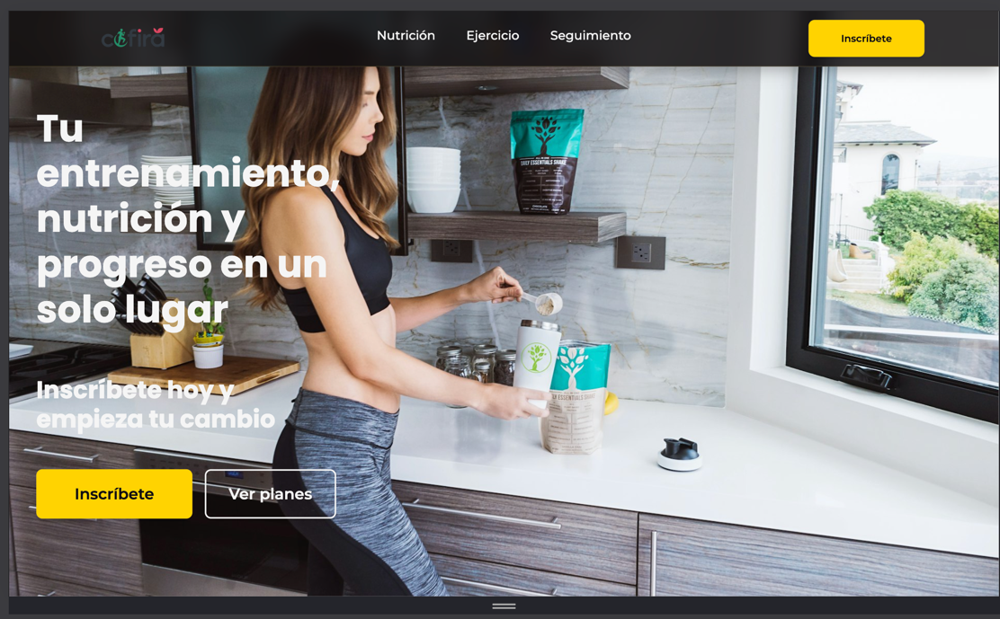

---

**Página Alimentacion:**

_Mobile (375px):_
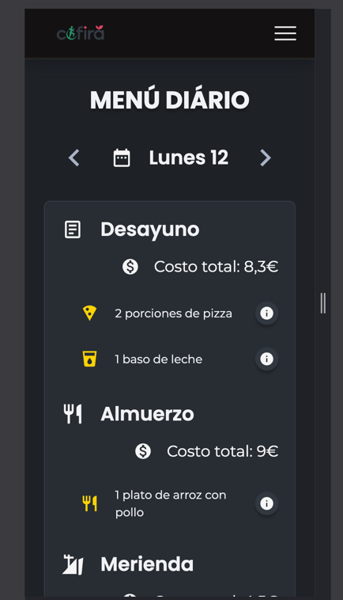

_Tablet (768px):_


_Desktop (1280px):_
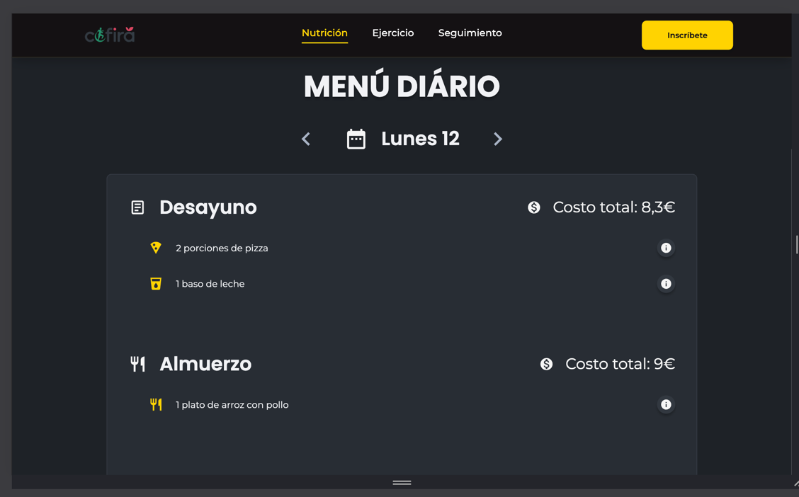

---

**Página Gimnasio:**

_Mobile (375px):_
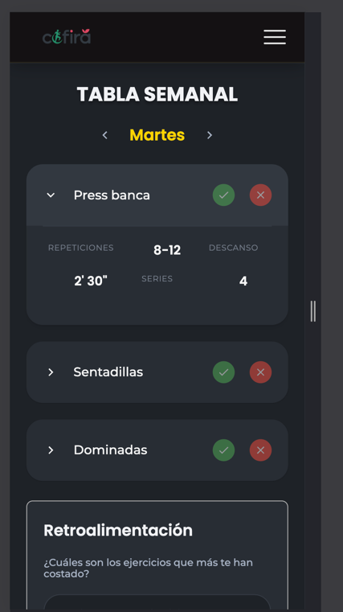

_Tablet (768px):_
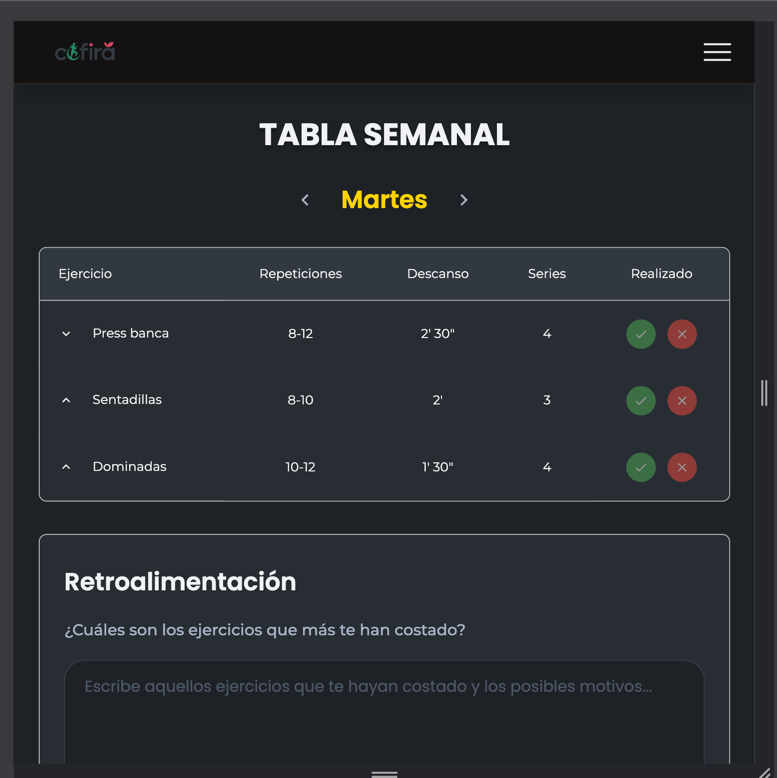

_Desktop (1280px):_
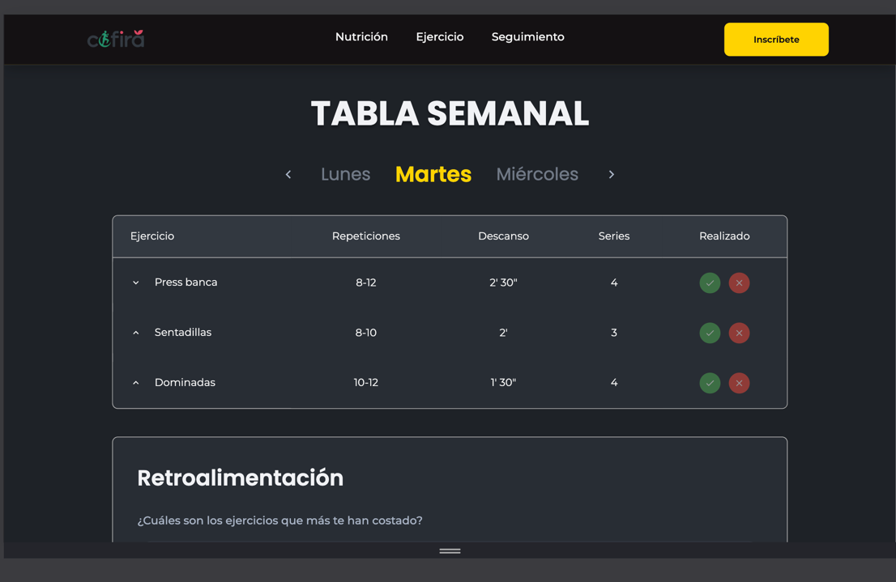

---

**Página Segumiento:**

_Mobile (375px):_


_Tablet (768px):_


_Desktop (1280px):_

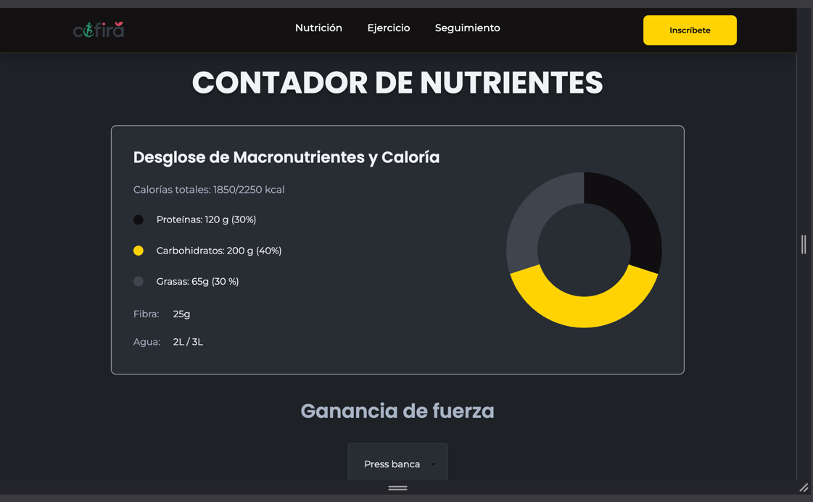

## 4.7 Testing responsive

He verificado la aplicación en los siguientes viewports usando Chrome DevTools:


**Viewports testeados:**

| Viewport | Dispositivo de referencia  | Resultado                           |
| -------- | -------------------------- | ----------------------------------- |
| 375px    | iPhone 12                  | Layout móvil correcto               |
| 768px    | iPad Mini                  | Transición a layout tablet correcta |
| 1024px   | iPad Pro / Desktop pequeño | Navegación desktop visible          |
| 1280px   | Desktop estándar           | Layout completo sin problemas       |

**Herramientas utilizadas:**

**Chrome DevTools:** Device Mode para simular diferentes dispositivos y viewports.

**Aspectos verificados:**

- El menú hamburguesa aparece correctamente en móvil y desaparece en desktop.
- Las cards de planes se reorganizan de 3 columnas a 1 columna según el viewport.
- Los formularios son usables en todos los tamaños de pantalla.
- La tipografía es legible en todos los dispositivos.
- No hay overflow horizontal en ningún viewport.
- Los elementos interactivos son accesibles con touch en móvil.
  He implementado responsive design en todas las páginas de la aplicación. A continuación listo cada página con una breve descripción de sus adaptaciones:

**Páginas principales:**


- **Home (`/`):** Página de inicio, muestra los planes y funcionalidades, además de una sección FAQ con acordeones.

- **Gimnasio (`/gimnasio`):** Tabla de ejercicios con scroll horizontal en móvil, navegación de días simplificada, y formulario de feedback adaptativo.

- **Alimentación (`/alimentacion`):** Cards de comidas adaptativas, menú del día en columna para móvil, y calendario responsive.

- **Seguimiento (`/seguimiento`):** Gráficas responsive, cards de progreso en grid adaptativo.

- **Login (`/login`):** Formulario de registro y inicio de sesión.

- **Onboarding (`/onboarding`):** Los 16 pasos tienen formularios con preguntas relacionadas al perfil del usuario, todos adaptativos con inputs a ancho completo en móvil.

**Páginas informativas:**

- **Blog (`/blog`):** Grid de artículos

- **Sobre nosotros (`/sobre-nosotros`):** Pagina explicativa sobre la empresa y el proyecto.

- **Contacto (`/contacto`):** Formulario responsive con validación para reclamaciones y sugerencias.

**Páginas legales:**

- **Privacidad (`/privacidad`):** Texto legal con max-width y padding adaptativo.

- **Términos (`/terminos`):** Mismo layout que privacidad.

- **Cookies (`/cookies`):** Página con las cookies y como se usara la información.

- **Licencias (`/licencias`):** Página con información sobre la licencia MIT de la web.

**Página de desarrollo:**

- **Style Guide (`/style-guide`):** Documentación visual de todos los componentes con sus variantes, adaptada para móvil.

---

# Sección 5: Optimización Multimedia

## 5.1 Formatos elegidos

### Formatos de imagen utilizados

He utilizado principalmente el formato **WebP** para todas las imágenes optimizadas del proyecto, antes todo el proyecto usaba imágenes jpg o png pero vi todo lo que pesaban incluso llegando a 8MB y lueo de otpimizarlas a webp se ha compromido a 140Kb.

**¿Por qué WebP?**

- **Mejor compresión:** WebP ofrece una compresión muchísimo mejor que JPEG con la misma calidad de imágen o un poco peor en caso de querer comprimirla mucho la imágen.
- **Soporte amplio:** Lo bueno del foramto webp es que la mayoria de navegadores pueden usarlo a diferencias de otros formatos que podrían dar más problemas en cuanto a compatiblidad.
- **Transparencia:** A diferencia de JPEG, WebP soporta transparencia como PNG pero con mejor compresión por lo que tambien por esto fue que me decanté por usar webp.

**¿Y para los iconos?**

He usado svg para los iconos y los he comprimido con la web **https://jakearchibald.github.io/svgomg**, pero al final acabé usando los svg en línea en el html porque de esta forma me permitía usar la propiedad fill para cambiarle los colores  y eso me ha ayudado bastante para cambiar los colores entre modo claro y oscuro.

Pero para demostrarte que lo he hecho y optimizado los svg, te he una página llamada **pruebas** que contiene ejemplos de los svg usando las imágenes svg directamente y con tablas que muestran compartivas entre sin optimizar y optimizadas.


---

## 5.2 Herramientas utilizadas

### Para optimización de imágenes rasterizadas

**Squoosh (https://squoosh.app/)**

He utilizado Squoosh como herramienta principal para optimizar todas las imágenes del proyecto. La elegí porque:

- Fue la primera que probé y me gustó lo sencillo que era usarla aunque no me gustó que aveces la web se detenía.
- Me gustó que se pudiera comprimmir en tiempo real y mostrara las diferencias visuales entre sin comprimir y comprimida la imágen.
- Permite comparar visualmente la imagen original con la optimizada antes de descargar.
- Permite redimensionar las imágenes directamente, lo cual fue muy útil para crear las versiones responsive (400w, 600w, 800w).
- Es una herramienta web, no requiere instalación y como estoy en mac pues solo podría usar una que era **ImageOptim** pero la descarga era de páginas raras y no la descargue porque no encontre una página fiable.

### Para optimización de SVGs

**Svgomg (https://jakearchibald.github.io/svgomg/)**

He utilizado Svgomg para optimizar los iconos SVG del proyecto. Mi opinión sobre esta herramienta:

- Es un buen programa y muy intuitivo de usar.
- No me gusta que no pueda importar muchas imágenes a la vez para hacer la misma compresión para todas.
- Permite ver el código SVG resultante en tiempo real.

**Nota importante sobre los svg:** Al usar svgomg me di cuenta de que, a diferencia de las imágenes jpg o png que pueden reducirse varios mb o bastantes kb, los svg al ser cuentas matemáticas no tienen tanta reducción. En mi caso, la diferencia era de apenas 4-10 bytes por archivo. Esto es una gran diferencia en comparación con las compresiones de las imágenes jpg por la diferencia de tamaños.

---

## 5.3 Resultados de optimización

### Tabla de optimización de imágenes

| Nombre del archivo           | Tamaño original | Tamaño optimizado (WebP) | Reducción |
| ---------------------------- | --------------- | ------------------------ | --------- |
| `imagen_progreso_mobile.jpg` | 7.0 MB          | 391 KB (900w)            | 94.5%     |
| `soyYo.jpg`                  | 1.8 MB          | 139 KB (600w)            | 92.3%     |
| `imagen_progreso.jpg`        | 909 KB          | 241 KB (1200w)           | 73.5%     |
| `cofiraLogoPng.png`          | 518 KB          | 14 KB                    | 97.3%     |
| `heroFitnessNutricion.jpg`   | 387 KB          | 117 KB (640w)            | 69.8%     |

**Resumen de resultados:**

- **Total original:** ~10.6 MB
- **Total optimizado:** ~902 KB
- **Reducción total:** ~91.5%

### Tabla de optimización de SVGs

| Archivo                    | Tamaño Original | Tamaño Optimizado | Reducción |
| -------------------------- | --------------- | ----------------- | --------- |
| `arrow-left.svg`           | 157 bytes       | 149 bytes         | 8 bytes   |
| `check-circle.svg`         | 234 bytes       | 226 bytes         | 8 bytes   |
| `check.svg`                | 202 bytes       | 197 bytes         | 5 bytes   |
| `clock.svg`                | 180 bytes       | 172 bytes         | 8 bytes   |
| `exclamation-circle.svg`   | 255 bytes       | 246 bytes         | 9 bytes   |
| `exclamation-triangle.svg` | 359 bytes       | 335 bytes         | 24 bytes  |
| `eye.svg`                  | 459 bytes       | 455 bytes         | 4 bytes   |
| `eye-off.svg`              | 508 bytes       | 507 bytes         | 1 byte    |
| `lock.svg`                 | 351 bytes       | 352 bytes         | -1 byte   |
| `shield-check.svg`         | 389 bytes       | 387 bytes         | 2 bytes   |
| `spinner.svg`              | 198 bytes       | 195 bytes         | 3 bytes   |
| `user.svg`                 | 327 bytes       | 327 bytes         | 0 bytes   |
| `x-circle-solid.svg`       | 358 bytes       | 350 bytes         | 8 bytes   |

Como se puede observar, la reducción en svg es mínima (entre 0-24 bytes) porque ya estaban bastante optimizados de origen.

---

## 5.4 Tecnologías implementadas

### 5.4.1 Elemento `<picture>` - Art Direction

He implementado el elemento `<picture>` en 2 lugares del proyecto para proporcionar "art direction" (imágenes diferentes según el dispositivo):

**1. Página Gimnasio (`gimnasio.html`) - Imagen de progreso:**

```html
<figure class="gimnasio__progreso-imagen">
  <picture>
    <!-- Versión móvil: imagen vertical optimizada para pantallas pequeñas -->
    <source
      media="(max-width: 900px)"
      type="image/webp"
      srcset="
        assets/images/imagen_progreso_mobile-400w.webp 400w,
        assets/images/imagen_progreso_mobile-600w.webp 600w,
        assets/images/imagen_progreso_mobile-900w.webp 900w"
      sizes="(max-width: 600px) 100vw, 80vw" />
    <!-- Versión desktop: imagen horizontal para pantallas grandes -->
    <source
      type="image/webp"
      srcset="
        assets/images/imagen_progreso-600w.webp 600w,
        assets/images/imagen_progreso-900w.webp 900w,
        assets/images/imagen_progreso-1200w.webp 1200w"
      sizes="(max-width: 1200px) 50vw, 600px" />
    <!-- Fallback para navegadores sin soporte WebP -->
    
  </picture>
</figure>
```

**2. Página Sobre Nosotros (`sobre-nosotros.html`) - Foto del equipo:**

```html
<figure class="sobre-nosotros__miembro-foto">
  <picture>
    <!-- Versiones WebP optimizadas con srcset -->
    <source
      type="image/webp"
      [srcset]="miembro.fotoWebp.small + ' 200w, ' + miembro.fotoWebp.medium + ' 400w, ' + miembro.fotoWebp.large + ' 600w'"
      sizes="(max-width: 640px) 200px, (max-width: 900px) 300px, 400px" />
    <!-- Fallback JPG para navegadores sin soporte WebP -->
    
  </picture>
</figure>
```

### 5.4.2 Atributos `srcset` y `sizes`

**¿Qué es `srcset`?**

El atributo `srcset` permite al navegador elegir la imagen más apropiada según la resolución de pantalla del dispositivo.

**¿Qué es `sizes`?**

El atributo `sizes` indica al navegador el tamaño que ocupará la imagen en el viewport.

**Ejemplo de implementación:**

```html
<source
  type="image/webp"
  srcset="
    assets/images/imagen_progreso-600w.webp 600w,
    assets/images/imagen_progreso-900w.webp 900w,
    assets/images/imagen_progreso-1200w.webp 1200w"
  sizes="(max-width: 1200px) 50vw, 600px" />
```

**Explicación del `sizes`:**

- `(max-width: 1200px) 50vw`: En pantallas hasta 1200px, la imagen ocupa el 50% del viewport.
- `600px`: En pantallas más grandes, la imagen tiene un ancho fijo de 600px.

### 5.4.3 CSS `image-set()` para backgrounds

Para imágenes de fondo en CSS, he utilizado `image-set()` que permite ofrecer WebP con fallback automático:

**Implementación en `home.scss`:**

```scss
.home__seccion-intro {
  // Fallback para navegadores sin soporte image-set
  background-image: url('/assets/images/heroFitnessNutricion.jpg');

  // Desktop: imagen grande (1920px)
  background-image: image-set(
    url('/assets/images/heroFitnessNutricion-1920w.webp') type('image/webp'),
    url('/assets/images/heroFitnessNutricion.jpg') type('image/jpeg')
  );

  // Tablet: imagen mediana (1024px)
  @include responsive-down('lg') {
    background-image: image-set(
      url('/assets/images/heroFitnessNutricion-1024w.webp') type('image/webp'),
      url('/assets/images/heroFitnessNutricion.jpg') type('image/jpeg')
    );
  }

  // Móvil: imagen pequeña (640px)
  @include responsive-down('sm') {
    background-image: image-set(
      url('/assets/images/heroFitnessNutricion-640w.webp') type('image/webp'),
      url('/assets/images/heroFitnessNutricion.jpg') type('image/jpeg')
    );
  }
}
```

### 5.4.4 Atributo `loading="lazy"`

He implementado lazy loading en todas las imágenes que no son críticas para el renderizado inicial:

```html
<!-- Imagen con lazy loading -->


```

**Dónde se usa `loading="lazy"`:**

- Imágenes de la sección de progreso en gimnasio.
- Fotos del equipo en sobre nosotros.
- Imágenes de artículos en el blog.
- Iconos SVG en la página de pruebas.

---

## 5.5 Animaciones CSS

### Animaciones implementadas

He creado **11 animaciones CSS** diferentes usando `@keyframes`:

1. **`notificacion-entrada`** (`_alerta.scss`)
   - **Qué hace:** Animación de entrada para las alertas del sistema, deslizándolas desde la derecha hacia su posición final.
   - **Propiedades:** `opacity` (0 → 1) y `transform: translateX(100% → 0)`
   - **Duración:** `var(--duration-base)` (300ms)

2. **`notificacion-salida`** (`_alerta.scss`)
   - **Qué hace:** Animación de salida para las alertas, deslizándolas de vuelta hacia la derecha hasta desaparecer.
   - **Propiedades:** `opacity` (1 → 0) y `transform: translateX(0 → 100%)`
   - **Duración:** `var(--duration-base)` (300ms)

3. **`girar-infinito`** (`autocomplete.scss`)
   - **Qué hace:** Rotación continua para el spinner de carga del componente autocomplete.
   - **Propiedades:** `transform: rotate(0deg → 360deg)`
   - **Duración:** 1s linear infinite

4. **`notificacion-deslizar-derecha`** (`notification.scss`)
   - **Qué hace:** Animación de entrada para notificaciones toast, deslizándolas desde fuera de la pantalla (derecha) hacia su posición final.
   - **Propiedades:** `opacity` (0 → 1) y `transform: translateX(120% → 0)`
   - **Duración:** `var(--duration-base)` (300ms)

5. **`notificacion-deslizar-salida-derecha`** (`notification.scss`)
   - **Qué hace:** Animación de salida para notificaciones toast, deslizándolas hacia la derecha mientras se reducen ligeramente de tamaño.
   - **Propiedades:** `opacity` (1 → 0), `transform: translateX(0 → 150%)` y `scale(1 → 0.9)`
   - **Duración:** `var(--duration-slow)` (500ms)

6. **`alerta-deslizar-entrada`** (`alert.scss`)
   - **Qué hace:** Animación de entrada para alertas inline, deslizándolas desde arriba con un pequeño desplazamiento vertical.
   - **Propiedades:** `opacity` (0 → 1) y `transform: translateY(-10px → 0)`
   - **Duración:** `var(--duration-base)` (300ms)

7. **`aparecer-gradual`** (`modal.scss`)
   - **Qué hace:** Fade in suave para el overlay oscuro del modal, creando la transición del fondo.
   - **Propiedades:** `opacity` (0 → 1)
   - **Duración:** `var(--duration-base)` (300ms)

8. **`deslizar-arriba`** (`modal.scss`)
   - **Qué hace:** Animación de entrada para el contenedor del modal, deslizándolo desde abajo hacia arriba mientras aparece.
   - **Propiedades:** `opacity` (0 → 1) y `transform: translateY(2rem → 0)`
   - **Duración:** `var(--duration-base)` (300ms)

9. **`acceso-girar`** (`login.scss`)
   - **Qué hace:** Rotación infinita para el spinner de carga durante el proceso de login.
   - **Propiedades:** `transform: rotate(0deg → 360deg)`
   - **Duración:** 0.8s linear infinite

10. **`aparecer-gradual`** (`step-register.scss`)
    - **Qué hace:** Fade in rápido para mensajes de error y requisitos de contraseña en el formulario de registro, con un ligero desplazamiento vertical.
    - **Propiedades:** `opacity` (0 → 1) y `transform: translateY(-4px → 0)`
    - **Duración:** 0.2s ease-out

11. **`registro-girar`** (`step-register.scss`)
    - **Qué hace:** Rotación continua para el spinner de carga durante la validación del formulario de registro.
    - **Propiedades:** `transform: rotate(0deg → 360deg)`
    - **Duración:** 0.8s linear infinite

### Ejemplos de código

**1. Carga usando animación tipo spinner:**

```scss
@keyframes girar-infinito {
  from {
    transform: rotate(0deg);
  }
  to {
    transform: rotate(360deg);
  }
}

.autocomplete__icono-svg--loading {
  animation: girar-infinito 1s linear infinite;
}
```

**2. Entrada de notificación:**

```scss
@keyframes notificacion-deslizar-derecha {
  from {
    opacity: 0;
    transform: translateX(120%);
  }
  to {
    opacity: 1;
    transform: translateX(0);
  }
}

.notification {
  animation: notificacion-deslizar-derecha var(--duration-base) ease;
}
```

**3. Modal con animaciones de entrada:**

```scss
@keyframes aparecer-gradual {
  from {
    opacity: 0;
  }
  to {
    opacity: 1;
  }
}

@keyframes deslizar-arriba {
  from {
    opacity: 0;
    transform: translateY(2rem);
  }
  to {
    opacity: 1;
    transform: translateY(0);
  }
}

.modal-overlay {
  animation: aparecer-gradual var(--duration-base) ease;
}

.modal {
  animation: deslizar-arriba var(--duration-base) ease;
}
```

### Transiciones hover/focus

He implementado **49 transiciones CSS** en diferentes componentes:

**Ejemplos de transiciones en botones:**

He creado mixins reutilizables para los estados interactivos que evitan repetir `:not(:disabled)` en cada selector:

```scss
.boton--primario {
  background-color: var(--button-yellow);
  color: var(--negro-normal);
  box-shadow: var(--shadow-md);


  @include hover-activo {
    background-color: var(--button-yellow-hover);
    transform: translateY(-0.125rem);
    box-shadow: var(--shadow-lg);
  }


  @include click-activo {
    transform: translateY(0);
    box-shadow: var(--shadow-sm);
  }


  @include focus-activo {
    outline: 0.1875rem solid var(--amarillo-normal);
    outline-offset: 0.125rem;
  }
}
```
**Ejemplos de transiciones en cards:**

```scss
.funcionalidades__item {
  display: flex;
  flex-direction: column;
  align-items: center;
  justify-content: center;
  padding: var(--spacing-size-xl);
  background-color: var(--blanco-normal-hover);
  border: 1px solid var(--blanco-dark);
  border-radius: var(--radius-xs);
  transition: all var(--duration-base) ease;
}

.funcionalidades__item:hover {
  border-color: var(--amarillo-normal);
  box-shadow: var(--shadow-lg);
  transform: translateY(-0.25rem);
}
```

**Ejemplos de transiciones en inputs:**

```scss
.input {
  width: 100%;
  padding: 0.75rem 1rem;
  border: 0.0625rem solid var(--gris-normal);
  border-radius: var(--radius-xss);
  background: var(--background-secondary);
  color: var(--text-primary);
  font-family: var(--font-primary);
  font-size: var(--font-size-md);
  transition: border-color var(--duration-fast);
}

.input:focus {
  outline: none;
  border-color: var(--amarillo-normal);
}
```

### ¿Por qué solo animo `transform` y `opacity`?

Solo animo las propiedades `transform` y `opacity` porque son las únicas propiedades CSS que el navegador puede animar sin provocar que se tengan que volver a cargar los valores. La gran ventaja del transform y opacity es que el navegador haría este proceso solamente una vez.

---

# Sección 6: Sistema de Temas

## 6.1 Variables de tema

He implementado un sistema de modo claro y oscuro usando **CSS Custom Properties**. Al principio pensé en usar clases CSS en el body, pero investigando descubrí que lo más estándar y profesional es usar el atributo `data-theme` en el elemento `<html>`, así que decidí implementarlo de esa forma.

### ¿Cómo organicé los archivos?

Dividí el sistema de temas en tres archivos para mantener todo organizado y no tener un archivo gigante de miles de líneas:

1. **`_dark-mode-config.scss`** - Solo las variables específicas del modo oscuro en `[data-theme="dark"]`
2. **`_dark-mode.scss`** - Los estilos que se aplican a cada componente cuando está en modo oscuro

Me gustó esta separación porque es mucho más fácil encontrar lo que necesito. Si quiero cambiar un color del tema oscuro, voy directo a `_dark-mode-config.scss` sin tener que buscar entre miles de líneas.

### Variables del tema claro

Para el tema claro definí todas las variables en `_variables.scss`. Aqui definí todas las variables tanto de colores como de animaciones, tamaños, fuentes... :

Claro ejemplo de colores configurados en el fichero _variables.scss:
```css

  --negro-normal: #110e10;
  --negro-normal-hover: #0f0d0e;
  --negro-normal-active: #0e0b0d;
  --negro-dark: #0d0b0c;
  --negro-dark-hover: #0a080a;
  --negro-dark-active: #080607;


  
  --amarillo-normal: #ffd300;
  --amarillo-normal-hover: #e6be00;
  --amarillo-normal-active: #cca900;
  --amarillo-dark: #bf9e00;
  --amarillo-dark-hover: #997f00;
  --amarillo-dark-active: #735f00;
  --amarillo-darker: #594A00;


  
  --blanco-normal: #f5f5f5;
  --blanco-normal-hover: #dddddd;
  --blanco-normal-active: #c4c4c4;
  --blanco-dark: #b8b8b8;
  --blanco-dark-hover: #939393;
  --blanco-dark-active: #6e6e6e;


  
  --gris-normal: #3f454c;
  --gris-normal-hover: #393e44;
  --gris-normal-active: #32373d;
  --gris-dark: #2f3439;
  --gris-dark-hover: #26292e;
  --gris-dark-active: #1c1f22;
  --gris-light: #b8b8b8;


  
  --verde-normal: #22c55e;
  --verde-normal-hover: #16a34a;
  --verde-normal-active: #15803d;
  --verde-dark: #166534;
  --verde-light: #86efac;


  
  --rojo-normal: #ef4444;
  --rojo-normal-hover: #dc2626;
  --rojo-normal-active: #b91c1c;
  --rojo-dark: #991b1b;
  --rojo-light: #fca5a5;
```

### Variables del tema oscuro

Para el modo oscuro lo configuré en los archivos `_dark-mode-config.scss` y `_dark-mode.scss`, lo hice de esta forma porque me parecía la forma más sencilla de ir cambiando los colores del dark mode sin tener que tener en un solo fichero o todo dividio en cada componente. La gran ventaja de esto es que si hay algun color que no me guste simplemente me tendré que ir a este fichero y lo puedo cambiar y no tengo que ir revisando cada componente ni nada de eso.

```scss
[data-theme="dark"] {
  

  .animation-item-codigo {
    color: var(--oscuro-texto-secundario);
    background: var(--oscuro-pagina-fondo);
  }

  
  .radius-item {
    background: var(--oscuro-superficie-fondo);
    border-color: var(--oscuro-borde-suave);
  }

  .radius-item-texto {
    color: var(--oscuro-texto-secundario);
  }

  
  .guia-estilos__nota {
    background-color: var(--oscuro-guia-nota-fondo);
    border-left-color: var(--oscuro-guia-nota-borde);
    color: var(--oscuro-texto-principal);
  }
```

---

## 6.2 Implementación del Theme Switcher

### ¿Cómo funciona el cambio de tema?

Para manejar la lógica del cambio del tema lo he hecho en un fichero typescript que es que maneja toda la lógica del cambio de tema. Para permitir que el usuario pueda cambiar entre modos lo que implementé fueron dos botones uno en el header y otro en el footer y con iconos muy claros.


### ThemeService - Cómo hice el sistema de temas

Creé un servicio llamado `ThemeService` que se encarga de gestionar todo el tema de la aplicación. Lo hice en un servicio separado en vez de meterlo directo en el header porque así puedo usarlo desde cualquier componente y no tengo que repetir código.

**¿Qué hace?**

Pues básicamente cuatro cosas:

1. **Guarda tu preferencia en el navegador** - Usa `localStorage` para que cuando recargues la página no se te olvide si elegiste modo claro u oscuro
2. **Mira si tu sistema ya está en modo oscuro** - Si es la primera vez que entras y tu ordenador ya tiene el modo oscuro activado, pues lo activa automáticamente
3. **Está pendiente de si cambias el tema del sistema** - Si cambias el tema de tu ordenador, la web también cambia (solo si no has elegido uno manual)
4. **Cambia el atributo del HTML** - Pone `data-theme="dark"` o `data-theme="light"` en el `<html>` y el CSS hace el resto

**La función clave que cambia el tema:**

```typescript
private setTheme(dark: boolean): void {
  this.isDarkMode.set(dark);
  const temaActual = dark ? 'dark' : 'light';
  document.documentElement.setAttribute('data-theme', temaActual);
}
```

Lo que hace esta función es muy simple: le pone un atributo al `<html>` que dice si estamos en modo `dark` o `light`. Luego el CSS detecta ese atributo y aplica los colores correspondientes. Así de sencillo.

**¿Cómo sabe qué tema usar al cargar la página?**

Pues tiene una prioridad que programé así:

1. **Primero mira** si ya elegiste un tema antes (lo busca en `localStorage`)
2. **Si no hay nada guardado**, pregunta al sistema operativo si está en modo oscuro con `prefers-color-scheme`
3. **Si no encuentra nada**, pues usa el modo claro por defecto

Me pareció la forma más lógica de hacerlo porque así respetas lo que el usuario haya elegido antes, pero si es nuevo pues le pones lo que ya tiene en su sistema.

**Una cosa que me mola de cómo lo hice:**

Si no has elegido manualmente un tema, el servicio se queda "escuchando" cambios en el tema de tu sistema. Por ejemplo, si es de noche y tu pc cambia automáticamente a modo oscuro, la web también cambia. Pero si YA elegiste modo claro a propósito, pues respeta tu decisión y no cambia aunque el sistema cambie. Esto lo hice porque me parece que la elección manual del usuario debe tener más peso que la automática

### El botón para cambiar el tema

Puse el botón para cambiar el tema en la cabecera (header) para que siempre esté visible. El botón muestra un sol ☀️ cuando estás en modo claro y una luna 🌙 cuando estás en modo oscuro.

**¿Por qué puse el botón en el header y no en el footer?**

Probé poniéndolo solo en el footer, pero me di cuenta de que si estás arriba de la página tienes que hacer scroll hasta abajo para cambiar el tema, y eso es molesto y además para usuarios nuevos que entren a la página y no les guste el modo blanco pues les podría costar imaginar donde he dejado el botón, aunque intenté que fuera lo más intuitivo posible. En el header está siempre visible, así que es mucho más cómodo para el usuario.


### Las transiciones entre temas

Una cosa que me parecía super importante era que cuando el usuario cambie de tema, el cambio sea suave y no un "flash" que moleste la vista. Entonces implementé transiciones CSS para todos los colores:

```scss
body * {
  transition: background-color 0.2s ease,
              border-color 0.2s ease,
              color 0.2s ease,
              box-shadow 0.2s ease;
}
```

Usé **200ms** porque probé con 100ms y se sentía demasiado brusco, y con 500ms se sentía lento. 200ms es el punto perfecto donde se ve fluido pero no lento.

---

## 6.3 Capturas de pantalla

Aquí te muestro cómo se ven las páginas principales de la aplicación en modo claro y en modo oscuro. Tomé capturas de las 4 páginas más importantes para que veas que el sistema de temas funciona en toda la aplicación, no solo en algunas partes:

### Página Home

**Modo claro:**

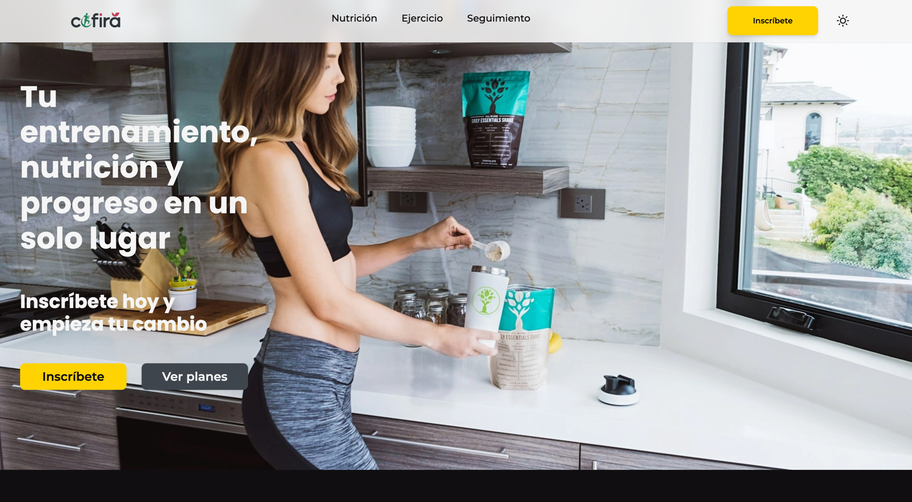

**Modo oscuro:**

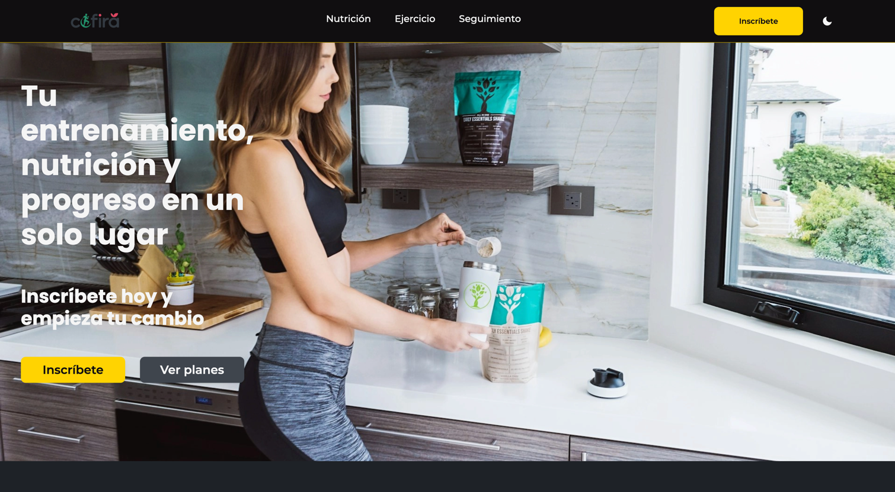

---

### Página Gimnasio

**Modo claro:**

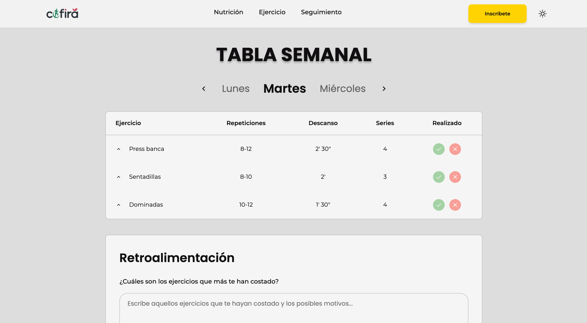

**Modo oscuro:**

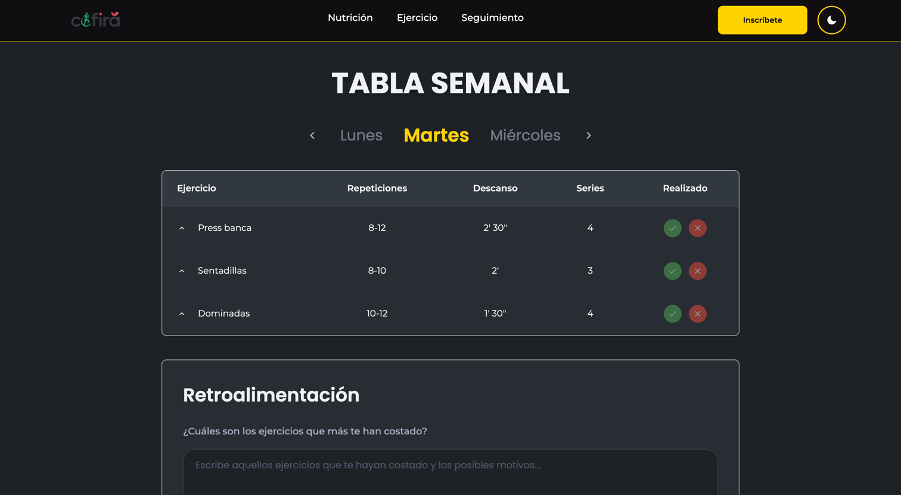

---

### Página Alimentación

**Modo claro:**

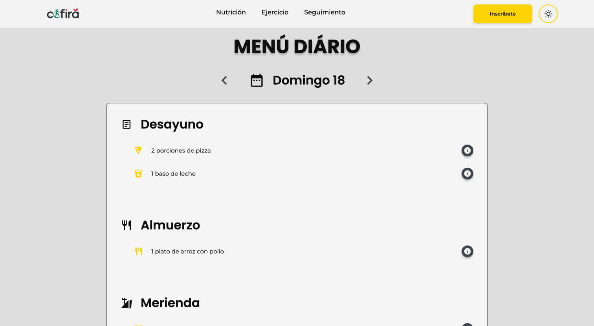


**Modo oscuro:**

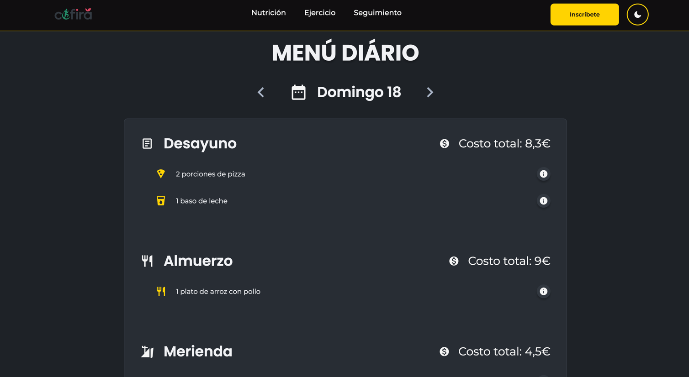


---

### Página Seguimiento

**Modo claro:**

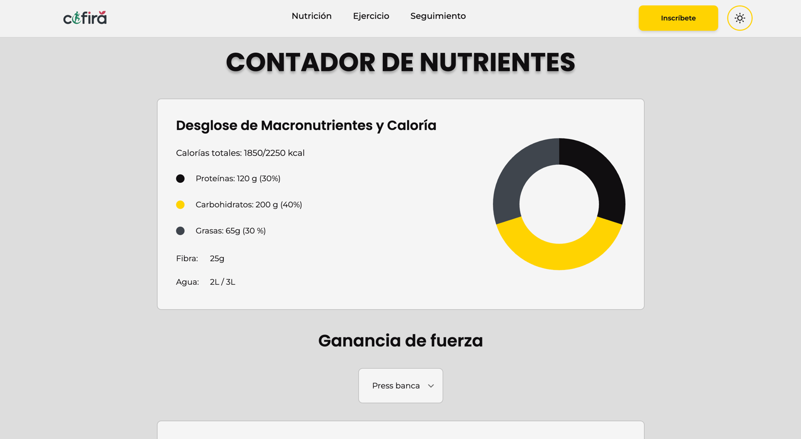


**Modo oscuro:**

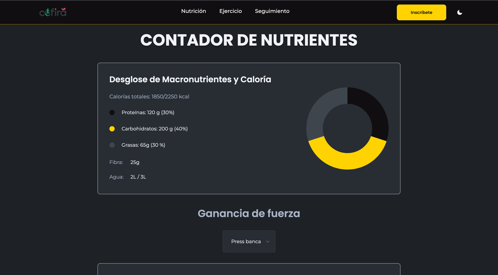

---

# Sección 7: Aplicación Completa y Despliegue

## 7.1 Estado final de la aplicación

Pues después de meses de trabajo, la aplicación está completamente terminada tanto en diseño como en funcionalidad. Aquí te cuento todo lo que he implementado:

### Páginas implementadas (15 páginas)

**Páginas principales:**
1. **Home** - Página de inicio con hero section, características y call-to-action
2. **Gimnasio** - Gestión de rutinas y ejercicios
3. **Alimentación** - Planificación de menús y recetas
4. **Seguimiento** - Gráficas de progreso y métricas
5. **Login** - Acceso a la aplicación
6. **Onboarding** - Proceso de registro en 14 pasos
7. **Sobre nosotros** - Información del equipo
8. **Blog** - Artículos y noticias
9. **Contacto** - Formulario de contacto

**Páginas legales y utilidades:**
10. **Privacidad** - Política de privacidad
11. **Cookies** - Política de cookies
12. **Términos** - Términos y condiciones
13. **Licencias** - Información de licencias MIT
14. **Style Guide** - Guía visual de componentes
15. **Pruebas** - Página de testing de SVG optimizados

### Componentes reutilizables (19 componentes)

He creado 19 componentes shared que se pueden usar en toda la aplicación:

**Componentes de UI:**
- `alert` - Alertas inline (success, error, warning, info)
- `notification` - Notificaciones toast temporales
- `button` - Botones con 4 variantes (primario, secundario, fantasma, peligro)
- `card` - Tarjetas reutilizables
- `modal` - Modales con overlay

**Componentes de formulario:**
- `form-input` - Campos de entrada de texto
- `form-select` - Selectores desplegables
- `form-textarea` - Áreas de texto
- `form-checkbox` - Casillas de verificación
- `autocomplete` - Campo de autocompletado

**Componentes de layout:**
- `header` - Cabecera con navegación y theme switcher
- `footer` - Pie de página con enlaces y controles

**Componentes especializados:**
- `form-contact` - Formulario completo de contacto
- `form-login` - Formulario de inicio de sesión
- `form-register` - Formulario de registro con validación compleja
- `option-card` - Tarjetas seleccionables para el onboarding
- `calendario` - Componente de calendario para seleccionar fechas
- `ingredientes` - Lista de ingredientes con cantidades
- `chip` - Etiquetas pequeñas para categorías o tags
- `progress-bar` - Barra de progreso animada


### Sistema de diseño CSS

**Arquitectura ITCSS completa:**
- `00-settings/` - Variables CSS (+500 custom properties)
- `01-tools/` - Mixins reutilizables (40+ mixins)
- `02-generic/` - Reset y normalización
- `03-elements/` - Estilos base HTML
- `04-layout/` - Grid y estructura
- `05-components/` - Componentes BEM
- `06-utilities/` - Clases utilitarias
- `07-dark-mode/` - Sistema de temas

**Metodología BEM:**
- Hasta 4 niveles de `__` cuando es necesario
- Sin anidación de selectores (100% planos)
- Variables intermedias siempre

### Responsive Design

La aplicación funciona perfectamente en:
- **Mobile pequeño (320px)** - iPhone SE
- **Mobile (375px)** - iPhone estándar
- **Mobile grande (640px)** - Phablets
- **Tablet (768px)** - iPad
- **Tablet landscape (900px)** - iPad horizontal
- **Desktop (1024px)** - Portátiles
- **Desktop grande (1280px+)** - Monitores grandes

### Funcionalidades implementadas

**Autenticación:**
- Login con validación en tiempo real
- Registro de usuarios
- Persistencia de sesión con localStorage
- Cierre de sesión

**Onboarding personalizado:**
- 14 pasos para conocer al usuario
- Cálculo de calorías según objetivos
- Validación de formularios en cada paso
- Barra de progreso visual

**Sistema de temas:**
- Modo claro/oscuro con más de 100 variables CSS
- Detección automática de preferencia del sistema
- Persistencia de preferencia del usuario
- Transiciones suaves entre temas (200ms)
- Theme switcher en header y footer

**Optimización multimedia:**
- Imágenes en WebP con múltiples tamaños comprimidas
- SVGs optimizados con SVGOMG
- 11 animaciones CSS

---

## 7.2 Testing multi-dispositivo

Probé la aplicación en los 5 viewports que pedía la especificación usando Chrome DevTools. Aquí están los resultados:

| Viewport | Ancho | Dispositivo de referencia | Estado | Observaciones |
|----------|-------|---------------------------|--------|---------------|
| **320px** | 320px | iPhone SE (1ª gen) | Funciona | Todo se ve bien, texto legible, botones accesibles |
| **375px** | 375px | iPhone 12/13/14 | Funciona | Perfecto, es el viewport más común de mobile |
| **768px** | 768px | iPad vertical | Funciona | Layout adapta a 2 columnas en algunas secciones |
| **1024px** | 1024px | iPad horizontal | Funciona | Navegación cambia a horizontal, todo fluido |
| **1280px** | 1280px | Desktop estándar | Funciona | Layout completo, todo el espacio aprovechado |

**Problemas encontrados y solucionados:**

- **320px:** Al principio el footer se veía apretado. Lo arreglé reduciendo el padding y usando flexbox columna en móvil.
- **375px:** Los botones del onboarding se salían en horizontal. Cambié a layout vertical con `flex-direction: column`.
- **768px:** El menú de navegación se veía raro a medio camino entre móvil y desktop. Ajusté el breakpoint a 900px para que el menú móvil se mantenga hasta ahí.

---

## 7.3 Testing en dispositivos reales

También probé la aplicación en dispositivos físicos reales para asegurarme de que funciona bien fuera del navegador de escritorio:

| Dispositivo | Sistema | Navegador | Resolución | Estado | Observaciones |
|-------------|---------|-----------|------------|--------|---------------|
| **iPad Air** | iPadOS 17 | Safari | 820×1180 | ✅ Funciona | Los gestos táctiles van perfectos, el menú desplegable se cierra bien al tocar fuera |
| **Samsung Galaxy** | Android 13 | Chrome - Brave | 360×740 | ✅ Funciona | Todo se ve bien, el botón de tema cambia sin problemas |
| **MacBook Pro** | macOS Sonoma | Brave | 1440×900 | ✅ Funciona | Los hover funcionan genial |


---

## 7.4 Verificación multi-navegador

Probé la aplicación en los cuatro navegadores principales para asegurarme de que funciona en todos:

| Navegador | Versión | Sistema | Compatibilidad | Problemas encontrados |
|-----------|---------|---------|----------------|----------------------|
| **Brave** | 1.86.140 | macOS Sonoma | 100% | Ninguno, funciona perfecto |
| **Safari** | 26.0 | macOS Sonoma | 100% | Funciona bien aunque estaría chulo añadir el estilo nuevo de apple para que se viera nativo|
| **Chrome** | 144.0.7559.60 | macOS Sonoma | 100% | Ninguno  |
| **Firefox** | 147.0 | macOS Sonoma | 100% | Ninguo |

---

## 7.5 Capturas finales

Aquí te muestro capturas de las páginas principales en los tres tamaños más representativos (mobile, tablet, desktop) y en ambos modos (claro y oscuro):

### Home

**Mobile (375px):**


**Mobile - Modo claro:**

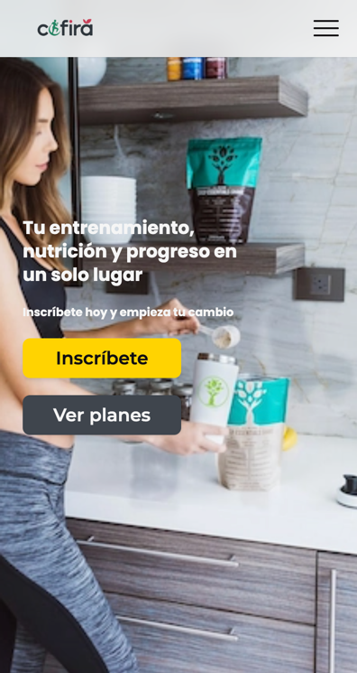

**Tablet (768px):**


**Tablet - Modo claro:**

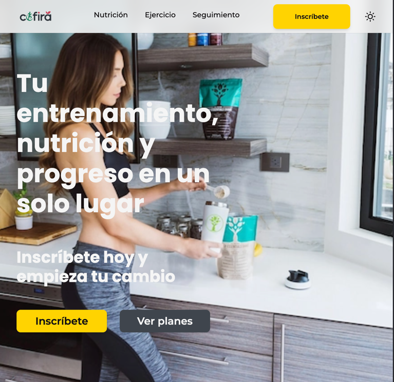

**Desktop (1280px):**


**Desktop - Modo claro:**

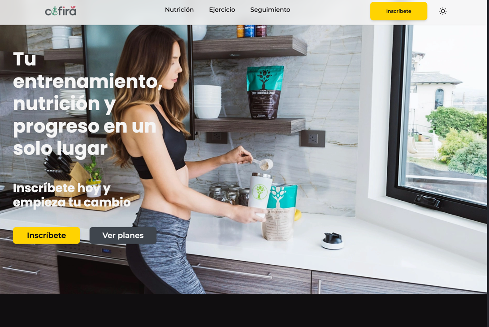

---

### Gimnasio

**Mobile (375px):**


**Mobile - Modo claro:**

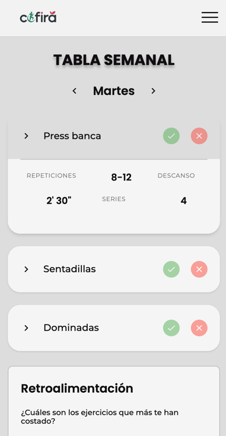

**Tablet (768px):**


**Tablet - Modo claro:**

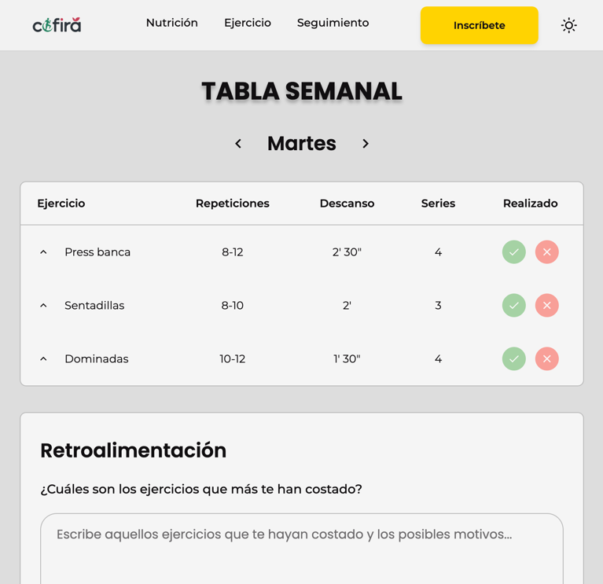

**Desktop (1280px):**


**Desktop - Modo claro:**

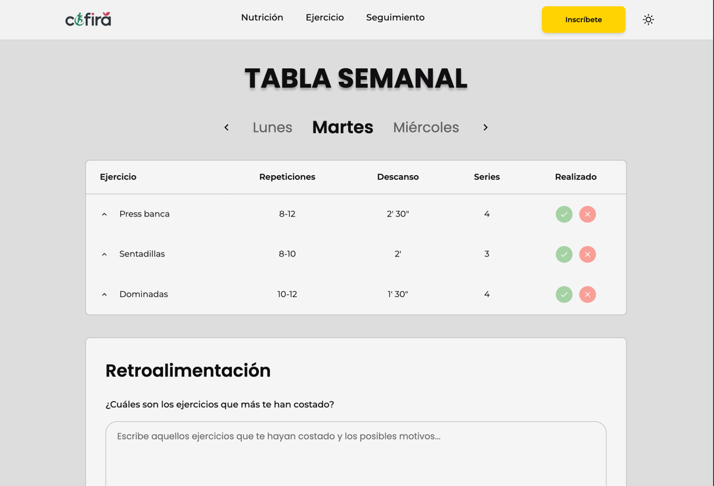

---

### Seguimiento

**Mobile (375px):**


**Mobile - Modo claro:**

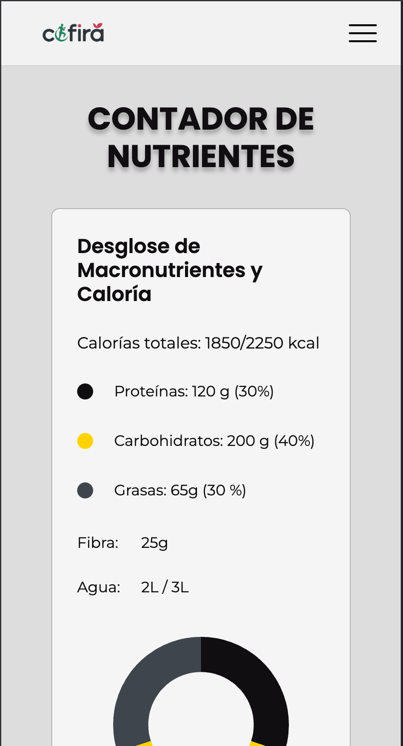

**Tablet (768px):**


**Tablet - Modo claro:**

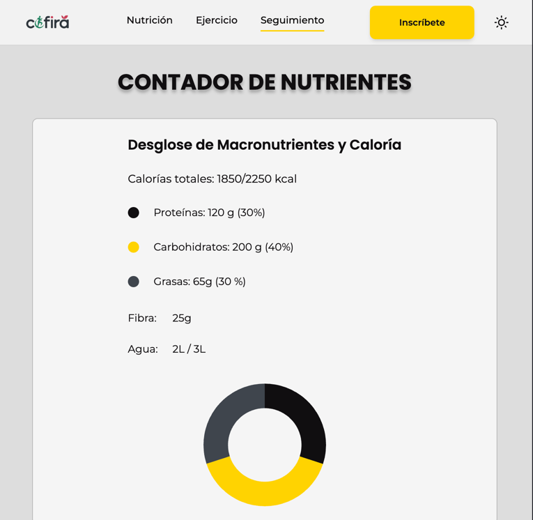

**Desktop (1280px):**


**Desktop - Modo claro:**

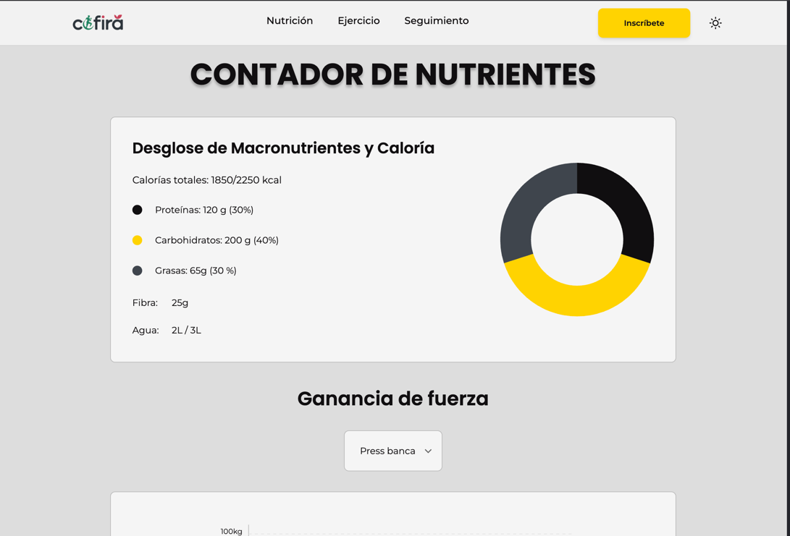

---

### Alimentación

**Mobile (375px) - Modo claro:**

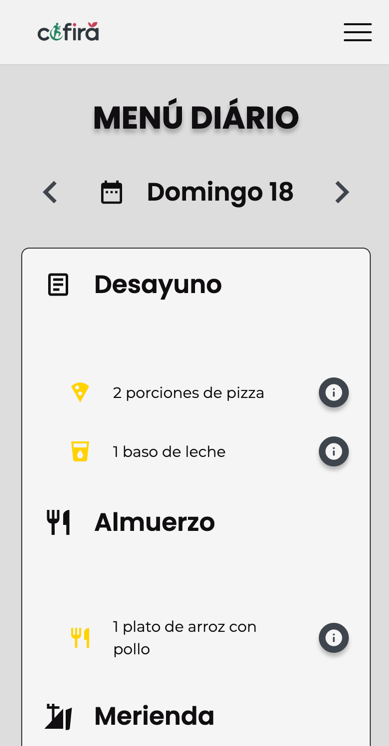

**Mobile (375px) - Modo oscuro:**


**Tablet (768px) - Modo claro:**

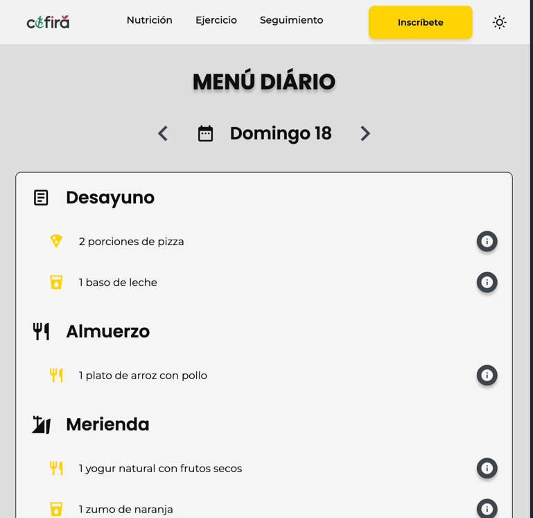

**Tablet (768px) - Modo oscuro:**

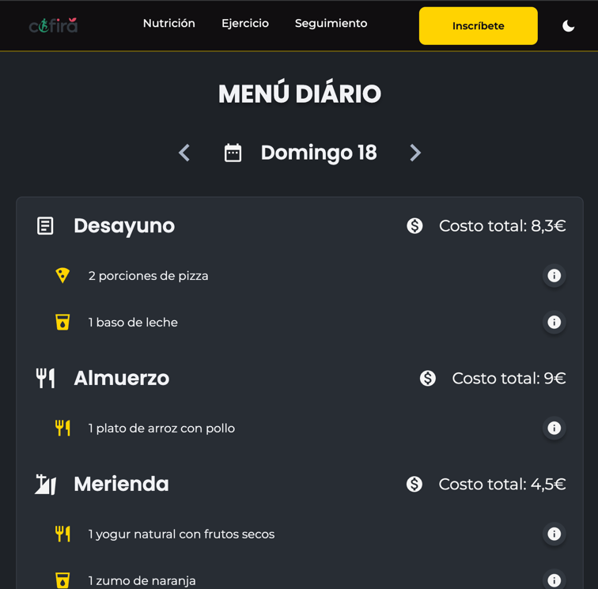

**Desktop (1280px) - Modo claro:**

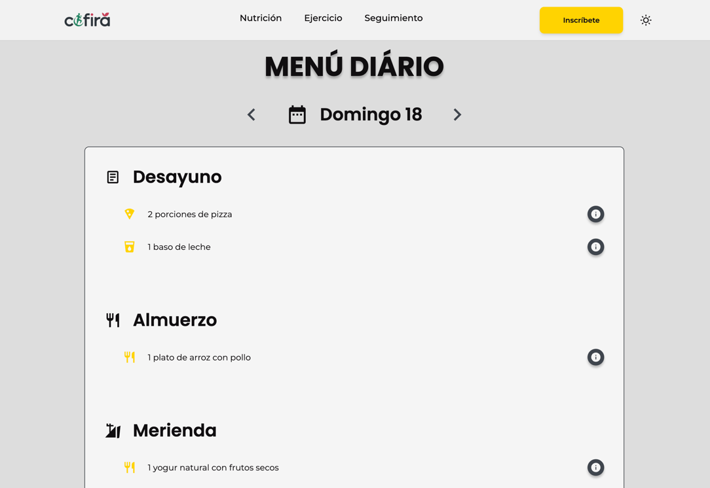

**Desktop (1280px) - Modo oscuro:**

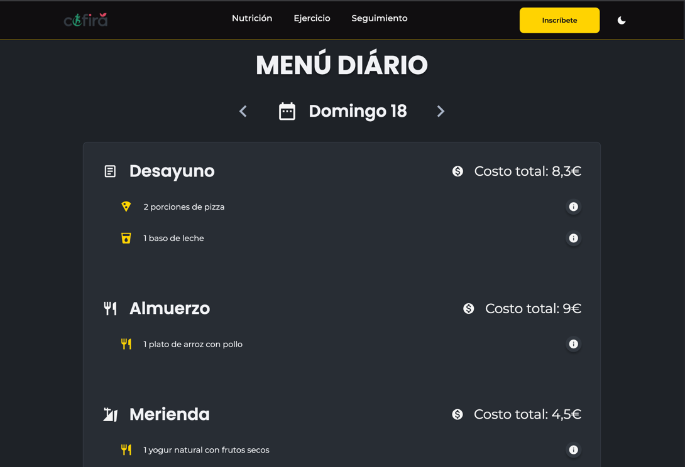

---

## 7.6 Despliegue

He desplegado la aplicación en un vps de ionos para que esté accesible públicamente.

**URL de producción:** [https://cofira.app](https://cofira.app)


Prueba de que funciona en producción:


---

## 7.7 Problemas conocidos y mejoras futuras

### Problemas conocidos (menores)

Estos son problemas pequeños que no afectan la funcionalidad pero que me gustaría mejorar en el futuro:

1. No me gusta que en la página antes del onboarding no esté centrado el botón con el texto.

2. Quiero agregar el efecto glass de apple

3.  Quiero usar modelos en ollama en local para que funcione la web


### Mejoras futuras

Cosas que me gustaría añadir cuando tenga tiempo:

**Funcionalidad:**
- **Conexión con backend real** - Ahora mismo uso datos de prueba hardcodeados
- **Autenticación con JWT** - Implementar autenticación real con tokens
- **PWA (Progressive Web App)** - Convertirla en app instalable con Service Workers
- **Notificaciones push** - Para recordar entrenamientos o comidas

**Diseño:**
- **Más animaciones** - Animaciones de transición entre páginas
- **Apple design** - Compatibilidad con el tema glass de apple para safari
- **Tema personalizable** - Permitir al usuario elegir su color de acento favorito


